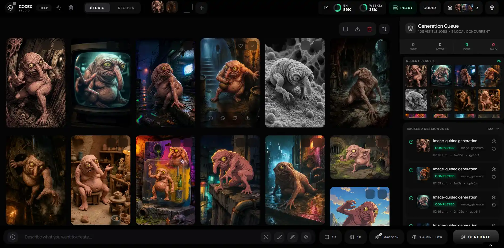

# Codex Studio

> A local-first image generation studio powered by your authenticated Codex/ChatGPT session — no `OPENAI_API_KEY` required for the main workflow.

[](./LICENSE)
[](https://bun.sh)
[](https://www.typescriptlang.org/)
[](#open-source-readiness-checklist)
[](./CONTRIBUTING.md)

Codex Studio is an open-source image creation environment built for fast local iteration, reliable job history, and future workflow expansion. Today it is Codex-first. Over time, it is designed to support multiple workflow types and providers behind a consistent studio UX.

## Who this is for

- Creative developers building image pipelines locally
- Technical artists who need repeatable generation/editing workflows
- Product teams prototyping AI-assisted visual tooling
- Open-source contributors interested in workflow-driven studio systems

## Quick start

1. Install dependencies and initialize your local studio library.
   - `bun install`
   - `bun run studio:init`
2. Start the development environment.
   - `bun run dev`
3. Confirm everything is healthy.
   - UI: <http://localhost:17222>
   - Local API health: <http://localhost:17223/api/health>

## Screenshots

### Studio workspace



## Why this project

- **No API key required** for the primary Codex flow.
- **Uses your local authenticated Codex/ChatGPT session**.
- **Persistent job queue + traceability** backed by SQLite.
- **Library-backed storage** keeps assets, logs, and transcripts outside the repo.
- **Full creative UI** with recipes, workspaces, visual grid, and review tools.
- **Extensible architecture** designed for multi-workflow evolution.

## Product direction: image studio + evolving workflows

Codex Studio starts with a strong image-generation core and a clear path to broader workflow support.

| Scope                    | Current status                  | Direction                                         |
| ------------------------ | ------------------------------- | ------------------------------------------------- |
| Image generation/editing | Production-ready locally        | Continue hardening and quality improvements       |
| Workflow model           | Codex-first runtime             | Add more workflow types over time                 |
| Provider boundary        | Adapter-based                   | Expand provider compatibility without UI rewrites |
| Studio UX                | Unified queue + review surfaces | Keep one coherent UX across workflow families     |

## Open-source launch positioning

Codex Studio is being prepared as an open-source platform for image-first creation that can evolve into a multi-workflow studio runtime.

| Pillar                            | What this means in practice                                              |
| --------------------------------- | ------------------------------------------------------------------------ |
| Image-first excellence            | Prioritize quality, speed, and reliability for image generation/editing  |
| Workflow extensibility            | Introduce new workflow families without fragmenting UX                   |
| Local-first reliability           | Keep durable history, assets, and logs under your control                |
| Contributor-friendly architecture | Clear boundaries, shared contracts, and docs that reduce onboarding time |

## How it works

1. React/Vite UI collects prompts, recipes, and reference assets.
2. Bun/Hono local server creates and supervises persistent jobs.
3. `codex app-server` executes real turns for image generation/editing.
4. Studio Library stores assets, SQLite data, transcripts, and logs.
5. UI syncs via HTTP + SSE and maintains compatibility surfaces for continuity.

## Requirements

- **Bun** in PATH — [bun.sh](https://bun.sh)
- **Codex CLI** installed and authenticated with ChatGPT on the same machine
- `codex app-server` support in that installation
- A modern browser with IndexedDB support

If Codex or local session auth is missing, the UI may open but real generations will not complete. See [`docs/TROUBLESHOOTING.md`](./docs/TROUBLESHOOTING.md).

## Local configuration

The backend reads variables from `.env.local`. You can let `bun run studio:init` generate it, or copy from `.env.example`.

Primary variables:

- `STUDIO_LIBRARY_DIR`
- `STUDIO_SERVER_PORT`
- `STUDIO_CODEX_WS_PORT`
- `VITE_STUDIO_API_BASE`

Optional variables for Electron shell:

- `STUDIO_ELECTRON_API_BASE`
- `STUDIO_ELECTRON_RENDERER_URL`

Example library paths:

- Windows: `%USERPROFILE%\AI-Studio-Library`
- macOS: `/Users/<your-user>/AI-Studio-Library`
- Linux: `/home/<your-user>/AI-Studio-Library`

## Useful scripts

```bash
bun run dev
bun run dev:server
bun run dev:ui
bun run dev:electron
bun run studio:init
bun run fmt
bun run lint
bun run check
bun run test
bun run build
bun run validate:fast
bun run validate:full
```

Maintenance:

```bash
bun run storage:audit
bun run storage:compact
bun run storage:thumbnails:backfill
bun run tooling:logs:prune
```

Interactive maintenance is also available in Studio Settings -> Storage Maintenance.

## Core technical decisions

| Topic                            | Decision                                              |
| -------------------------------- | ----------------------------------------------------- |
| Durable source of truth          | `SQLite + Image Catalog`                              |
| Compatibility visual cache       | `GenerationBatch[]` in IndexedDB (compatibility-only) |
| Live events                      | `GET /api/events` (SSE)                               |
| Canonical local session endpoint | `/api/codex/session`                                  |
| Product philosophy               | Codex-first, local-first, library-backed              |

## Repository layout

```text
.
├─ apps/local-server/
├─ components/
├─ contexts/
├─ docs/
├─ hooks/
├─ packages/shared/
├─ scripts/
└─ services/
```

## Documentation map

- [`CONTEXT.md`](./CONTEXT.md) — canonical domain vocabulary
- [`AGENTS.md`](./AGENTS.md) — operational rules for agents
- [`SKILLS.md`](./SKILLS.md) — specialized workflow guides
- [`docs/ARCHITECTURE.md`](./docs/ARCHITECTURE.md) — current architecture
- [`docs/SERVICES.md`](./docs/SERVICES.md) — service and integration map
- [`docs/DEV_GUIDE.md`](./docs/DEV_GUIDE.md) — development conventions
- [`docs/TOOLING.md`](./docs/TOOLING.md) — tooling and quality commands
- [`docs/TROUBLESHOOTING.md`](./docs/TROUBLESHOOTING.md) — quick diagnostics

## Open-source readiness checklist

- [ ] `bun run studio:init` completes successfully
- [ ] `bun run dev` starts UI + backend
- [ ] `GET /api/health` returns healthy response
- [ ] UI opens and shows readiness status
- [ ] `CONTRIBUTING.md`, `SECURITY.md`, and `CODE_OF_CONDUCT.md` are reviewed before publishing

## Contributing

Contributions are welcome. Start with [`CONTRIBUTING.md`](./CONTRIBUTING.md), then review [`ROADMAP.md`](./ROADMAP.md) for product priorities.

## License

This project is licensed under the [MIT License](./LICENSE).
