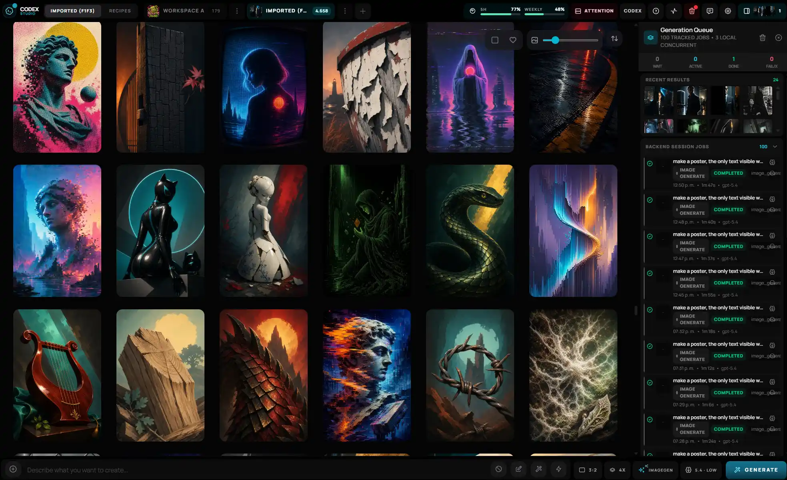
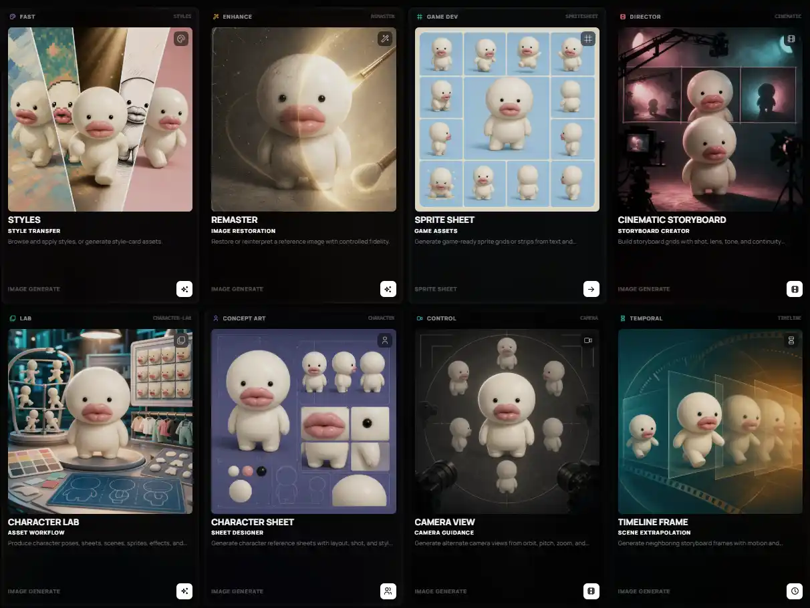
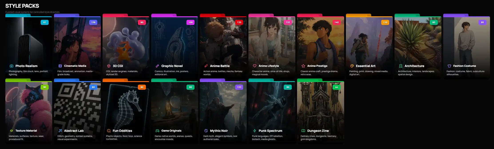

# Codex Studio

> Local-first image studio for creating, reviewing, and organizing AI images through your authenticated Codex/ChatGPT session.

[](./LICENSE)
[](https://bun.sh)
[](https://www.typescriptlang.org/)
[](#status)
[](./CONTRIBUTING.md)

Codex Studio runs on your machine: a React/Vite studio UI, a local Bun/Hono server, and `codex app-server` working together against your local ChatGPT login. The main Codex workflow does not require `OPENAI_API_KEY`; assets, job history, logs, and SQLite state live in your local Studio Library instead of the repo.

- Generate and edit images from a visual studio surface.
- Browse workspaces, recipes, recent jobs, and generated assets in one place.
- Keep job history and catalog metadata traceable through local SQLite.
- Use Codex first, with optional provider adapters kept behind backend boundaries.
- Maintain local assets outside git by default.

## Screenshots




### Recipes



### Style



## Quick Start

Requirements:

- Bun 1.3.14 on `PATH`
- Codex CLI installed and authenticated with ChatGPT
- `codex app-server` support in that Codex installation
- A modern browser

Fast path: ask Codex from this repo to run first setup.

```text
Set up Codex Studio for first run.
```

Manual path:

```bash
bun install
bun run studio:init
bun run dev
```

Then open:

- UI: <http://localhost:17222>
- Local API health: <http://localhost:17223/api/health>

## First Minute

1. Start the app with `bun run dev`.
2. Confirm the toolbar shows the local backend and Codex session as ready.
3. Choose a workspace or create one.
4. Open `Recipes` for guided workflows, or stay in `Studio` for direct prompts.
5. Generate, then review results in the grid and queue.

## Configuration

Run `bun run studio:init` to create local defaults. For manual setup, copy `.env.example` to `.env.local`.

By default, the Studio Library lives under your OS home directory as `AI-Studio-Library`. Override it only when you want a custom absolute path:

```env
# Windows
STUDIO_LIBRARY_DIR=C:\Users\<your-user>\AI-Studio-Library

# macOS
STUDIO_LIBRARY_DIR=/Users/<your-user>/AI-Studio-Library

# Linux
STUDIO_LIBRARY_DIR=/home/<your-user>/AI-Studio-Library
```

Provider secrets, if used for optional external adapters, must stay in backend environment variables and out of SQLite, logs, screenshots, docs, and committed files.

## Useful Commands

```bash
bun run dev
bun run studio:init
bun run check
bun run test
bun run build
bun run validate:fast
bun run validate:full
```

Maintenance:

```bash
bun run storage:audit
bun run storage:compact
bun run storage:thumbnails:backfill
bun run tooling:logs:prune
```

## Documentation

- [Agent guide](./AGENTS.md)
- [Project vocabulary](./CONTEXT.md)
- [Architecture](./docs/ARCHITECTURE.md)
- [Development guide](./docs/DEV_GUIDE.md)
- [Tooling](./docs/TOOLING.md)
- [Troubleshooting](./docs/TROUBLESHOOTING.md)
- [Roadmap](./ROADMAP.md)

## Status

Codex Studio is in open-source preview.

- Local development flow is active and documented.
- The default path is Codex-first and local-first.
- Optional provider adapters exist, but should be treated as backend integrations, not the product center.
- Desktop packaging and broader first-run polish are still being hardened.

---

- For deep technical details, check the [docs](docs/README.md) folder.
- For feature requests and suggestions, create an issue or submit a PR.
- If you like this project, consider giving it a star or becoming a sponsor.

---

<h4 align="right">Support the further development of this tool 🤍</h4>
<p align="right">
  <a href="https://github.com/sponsors/gvastethecreator/"></a>
  <a href="https://x.com/gvastebb"></a>
</p>
