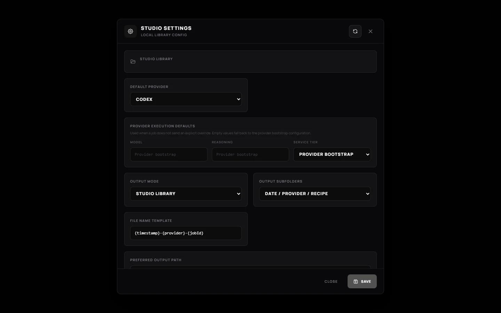

<p align="center">
  <picture>
    <source media="(prefers-color-scheme: dark)" srcset="https://shieldcn.dev/header/document.svg?title=Codex+Studio&subtitle=Local-first+image+operations+through+your+Codex+session&logo=openai&theme=cyan&align=center&mode=dark" />
    
  </picture>
</p>

<p align="center">
  <a href="https://github.com/gvastethecreator/codex-studio/actions/workflows/ci.yml"></a>
  <a href="https://gvastethecreator.github.io/codex-studio/"></a>
  <a href="https://bun.com"></a>
  <a href="https://github.com/gvastethecreator/codex-studio/stargazers"></a>
  <a href="LICENSE"></a>
</p>

Codex Studio is a local image studio. You create, review, and organize AI images with your Codex/ChatGPT login.

[Project site](https://gvastethecreator.github.io/codex-studio/) · [Source and issues](https://github.com/gvastethecreator/codex-studio)

The app runs on your machine. The UI is React/Vite. The API is Bun/Hono. Image jobs run through `codex app-server` and your local ChatGPT login.

The main Codex path does not need `OPENAI_API_KEY`. Assets, job history, logs, and SQLite state live in your Studio Library, not in this repo.

- Generate and edit images in the studio UI.
- Browse workspaces, recipes, recent jobs, and assets in one place.
- Keep job history and catalog metadata in local SQLite.
- Use Codex first. Optional providers such as Grok Imagine stay behind the backend.
- Keep local assets out of git.

## Product tour

| Catalog and persistent jobs                                                                                         | Studio Settings                                                                                                                |
| ------------------------------------------------------------------------------------------------------------------- | ------------------------------------------------------------------------------------------------------------------------------ |
|  |  |
| **Guided recipes**                                                                                                  | **Style systems**                                                                                                              |
|                            |                                         |

## Quick start

You need:

- Bun on `PATH`, able to run the repo scripts
- Codex CLI, signed in with ChatGPT, with `codex app-server`
- A modern browser

Grok Imagine is optional.

1. Install Grok Build.
2. Run `grok login`.
3. Make sure that `bun run providers:preflight -- --provider=grok` reports `canAttempt=true`.

Studio reuses that CLI login. It does not store `XAI_API_KEY`. Home and the Styles recipe support Codex and Grok. Styles can generate from a prompt or from managed library references. Codex stays the first default provider.

App readiness is the source of truth. Bun and Codex version strings are only diagnosis. If the Codex path or app-server support is unclear, run `bun run runtime:doctor`.

Do not set `STUDIO_CODEX_CLI_PATH` to a `node_modules/.../vendor` binary. Use a supported launcher such as the desktop binary or `codex.cmd`.

Fast path: ask Codex in this repo to run first setup.

```text
Set up Codex Studio for first run.
```

Manual path:

```bash
bun install
bun run studio:init
bun run dev
```

Then open:

- UI: <http://localhost:17222>
- Local API health: <http://localhost:17223/api/health>

## First minute

1. Start the app with `bun run dev`.
2. Make sure that the toolbar shows the local backend and the Codex session as ready.
3. Choose a workspace or create one.
4. Open `Recipes` for guided workflows, or stay in `Studio` for direct prompts.
5. Generate. Then review results in the grid and the queue.

## Settings

Run `bun run studio:init` to create local defaults and apply pending SQLite migrations. The command is safe to run again. It does not replace an existing Studio Library.

For manual setup, copy `.env.example` to `.env.local`.

By default, the Studio Library lives under your OS home directory as `AI-Studio-Library`. Set a custom absolute path only when you need one:

```env
# Windows
STUDIO_LIBRARY_DIR=C:\Users\<your-user>\AI-Studio-Library

# macOS
STUDIO_LIBRARY_DIR=/Users/<your-user>/AI-Studio-Library

# Linux
STUDIO_LIBRARY_DIR=/home/<your-user>/AI-Studio-Library
```

If you use optional external adapters, keep Provider Secrets in backend environment variables. Do not put them in SQLite, logs, screenshots, docs, or committed files.

Grok Build auth stays on the local CLI under `GROK_HOME`.

Use the provider control in the top Command Center to switch the next image job between Codex and Grok. The control shows runtime readiness. It stores the choice in Studio Settings. Deeper diagnostics stay in the same menu. Codex stays the initial default.

## Useful commands

```bash
bun run dev
bun run runtime:doctor
bun run providers:preflight
bun run studio:init
bun run check
bun run test
bun run build
bun run validate:fast
bun run validate
bun run validate:release
```

In VS Code, run the same commands from **Terminal -> Run Task**. The tracked tasks include `📦 deps`, `🧱 init`, `🚀 dev`, `🏗 build`, `🧪 test`, `✅ gate`, `🛡 release`, `🔌 providers`, and focused UI or API tasks.

Maintenance:

```bash
bun run storage:audit
bun run storage:compact
bun run storage:thumbnails:backfill
bun run tooling:logs:prune
```

## Documentation

- [Agent guide](./AGENTS.md)
- [Project vocabulary](./CONTEXT.md)
- [Architecture](./docs/ARCHITECTURE.md)
- [Development guide](./docs/DEV_GUIDE.md)
- [Tooling](./docs/TOOLING.md)
- [Dependencies and upgrades](./docs/DEPENDENCIES.md)
- [Troubleshooting](./docs/TROUBLESHOOTING.md)
- [Roadmap](./ROADMAP.md)

## Status

Codex Studio is in open-source preview.

- Local development is documented and works.
- The default path is Codex-first and local-first.
- Optional provider adapters are backend integrations, not the product center.
- Grok Imagine image generation and managed local image edits use your Grok Build CLI login. Native video is a later media-domain decision.
- Desktop packaging and first-run polish are still in progress.

---

- For technical detail, read the [docs](docs/README.md) folder.
- For feature requests, open an issue or a pull request.
- If this project is useful, star it or become a sponsor.

---

<h4 align="right">Support the further development of this tool 🤍</h4>
<p align="right">
  <a href="https://github.com/sponsors/gvastethecreator/"></a>
  <a href="https://ko-fi.com/gvaste"></a>
  <a href="https://x.com/gvastebb"></a>
</p>
