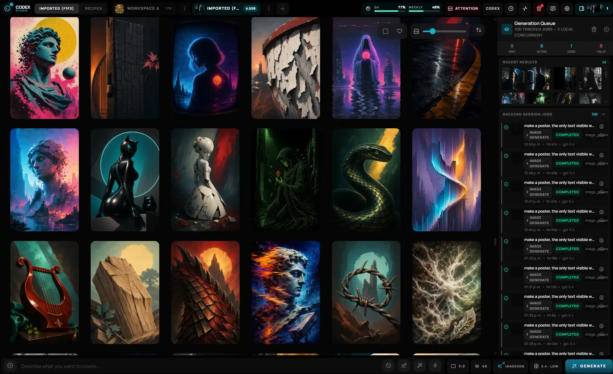
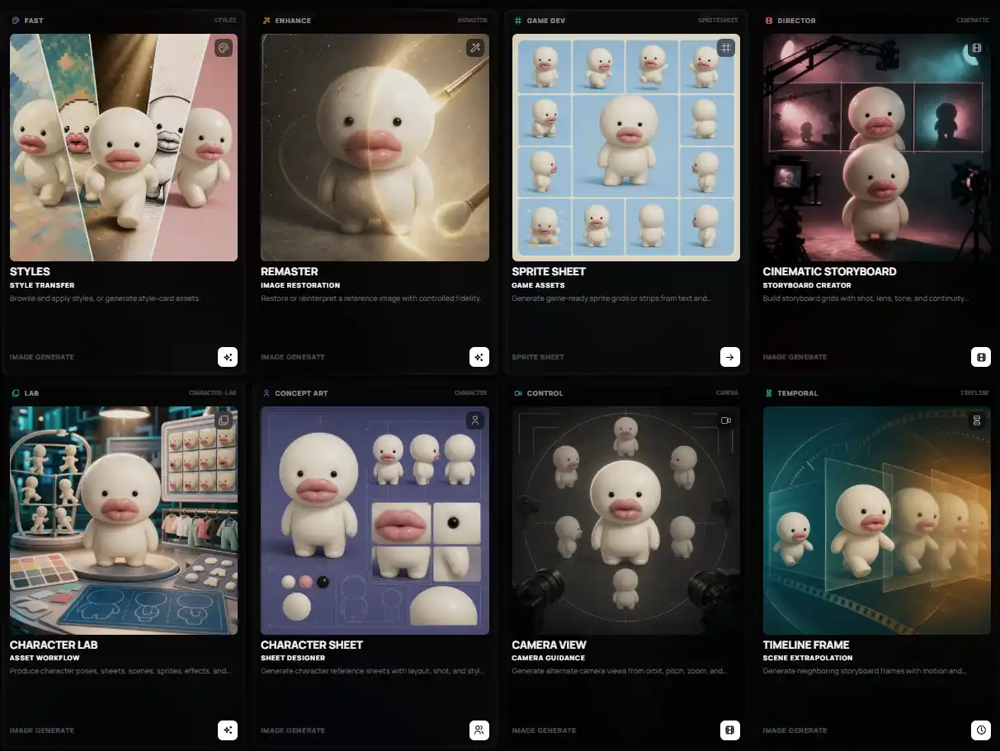
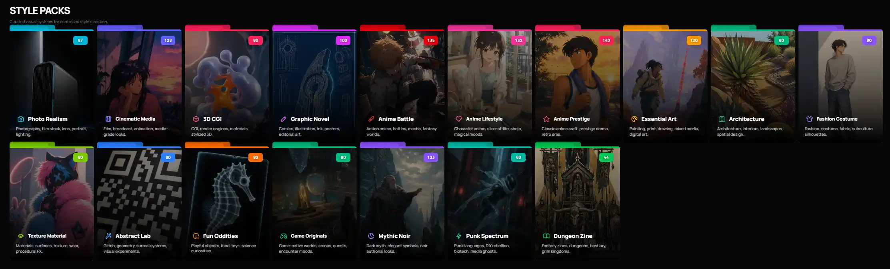

# Codex Studio

> Local-first image studio for creating, reviewing, and organizing AI images through your authenticated Codex/ChatGPT session.

[](./LICENSE)
[](https://bun.com)
[](https://www.typescriptlang.org/)
[](#status)
[](./CONTRIBUTING.md)

Codex Studio runs on your machine: a React/Vite studio UI, a local Bun/Hono server, and `codex app-server` working together against your local ChatGPT login. The main Codex workflow does not require `OPENAI_API_KEY`; assets, job history, logs, and SQLite state live in your local Studio Library instead of the repo.

- Generate and edit images from a visual studio surface.
- Browse workspaces, recipes, recent jobs, and generated assets in one place.
- Keep job history and catalog metadata traceable through local SQLite.
- Use Codex first, with optional providers such as the locally authenticated Grok Imagine adapter kept behind backend boundaries.
- Maintain local assets outside git by default.

## Screenshots



### Recipes



### Style Packs



## Quick Start

Requirements:

- Bun available on `PATH` and able to run this repo's scripts.
- Codex CLI available, authenticated with ChatGPT, and exposing `codex app-server`.
- A modern browser.

Grok Imagine is optional. To use it, install Grok Build, run `grok login`, and
confirm `bun run providers:preflight -- --provider=grok` reports
`canAttempt=true`. Studio reuses that CLI-owned login; it does not require or
store `XAI_API_KEY`. The Styles recipe supports both Codex and Grok for direct
generation and managed-reference styling. Codex stays first and remains the
initial default provider.

The app readiness checks are the source of truth. Reported Bun and Codex
metadata is diagnostic, not a hard setup gate; use `bun run runtime:doctor`
when Codex path or app-server support is unclear. Do not pin
`STUDIO_CODEX_CLI_PATH` to a package-internal `node_modules/.../vendor`
binary; use a supported launcher such as the desktop binary or `codex.cmd`.

Fast path: ask Codex from this repo to run first setup.

```text
Set up Codex Studio for first run.
```

Manual path:

```bash
bun install
bun run studio:init
bun run dev
```

Then open:

- UI: <http://localhost:17222>
- Local API health: <http://localhost:17223/api/health>

## First Minute

1. Start the app with `bun run dev`.
2. Confirm the toolbar shows the local backend and Codex session as ready.
3. Choose a workspace or create one.
4. Open `Recipes` for guided workflows, or stay in `Studio` for direct prompts.
5. Generate, then review results in the grid and queue.

## Configuration

Run `bun run studio:init` to create local defaults and apply pending SQLite migrations. The command is safe to rerun and does not replace an existing Studio Library. For manual setup, copy `.env.example` to `.env.local`.

By default, the Studio Library lives under your OS home directory as `AI-Studio-Library`. Override it only when you want a custom absolute path:

```env
# Windows
STUDIO_LIBRARY_DIR=C:\Users\<your-user>\AI-Studio-Library

# macOS
STUDIO_LIBRARY_DIR=/Users/<your-user>/AI-Studio-Library

# Linux
STUDIO_LIBRARY_DIR=/home/<your-user>/AI-Studio-Library
```

Provider secrets, if used for optional external adapters, must stay in backend environment variables and out of SQLite, logs, screenshots, docs, and committed files.
Grok Build authentication remains owned by the local CLI under `GROK_HOME`.
Use the provider control in the top Command Center to switch the next image
generation between Codex and Grok. The control shows runtime readiness and
persists the choice in Studio Settings; deeper diagnostics remain available
from the same menu. Codex remains the initial default.

## Useful Commands

```bash
bun run dev
bun run runtime:doctor
bun run providers:preflight
bun run studio:init
bun run check
bun run test
bun run build
bun run validate:fast
bun run validate
bun run validate:release
```

VS Code users can run the same commands from **Terminal -> Run Task**. The
tracked task set includes `📦 deps`, `🧱 init`, `🚀 dev`, `🏗 build`, `🧪 test`,
`✅ gate`, `🛡 release`, `🔌 providers`, and focused UI/API tasks.

Maintenance:

```bash
bun run storage:audit
bun run storage:compact
bun run storage:thumbnails:backfill
bun run tooling:logs:prune
```

## Documentation

- [Agent guide](./AGENTS.md)
- [Project vocabulary](./CONTEXT.md)
- [Architecture](./docs/ARCHITECTURE.md)
- [Development guide](./docs/DEV_GUIDE.md)
- [Tooling](./docs/TOOLING.md)
- [Dependencies and upgrades](./docs/DEPENDENCIES.md)
- [Maintenance reviews](./docs/reviews/README.md)
- [Troubleshooting](./docs/TROUBLESHOOTING.md)
- [Roadmap](./ROADMAP.md)

## Status

Codex Studio is in open-source preview.

- Local development flow is active and documented.
- The default path is Codex-first and local-first.
- Optional provider adapters exist, but should be treated as backend integrations, not the product center.
- Grok Imagine image generation and managed local image editing are available through the user's authenticated Grok Build CLI; native video remains a separate future media-domain decision.
- Desktop packaging and broader first-run polish are still being hardened.

---

- For deep technical details, check the [docs](docs/README.md) folder.
- For feature requests and suggestions, create an issue or submit a PR.
- If you like this project, consider giving it a star or becoming a sponsor.

---

<h4 align="right">Support the further development of this tool 🤍</h4>
<p align="right">
  <a href="https://github.com/sponsors/gvastethecreator/"></a>
  <a href="https://x.com/gvastebb"></a>
</p>
