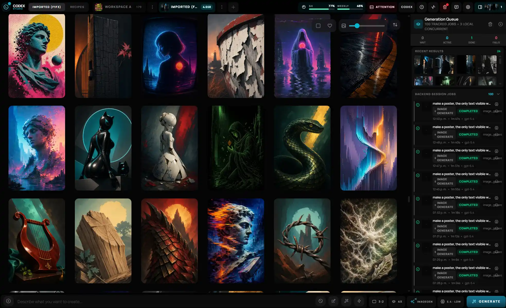
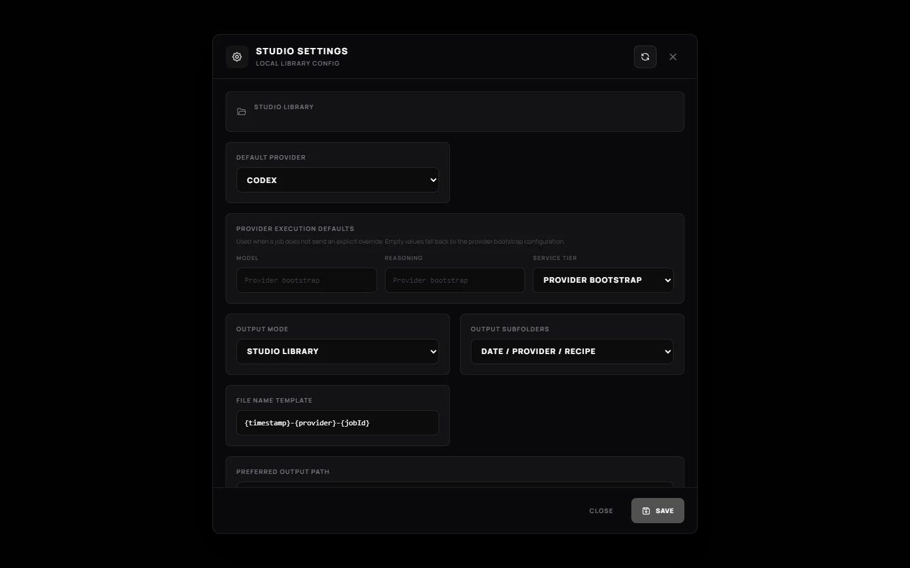
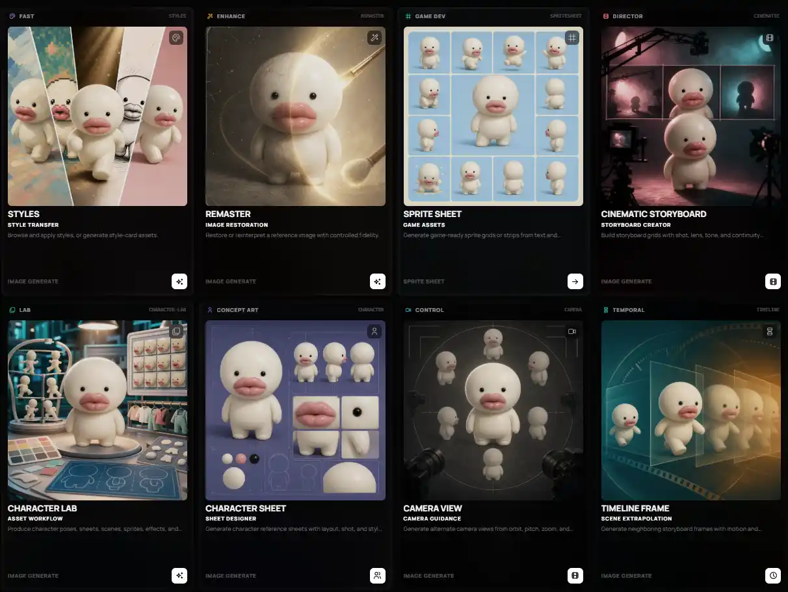
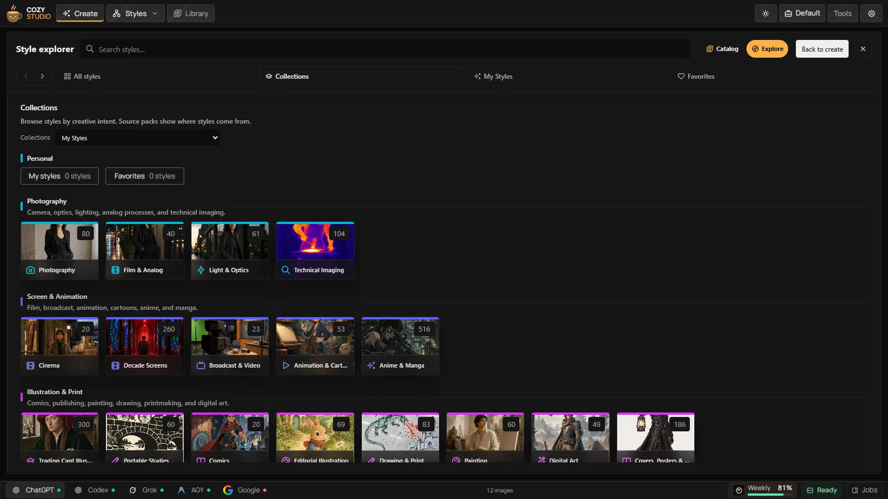

<p align="center">
  <picture>
    <source media="(prefers-color-scheme: dark)" srcset="https://shieldcn.dev/header/document.svg?title=Cozy+Studio&subtitle=Your+space+to+create+images&logo=openai&theme=cyan&align=center&mode=dark" />
    
  </picture>
</p>

<p align="center">
  <a href="https://github.com/gvastethecreator/codex-studio/actions/workflows/ci.yml"></a>
  <a href="https://gvastethecreator.github.io/codex-studio/"></a>
  <a href="https://bun.com"></a>
  <a href="https://github.com/gvastethecreator/codex-studio/stargazers"></a>
  <a href="LICENSE"></a>
</p>

Cozy Studio is a local image studio. You create, explore styles, and keep working from your results. ChatGPT is the suggested first connection. Codex remains a separate connection.

[Project site](https://gvastethecreator.github.io/codex-studio/) · [Source and issues](https://github.com/gvastethecreator/codex-studio)

The app runs on your machine. The UI is React/Vite. The API is Bun/Hono. Choose a provider for each image job: **ChatGPT** uses direct subscription HTTP (GPT Image 2.5 Flare, GPT Image 2.5 Sunburst, or GPT Image 2 when available), while **Codex** uses local `codex app-server`. ChatGPT does not require the Codex executable or its model catalog and does not create Codex threads.

The ChatGPT subscription and Codex paths do not need `OPENAI_API_KEY`. Assets, job history, logs, and SQLite state live in your Studio Library, not in this repo.

- Generate and edit images in the studio UI.
- Browse workspaces, recipes, recent jobs, and assets in one place.
- Keep job history and catalog metadata in local SQLite.
- Choose ChatGPT or Codex. Optional Grok Imagine, Google Nano Banana, and Antigravity providers stay behind the backend.
- Keep local assets out of git.

## Product tour

Create pairs a freeform text/image workspace and composer on the left with compact recipe cards on the right. Library focuses on search and review; using an image as a reference opens Create. Each recipe keeps a separate draft per workspace, with a central preview and a right configuration panel. On narrow windows, Result and Configure tabs share the space. Styles and Character Lab open their explorers on demand. Use a result as a reference or reuse its settings to continue explicitly.

Library search queries the whole workspace catalog. Jobs separates active work, results needing review, and history; the inspector shows returned images before technical details. Animation frames show linked job status separately from attached frames. Sprite Atlas labels fixture checks separately from validation of imported art.

Styles includes the Medieval and TCG visual catalogs. The 42 TCG finishes, layouts, and crossover recipes are available in Component Studio: choose or upload artwork, edit card fields, supply the masks required by a finish, and export a digital PNG composition. These components do not act as visual style presets or certify a physical print process.

| Catalog and persistent jobs                                                                                        | Studio Settings                                                                                                               |
| ------------------------------------------------------------------------------------------------------------------ | ----------------------------------------------------------------------------------------------------------------------------- |
|  |  |
| **Guided recipes**                                                                                                 | **Style systems**                                                                                                             |
|                            |                                         |

## Quick start

You need:

- Bun on `PATH`. Install it yourself from <https://bun.sh/docs/installation>. Cozy Studio never silent-installs Bun.
- For ChatGPT HTTP: a ChatGPT subscription login through Studio Settings Sign in. That login is not bundled.
- For Codex app-server: Codex CLI from <https://github.com/openai/codex> with `codex login`.
- A modern browser

Use Studio Settings Sign in and the ChatGPT provider for image jobs. Those jobs use subscription HTTP and do not create Codex turns, so they do not spend the Codex app-server usage bucket. They can still reach the ChatGPT HTTP usage limit. This path is not a second subscription and not API credits.

The first-run surface is a detect, consent, mutate, stream, re-validate loop. One primary button follows this order:

1. Missing Bun: open the official Bun installer.
2. Missing Codex CLI and no Studio ChatGPT Sign in: open the Codex install docs.
3. Login missing: use Studio Settings Sign in for ChatGPT HTTP. Open a visible `codex login` terminal only for an explicit Codex app-server job.
4. Studio Library or Bootstrap Configuration missing: in-app Setup, or `bun run studio:onboard --setup`.
5. Everything else ready except Codex Product Runtime, and Studio ChatGPT Sign in is not ready: Start app-server.
6. Ready: Open Studio.

Ask Codex is an extra path when Codex CLI exists. Copy prompt stays a fallback. Optional providers are separate backend rows, not Studio installers.

Cozy Studio keeps its own data apart from your images. The Studio Library (SQLite, settings, references, thumbnails, temporary files, logs and trash) and installed style packs live in a private app-data folder: `%LOCALAPPDATA%\Cozy Studio` on Windows, `~/Library/Application Support/Cozy Studio` on macOS and `~/.local/share/cozy-studio` on Linux. Generated images go to a `Cozy Studio` folder in your Pictures folder, all in one place, named `{date}_{style}_{prompt}` (for example `2026-09-28_kodak-portra-400_small-wise-owl.png`). Onboarding shows the images folder and lets you pick another. Settings → Output can add subfolders and change the filename tokens. Changes apply to new jobs; running jobs keep their captured destination. Existing `STUDIO_LIBRARY_DIR` is kept, `STUDIO_IMAGES_DIR` sets the default images folder, and the app does not auto-migrate an older library.

Portable zip: double-click `Cozy Studio.bat` on Windows or `Cozy Studio.command` on macOS. Read `PORTABLE.txt`. If `STUDIO_LIBRARY_DIR` is unset, portable start uses `Cozy Studio Library` beside the unpacked folder. Linux is best-effort. Electron is a development shell, not this user channel.

To use Grok Imagine:

1. Sign in with xAI from Studio Settings, or install Grok Build and run `grok login`.
2. `XAI_API_KEY` in `.env.local` also works on the same HTTP path.
3. Make sure that `bun run providers:preflight -- --provider=grok` reports `canAttempt=true`.

To use Google Nano Banana directly:

1. Set `GOOGLE_API_KEY` or `GEMINI_API_KEY` to a restricted Gemini key; or enable the Generative Language API, create a Desktop app OAuth client, and set `GOOGLE_OAUTH_CLIENT_ID` plus `GOOGLE_CLOUD_PROJECT_ID`.
2. For OAuth, add your account to the consent-screen test users when the app is still in testing, then connect Google from Studio Settings. `GOOGLE_OAUTH_CLIENT_SECRET` is optional.
3. Confirm that `bun run providers:preflight -- --provider=google` reports `canAttempt=true`.

Direct requests use the Interactions API and current Nano Banana models. An API key takes priority over OAuth. OAuth requests charge quota to `GOOGLE_CLOUD_PROJECT_ID`. Studio requests `store: false`, but Google's service terms and account controls still apply.

To use Nano Banana through Antigravity:

1. Install the official `agy` CLI, open it interactively once, and complete its Google authentication.
2. Run `agy models`, then confirm that `bun run providers:preflight -- --provider=antigravity` reports `canAttempt=true`.
3. Select Antigravity in Studio. Its model setting chooses an Antigravity reasoning model; Nano Banana runs behind the CLI as the `generate_image` tool.

Studio never reads or copies Antigravity credentials. It runs one sandboxed headless conversation in a temporary workspace, imports one validated image, and leaves Antigravity's own artifact history in place.

Studio stores xAI, Google, and ChatGPT OAuth tokens in the current user's private app-data folder, separate from the portable or shareable Studio Library and never in SQLite. Grok Build and Antigravity keep their own CLI login state. Provider API keys stay in the backend environment. Home and the Styles recipe support ChatGPT, Codex, Grok, Google, and Antigravity. Styles can generate from a prompt or from managed library references. Provider selection and execution defaults are stored separately in Studio Settings.

App readiness is the source of truth. Bun and Codex version strings are only diagnosis. If the Codex path or app-server support is unclear, run `bun run runtime:doctor`.

Do not set `STUDIO_CODEX_CLI_PATH` to a `node_modules/.../vendor` binary. Use a supported launcher such as the desktop binary or `codex.cmd`.

Fast path: ask Codex in this repo to run first setup, or use Copy prompt / Ask Codex on the onboarding surface. That prompt points at `skills/cozy-studio-setup/SKILL.md`.

```text
Set up Cozy Studio for first run.
```

Manual path:

```bash
bun install
bun run studio:onboard --setup
bun run studio:init
bun run dev
```

Then open:

- UI: <http://localhost:17222>
- Local API health: <http://localhost:17223/api/health>

## First minute

1. Start the app with `bun run dev`.
2. Make sure that the local backend is ready and the selected provider is connected.
3. Choose a workspace or create one.
4. Open `Recipes` for guided workflows, or stay in `Studio` for direct prompts.
5. Generate. Then review results in the grid and the queue.

## Settings

Run `bun run studio:init` to create local defaults and apply pending SQLite migrations. The command is safe to run again. It does not replace an existing Studio Library. Studio loads styles only from installed extensions. Settings → Extensions installs and updates style packs published on GitHub (by default `gvastethecreator/cozy-styles`; add more with `STUDIO_EXTENSION_REMOTE_SOURCES=owner/repo,owner/repo`). For a private repository, set `COZY_STYLES_GITHUB_TOKEN` in `.env.local`. Downloaded packs go to `.local/extensions/installed`. To use packs built on this machine, point `STUDIO_EXTENSION_SOURCES` at their folder, such as `../cozy-styles-dev/dist/build`.

For manual setup, copy `.env.example` to `.env.local`.

Worker capacity is configured on the host and takes effect after a server restart. `STUDIO_MAX_CONCURRENT_JOBS` is the global ceiling (default 4, range 1–16). Each `STUDIO_MAX_CONCURRENT_<PROVIDER>_JOBS` value limits that provider (default 1, no higher than the global ceiling). The Codex-named setting now controls only Codex; set the global variable explicitly when updating an older checkout. Invalid limits stop startup. Jobs separates Active, Review, and History, with a workspace filter for each view. Active contains only queued and running jobs; jobs needing review stay in Review and do not appear as loading images in the gallery. Batch progress and retry are available within each job, and Worker details shows active slots and provider limits. Queued jobs show why they are waiting. Available providers take turns; jobs within one provider keep their arrival order. Cancellation and asset import retain their slot until processing finishes.

By default, the Studio Library lives in the private app-data folder described above. Set a custom absolute path only when you need one:

```env
# Windows
STUDIO_LIBRARY_DIR=D:\Cozy Studio Library

# macOS
STUDIO_LIBRARY_DIR=/Users/<your-user>/Cozy Studio Library

# Linux
STUDIO_LIBRARY_DIR=/home/<your-user>/Cozy Studio Library
```

Preferred Output Path in Settings is an External Output Source scan hint. Generate still writes inside the Studio Library.

If you use optional external adapters, keep Provider Secrets in backend environment variables. Do not put them in SQLite, logs, screenshots, docs, or committed files.

Grok Build CLI login stays under `GROK_HOME`. Antigravity owns its CLI login and artifacts. Studio Sign in tokens stay in the current user's private app-data folder.

Use the provider control in the top Command Center to switch the next image job between ChatGPT, Codex, Grok, Google, and Antigravity. Choose ChatGPT for ordinary image jobs. The control shows runtime readiness and stores the choice in Studio Settings. Deeper diagnostics stay in the same menu. Selecting ChatGPT shows its existing Studio Sign in; selecting Codex shows local runtime readiness. A connected session confirms authentication, not available quota.

## Useful commands

```bash
bun run dev
bun run runtime:doctor
bun run providers:preflight
bun run studio:onboard
bun run studio:init
bun run check
bun run test
bun run build
bun run validate:fast
bun run validate
bun run validate:release
```

In VS Code, run the same commands from **Terminal -> Run Task**. Daily tasks start with `🚀 dev`, `🧪 test`, `🔍 check`, and `🏗 build`. Setup and infrequent tasks (`🧱 init`, `📦 deps`, `🛡 release`, `🔌 providers`) sit later in the list.

Maintenance:

```bash
bun run storage:audit
bun run storage:compact
bun run storage:thumbnails:backfill
bun run tooling:logs:prune
```

## Documentation

- [Agent rules](./AGENTS.md)
- [Dependencies](./docs/DEPENDENCIES.md)
- [Troubleshooting](./docs/TROUBLESHOOTING.md)
- [Portable launch](./PORTABLE.txt)
- [Electron development shell](./docs/ELECTRON.md)
- [Contributing](./CONTRIBUTING.md)
- [Security](./SECURITY.md)

## Status

Cozy Studio is in open-source preview.

- Local development is documented and works.
- The app is local-first, with separate ChatGPT HTTP and Codex app-server providers.
- Optional provider adapters are backend integrations, not the product center.
- Grok Imagine image generation and managed local image edits use Studio Sign in, `XAI_API_KEY`, or Grok Build CLI login.
- Google Nano Banana uses the Interactions API through a restricted API key or Studio-owned desktop OAuth. Antigravity is a separate local CLI path and never supplies Google credentials to Studio.
- Native video is a later media-domain decision.
- Desktop packaging is not the user channel. Use the browser plus portable launchers, or `bun run dev` in a checkout.

---

- For technical detail, read the [docs](docs/README.md) folder.
- For feature requests, open an issue or a pull request.
- If this project is useful, star it or become a sponsor.

---

<h4 align="right">Support the further development of this tool 🤍</h4>
<p align="right">
  <a href="https://github.com/sponsors/gvastethecreator/"></a>
  <a href="https://ko-fi.com/gvaste"></a>
  <a href="https://x.com/gvastebb"></a>
</p>

## Workflows and preferences

The workflow picker, Recipes, Settings, and Help share five groups: Create & Edit, Character, Camera & Story, Animation, and Game Assets. Timeline Frame prepares neighboring storyboard frames; Animation Sequence owns frame sequences and GIF export. Character views share the source character within a workspace and keep separate action, prompt, appearance, format, and background drafts.

Settings starts in General. Choose a preferred workflow for startup without a direct link and for new workspaces. Direct workflow links take priority. Save applies the draft; Discard restores saved settings, including the theme, accent, and motion preview. Search opens the matching section and focuses its control. Help contains the reusable Cozy guide.

Every workflow offers Maintain background or Remove background. Maintain keeps the source background for image-guided work, while explicit prompt or action changes take priority. With text only, it follows the requested scene and uses workflow defaults only when unspecified. Remove requests native transparent PNG and suppresses automatic backdrops. Prepared Animation and Atlas runs retain the choice captured when they were prepared. Native alpha uses the ChatGPT HTTP provider and GPT Image models. GPT Image 2 support is in preview; Flare and Sunburst support transparent output. See the [OpenAI image prompting guide](https://developers.openai.com/api/docs/guides/image-prompting). Provider rejection remains an error. Studio keeps opaque results and reports an alpha warning instead of applying a hidden cutout. Local fixtures verify requests and pixel handling; they do not establish endpoint availability or image quality.

PNG keeps full alpha. Animation Sequence uses the common Maintain/Remove choice; its export controls can preserve alpha or apply an explicit solid fill. GIF uses binary alpha at 128 and clears each frame to avoid trails. A checkerboard is a preview aid, never part of the saved image.

Output filename tokens are `{date}`, `{time}`, `{timestamp}`, `{workspace}`, `{workflow}`, `{provider}`, `{model}`, `{job}`, `{jobId}`, and `{recipe}`. The shared formatter adds the extension and produces the preview shown in Settings. Folder levels can use workspace, date, workflow, provider, model, and recipe. Registered roots, safe Windows names, and reserved numeric suffixes prevent path escape and overwriting existing outputs.
