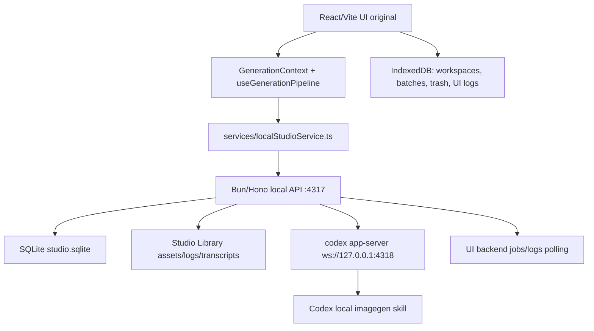

# Arquitectura

## Vista General

La aplicacion conserva la SPA React/Vite original como interfaz principal, pero la generacion ya no ocurre desde el navegador contra una API externa. La UI habla con un backend local Bun/Hono que administra jobs, SQLite, biblioteca de assets, logs y el proceso `codex app-server`.

## Fronteras

- `components/` y `hooks/`: mantienen el contrato visual original (`GenerationBatch`, `GeneratedImage`, workspaces, recipes, queue panel).
- `hooks/useLocalStudioSync.ts`: seam de sincronizacion local; importa assets, refresca jobs/logs y verifica la sesion Codex sin que el layout conozca esos detalles.
- `services/localGenerationRun.ts`: seam de ejecucion de generacion; oculta creacion de jobs persistentes, polling, importacion de assets y thumbnails.
- `services/localStudioService.ts`: unico adaptador frontend hacia el backend local.
- `apps/local-server/src/`: API local, worker, DB, logging, supervisor de `codex app-server`.
- `packages/shared/src/types.ts`: tipos compartidos para jobs, assets, logs y health.
- `Studio Library`: biblioteca externa configurable; por defecto vive bajo el home del usuario (por ejemplo `%USERPROFILE%\AI-Studio-Library` en Windows) y contiene `assets/`, `logs/`, `transcripts/` y `db/studio.sqlite`.

## Flujo de Generacion

1. El usuario trabaja en la UI original: prompt, recetas, adjuntos, batch count y workspace.
2. `useQueueManager` registra el job de UI.
3. `useGenerationPipeline` delega en `runLocalGeneration`.
4. `runLocalGeneration` crea jobs persistentes `codex_imagegen`, espera su finalizacion, importa assets y arma un `GenerationBatch`.
5. El backend ejecuta el worker, llama a `codex app-server` y captura el asset generado.
6. El backend persiste job, asset, transcript y logs.
7. La UI inserta el `GenerationBatch` listo en IndexedDB.

## Estado y Persistencia

- SQLite es la fuente local de verdad para jobs, assets, projects y system logs.
- IndexedDB sigue siendo la cache visual de la app para workspaces, selecciones, trash y batches renderizados.
- La UI importa assets existentes al cargar para que la biblioteca local aparezca en el grid.
- El panel de cola muestra tanto jobs de UI como jobs persistentes del backend.

## Sin API Key

El flujo principal no requiere `OPENAI_API_KEY`, `GEMINI_API_KEY` ni llamadas directas desde el navegador a proveedores externos. Las rutas legacy de Gemini quedan fuera del pipeline activo.
