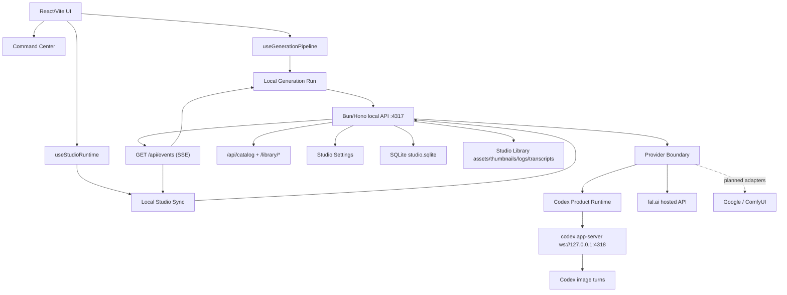

# Arquitectura

## Vista General

La aplicacion conserva la SPA React/Vite original como interfaz principal, pero toda la generacion real ocurre en un backend local Bun/Hono que supervisa `codex app-server`, persiste SQLite y emite eventos SSE. El frontend combina consultas HTTP, stream de eventos y una cache visual en IndexedDB para mantener la UI original mientras el catalogo SQLite se consolida como modelo duradero.

## Fronteras

- `services/studioRuntime.ts`: resuelve `apiBase` y metadatos de runtime (web o desktop) sin acoplar el renderer a Electron.
- `hooks/useStudioRuntime.ts`: agrupa sincronizacion, onboarding, diagnosticos y readiness para que el shell consuma una sola interfaz.
- `hooks/useLocalStudioSync.ts`: hace catch-up inicial por HTTP, se suscribe a `GET /api/events`, refleja jobs/logs del backend e importa imagenes del catalogo al cache visual.
- `services/localGenerationRun.ts`: crea jobs de Generation Task, espera estados terminales via `watchJob()`, consulta `/api/catalog?job_id=...` y devuelve un `GenerationBatch`.
- `services/localStudioService.ts`: unico adaptador HTTP de la UI hacia el backend local.
- `services/studioEventSource.ts`: adaptador SSE compartido para jobs, assets, logs y estado de conexion.
- `lib/studioReadiness.ts` y `lib/studioDiagnostics.ts`: builders puros para onboarding y paneles de diagnostico.
- `lib/recipeModules.ts`: registry declarativo de Recipe Modules con metadata, parametros, controles, defaults, validacion, tasks soportadas y providers compatibles.
- `lib/recipeCatalog.ts`: Recipe Module Catalog consultable por UI, scripts y agentes. Expone defaults, grupos de parametros y parametros requeridos; `RecipesView` usa este catalogo para textos/metadata y conserva solo iconos/assets visuales.
- `lib/recipeDerivedParams.ts`: helpers provider-independent para parametros derivados de Recipe Modules, como traduccion de camara a lenguaje de direccion y mapeo temporal de Timeline. Mantiene esa logica testeable fuera de React.
- `lib/recipePromptFragments.ts`: fragmentos provider-independent para construir Recipe Contexts de Character, Cinematic y Spritesheet sin mezclar reglas de prompt con el envelope compartido.
- `lib/recipeContextBuilders/`: builders de Recipe Context por Recipe Module. `lib/recipeContext.ts` queda como registry/envelope resolver para construir, parsear y aplicar el contexto sin concentrar cada receta en un monolito.
- `packages/shared/src/recipeProviderDirectives.ts` y `lib/recipeProviderDirectives.ts`: snapshot compacto de Recipe Provider Directives. Todas las Recipe Modules actuales emiten directivas estructuradas para que los providers puedan compilar payloads compactos sin depender siempre del Recipe Context legacy.
- `components/recipes/recipeModuleUi.ts`: proyeccion UI ligera de Recipe Modules. Permite que las recipe surfaces consuman opciones, defaults y rangos del schema central sin duplicar arrays locales.
- `components/recipes/styles/manifests/`: fuente granular de Style Pack Manifests y Style Preset Manifests. `stylePresetCatalogData.ts` carga el grafo editorial completo para validacion y busqueda; `styleRuntimeData.generated.ts` materializa datos compactos para que `stylesData.ts` alimente la UI sin construir el catalogo pesado. `styles:runtime:check` prueba que esa materializacion siga sincronizada.
- `components/recipes/StylePresetCatalogSearchSurface.tsx`: Demand-Mounted Surface del Style Preset Catalog. Importa el grafo editorial pesado solo cuando el usuario abre busqueda de catalogo desde Styles.
- `apps/local-server/src/providers/providerInputCompiler.ts`: registry de Provider Input Compilers para Codex, Dry Run, Google, fal.ai y ComfyUI. Da una seam unica para diagnostics, fixtures y futuros adapters.
- `apps/local-server/src/providers/externalProviderInputs.ts`: compilers de frontera para Google, fal.ai y ComfyUI. Prueban el shape de Compiled Provider Inputs compactos, incluyen Recipe Provider Directives cuando existen y no activan ejecucion externa ni serializan secretos.
- `apps/local-server/src/providers/externalProvider.ts`: adapter shell de ejecucion externa. Compila el Provider Input, aplica preflight no-secreto y delega en un executor registrado. No importa providers concretos.
- `apps/local-server/src/providers/externalProviderExecutors.ts`: registry de executors externos concretos. Hoy registra Google y fal.ai por defecto; ComfyUI sigue sin executor por defecto hasta tener implementacion real.
- `apps/local-server/src/providers/externalProviderResults.ts`: normalizador compartido para resultados hosted. Centraliza retry HTTP, extraccion de URL de imagen, descarga, mime/ext, escritura de asset/transcript no-secreto, diagnostics compactos opcionales y redaccion de snippets.
- `apps/local-server/src/providers/googleExecutor.ts`: executor hosted para Google Gemini image API. Usa `GOOGLE_API_KEY`, `GEMINI_API_KEY` o `NANO_BANANA_API_KEY`, llama `generateContent`, escribe resultados `inlineData` como Local Assets y mantiene secrets fuera de Provider Inputs, transcripts y errores. `image_edit` requiere asset `input` o `external_output` local; assets `sourceUrl` deben importarse antes como `localPath`.
- `apps/local-server/src/providers/falExecutor.ts`: executor hosted para fal.ai. Usa `FAL_KEY` o `FAL_API_KEY`, sube assets `localPath` a fal CDN via `@fal-ai/client`, llama `fal.run`, mapea assets hospedados a `image_url`, `mask_url`, `control_image_url` y `reference_image_urls`, y delega normalizacion/descarga/transcript en el normalizador compartido. `image_edit` exige asset `input` o `external_output`; assets inline quedan bloqueados porque el Compiled Provider Input compacto no conserva bytes inline.
- `apps/local-server/src/providers/runtimeConfig.ts`: preflight backend de Provider Secrets y endpoints locales para Google, fal.ai y ComfyUI. Expone nombres de fuentes y estado de runtime sin devolver valores secretos a traves de `/api/providers/preflight` y la vista de Settings.
- `apps/local-server/src/codex/imagegenContract.ts`: Provider Session Contract de Codex imagegen. Reutiliza instrucciones estables entre provider compiler, persistent threads y fallback prompt para no duplicar boilerplate por turno.
- `apps/local-server/src/outputSources.ts`: detector, registry e import explicito de External Output Sources. Solo copia archivos seleccionados hacia la Studio Library; no mueve ni borra en la fuente externa.
- `apps/local-server/src/appFactory.ts`: expone health, catalogo, jobs, bibliotecas, eventos SSE y rutas publicas de la Studio Library.
- `apps/local-server/src/codex/`: concentra lectura de Local Codex Session, catalogo de modelos, session pooling, RPC y supervision del app-server.
- `Provider Boundary`: frontera backend donde las Generation Tasks se ejecutan con Codex primero y, cuando hay executor concreto, con adapters externos que devuelven el mismo contrato local.
- `packages/shared/src/types.ts`: tipos compartidos para catalogo, jobs, health, session/readiness y eventos.
- `Studio Library`: biblioteca externa configurable; por defecto vive bajo el home del usuario (por ejemplo `%USERPROFILE%\AI-Studio-Library` en Windows) y contiene `assets/`, `thumbnails/`, `references/`, `logs/`, `transcripts/` y `db/studio.sqlite`.

## Flujo de Generacion

1. El usuario trabaja en la UI original: prompt, recetas, adjuntos, batch count y workspace.
2. `useGenerationPipeline` delega en `runLocalGeneration`.
3. `runLocalGeneration` resuelve el Recipe Module, crea una Generation Task Spec, crea uno o mas jobs persistentes y reutiliza un stream SSE compartido para esperar su estado terminal.
4. El worker del backend ejecuta la tarea a traves del Provider Boundary. Hoy el adapter principal es Codex y ejecuta un Codex Turn contra `codex app-server`.
5. Al completar cada job, el frontend consulta `/api/catalog` filtrando por `jobId` y materializa un `GenerationBatch` para el grid actual.
6. `useLocalStudioSync` mantiene jobs, logs y assets frescos en la UI a traves del stream SSE y hace catch-up por HTTP cuando la conexion se cae o al iniciar.
7. La UI sigue renderizando desde `GenerationBatch[]` en IndexedDB, mientras SQLite y el Image Catalog siguen siendo la fuente duradera de verdad.

## Estado y Persistencia

- SQLite es la fuente local de verdad para jobs, assets catalogados, libraries, projects y system logs.
- IndexedDB sigue siendo la cache visual de la app para `catalog-cache`, `catalog-trash`, workspaces, logs de sesion y preferencias visuales.
- El grid actual sigue usando `Visual Batches`; esos batches se derivan de Catalog Entries y no reemplazan al Catalog como indice duradero.
- Las imagenes y thumbnails viven en disco dentro de la Studio Library y se sirven a la UI via `/library/*`.
- El panel de cola mezcla jobs visuales efimeros de la UI con jobs persistentes del backend.
- External Output Sources son candidatos o registros de salida externos. No son Catalog Entries y no habilitan delete/move/tag hasta que el import explicito copie archivos seleccionados como Local Assets dentro de la Studio Library.

## Sesion local y readiness

- El producto esta bloqueado a **ChatGPT login** en el Codex CLI local; no usa `OPENAI_API_KEY` ni otros proveedores externos en el flujo principal.
- `/api/codex/session` es la lectura canonica de la Local Codex Session; `/api/codex/account` se mantiene como alias de compatibilidad.
- `Studio Readiness` combina backend reachability, Studio Library, Codex CLI, `codex app-server` y Local Codex Session para guiar el onboarding y los paneles del sistema.

## Direccion profesionalizacion

- Codex Studio es Codex-first: `codex app-server` sigue siendo el Codex Product Runtime.
- El Codex SDK queda como Codex Automation Surface para scripts, auditorias, migraciones y mantenimiento.
- Generation Task y Generation Provider se modelan por separado.
- Recipe Modules declaran metadata, parametros, controles, defaults, validacion, tasks/providers compatibles y producen Generation Task Specs; providers compilan esos specs en Compiled Provider Inputs compactos.
- Las Recipe Modules actuales ya emiten Recipe Provider Directives compactas para que Codex y proveedores externos compilen menos texto que el Recipe Context legacy cuando sea seguro.
- Google, fal.ai y ComfyUI ya tienen compilers de conformance, preflight visible en Settings y un adapter shell de ejecucion externa. Google y fal.ai tienen executors hosted reales registrados en el executor registry; ComfyUI sigue planificado hasta tener executor concreto.
- Studio Settings contienen preferencias editables no secretas; Provider Secrets viven fuera de SQLite.
- El Command Center concentra estado global y abre Demand-Mounted Surfaces para diagnosticos, settings y provider internals.
- Style presets ya tienen manifests granulares generados desde YAML legacy; el siguiente paso es autorar nuevos presets directamente ahi y degradar los pack YAML a compat/migracion.
- La busqueda completa del Style Preset Catalog vive en una Demand-Mounted Surface para mantener el browser visual en datos runtime compactos.
- External Output Sources ya tienen deteccion read-only, registry, UI de registro y endpoint de import seleccionado hacia Local Assets. Falta la UI completa para seleccionar archivos e iniciar import desde el usuario final.
