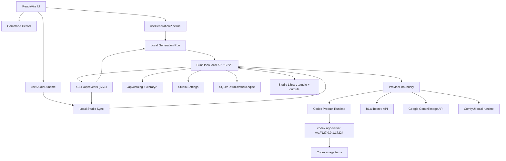

# Architecture

Codex Studio is a local-first image studio. The React/Vite UI is the main product surface, while a local Bun/Hono backend supervises `codex app-server`, persists state in SQLite, serves Studio Library assets, and emits live SSE events.

## Product Shape

- **Codex-first:** the default image workflow uses the user's local Codex/ChatGPT session through `codex app-server`.
- **Local-first:** assets, SQLite state, transcripts, thumbnails, and logs live in the Studio Library, outside the repo.
- **Library-backed:** the repo contains source code and public assets; generated user data belongs in the Studio Library.
- **Provider-aware:** optional providers plug in behind backend adapters without changing the product center.
- **Catalog-first:** durable image truth is the Image Catalog; legacy Visual Batch data is compatibility only.

## Core Frontend Seams

- `hooks/useStudioShell.ts` composes navigation, runtime, overlays, page state, catalog state, and generation state into the shell.
- `hooks/useStudioRuntime.ts` aggregates backend health, onboarding, diagnostics, session verification, and readiness.
- `hooks/useLocalStudioSync.ts` mirrors jobs, logs, catalog changes, and SSE state.
- `hooks/useCatalog.ts` owns Image Catalog reads, pagination, mutations, trash, queue-result previews, and refresh scopes.
- `services/localStudioService.ts` is the frontend HTTP adapter to the local backend.
- `services/studioEventSource.ts` owns the shared SSE connection.
- `services/localGenerationRun.ts` creates Persistent Jobs, waits for terminal state, and returns catalog-derived results.
- `services/localGenerationVisualBatchCompat.ts` is the explicit legacy Visual Batch compatibility edge.
- `lib/studioCatalogView.ts` and `lib/studioCatalogImageAdapter.ts` materialize UI images from Catalog Entries.
- `lib/buildStudioHeaderToolbarProps.ts` and `lib/commandCenterProjection.ts` project Command Center state.
- `components/shell/StudioViewport.tsx` demand-loads route surfaces.

## Core Backend Seams

- `apps/local-server/src/appFactory.ts` composes the local API.
- `apps/local-server/src/runtimeRoutes.ts` owns health, bootstrap config, and app-server lifecycle routes.
- `apps/local-server/src/codexRoutes.ts` owns Local Codex Session routes.
- `apps/local-server/src/jobRoutes.ts` and `apps/local-server/src/persistentJobIntake.ts` own job creation, validation, provider selection, and enqueue behavior.
- `apps/local-server/src/catalog.ts` and `apps/local-server/src/db.ts` own catalog and SQLite persistence.
- `apps/local-server/src/eventStreamRoutes.ts` owns SSE.
- `apps/local-server/src/libraryRoutes.ts` owns local asset serving.
- `apps/local-server/src/settingsRoutes.ts` owns editable Studio Settings.
- `apps/local-server/src/providerRoutes.ts` and `apps/local-server/src/providers/providerRegistry.ts` own provider facts, capability reads, preflight, compilers, and executor routing.
- `apps/local-server/src/outputSourceRoutes.ts` owns External Output Source registration and import.

## Generation Flow

1. The user works in the UI with a prompt, recipe, attachments, provider choice, batch count, and workspace.
2. `useGenerationPipeline` delegates execution to the local generation runner.
3. The runner resolves Recipe Module data, builds provider-independent Generation Task Specs, and creates Persistent Jobs.
4. The backend validates intake, selects the Generation Provider, persists job state, and enqueues work.
5. The Provider Boundary compiles the Generation Task Spec into provider-specific input.
6. The Codex provider runs turns through `codex app-server`; external providers run only when concrete preflight passes.
7. Completed jobs write Local Assets, Catalog Entries, transcripts, and logs into the Studio Library.
8. The UI refreshes `/api/catalog` by job id and renders catalog-derived images.
9. Legacy Visual Batch compatibility is built only at remaining export/recovery/generated-append edges.

## Persistence

- SQLite is the durable source of truth for jobs, cataloged assets, libraries, projects, settings, events, and system logs.
- `/api/jobs` and `/api/catalog` are summary-first hot reads; detail paths load full payloads on demand.
- The Studio Library defaults to a local user folder, for example `%USERPROFILE%\AI-Studio-Library` on Windows.
- Internal Studio Library state lives under `.studio/`.
- Generated outputs, thumbnails, exports, and trash assets live under `outputs/`.
- Browser storage is bounded compatibility state, not durable truth.
- External Output Sources are read-only candidates until selected files are explicitly imported as Local Assets.

## Readiness

Studio Readiness combines:

- local backend reachability
- Studio Library health
- Codex CLI availability
- `codex app-server` lifecycle
- Local Codex Session state

The main product flow is blocked when the local Codex/ChatGPT login cannot run jobs. The default Codex flow does not require `OPENAI_API_KEY`.

## Provider Boundary

Generation Tasks and Generation Providers stay separate:

- Recipe Modules produce Generation Task Specs.
- Providers compile specs into Compiled Provider Inputs.
- Provider-specific secrets, SDKs, retries, and output discovery stay behind backend adapters.
- Provider Secrets stay outside SQLite-backed Studio Settings, job metadata, logs, transcripts, screenshots, and docs.
- Providers must return the same local contract: job state, Local Assets, Catalog Entries, metadata, logs, and diagnostics.

Current concrete adapters:

- **Codex:** primary product runtime through `codex app-server`.
- **fal.ai:** hosted executor using `FAL_KEY` or `FAL_API_KEY` from backend env only.
- **Google Gemini image API:** hosted executor using `GOOGLE_API_KEY`, `GEMINI_API_KEY`, or `NANO_BANANA_API_KEY` from backend env only.
- **ComfyUI:** local executor using `COMFY_API_URL` or `COMFYUI_API_URL` plus `COMFY_WORKFLOW_TEMPLATE_PATH`.

## Demand-Mounted Surfaces

Heavy or optional UI should mount only when visible or explicitly requested:

- recipe pages are route-lazy;
- style catalog search mounts on demand;
- heavy catalog data, YAML parsing, ZIP export, and Three.js are lazy-loaded;
- settings, diagnostics, activity, and provider internals open from explicit surfaces;
- `ui:source:verify` and `ui:chunks:verify` guard against eager-regression imports.

## Automation Surfaces

Codex SDK and scripts are automation surfaces, not the product runtime. They support audits, migrations, verification, and maintenance:

- `storage:audit`
- `storage:compact`
- `storage:thumbnails:backfill`
- `tooling:logs:prune`
- `catalog:source:verify`
- `providers:verify`
- `recipes:verify`
- `styles:verify`
- `ui:source:verify`
- `ui:chunks:verify`
- `library:layout:verify`

## Storage Maintenance

Studio Settings exposes a demand-mounted Storage Maintenance panel backed by `/api/maintenance`. It can run storage audit, inline-payload compaction plans/writes, historical thumbnail backfill plans/writes, and tooling-log pruning without letting the browser execute arbitrary shell commands.

Storage Repair Plans are dry-run/read-only until a guarded write adapter is selected. Script commands remain the automation equivalent for agents and release checks.

## Open-Source Architecture Goals

- Keep setup local-first and Codex-first.
- Keep user assets and runtime state outside the repo.
- Keep provider secrets out of catalog metadata, logs, transcripts, screenshots, and docs.
- Prefer deep seams with small interfaces over shallow pass-through modules.
- Make diagnostics actionable for first-time users.
