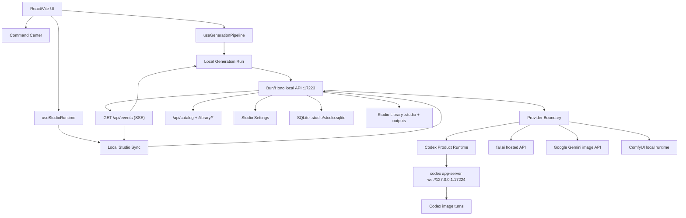

# Architecture

## Overview

Codex Studio keeps the React/Vite SPA as the primary interface, but real generation work runs through a local Bun/Hono backend. The backend supervises `codex app-server`, persists SQLite state, serves Studio Library assets, and emits live SSE events.

## Main seams

- `hooks/useStudioShell.ts`: materializes the `Studio Shell` by composing deeper shell-facing seams instead of owning catalog, page, and command wiring inline.
- `hooks/useCatalog.ts`: exposes the `Image Catalog` read seam plus `useStudioCatalogController()` for catalog mutations, queue-result previews, trash grouping, and refresh choreography.
- `services/studioRuntime.ts`: resolves the backend API base and runtime metadata without coupling the renderer to Electron.
- `hooks/useStudioRuntime.ts`: aggregates sync, onboarding, diagnostics, readiness, and session verification for shell consumers.
- `hooks/useLocalStudioSync.ts`: performs HTTP catch-up, subscribes to `GET /api/events`, mirrors backend jobs/logs, and refreshes the catalog.
- `services/localGenerationRun.ts`: creates Generation Task jobs, waits for terminal states with `watchJob()`, queries `/api/catalog?job_id=...`, and returns catalog-derived local result data.
- `services/localGenerationVisualBatchCompat.ts`: builds the legacy Visual Batch only at the compatibility edge.
- `services/localStudioService.ts`: the UI's single HTTP adapter to the local backend.
- `services/studioEventSource.ts`: shared SSE adapter for jobs, assets, logs, and connection state.
- `lib/studioCatalogView.ts`: pure Catalog Entry read model. It groups and filters catalog data without depending on Visual Batches or IndexedDB.
- `lib/studioCatalogImageAdapter.ts`: materializes UI images from Catalog Entries.
- `lib/studioLegacyVisualSnapshotExport.ts`: builds legacy `GenerationBatch[]` snapshots only for export compatibility.
- `lib/buildStudioPageController.ts`: concentrates `Studio Page` debug, grid, and operations projection behind grouped shell contexts.
- `lib/buildStudioHeaderToolbarProps.ts`: concentrates `Command Center` and header-toolbar transitions, runtime status derivation, queue counts, and provider fallback in one seam.
- `lib/studioReadiness.ts` and `lib/studioDiagnostics.ts`: pure builders for onboarding, header status, and system panels.
- `components/shell/StudioViewport.tsx`: demand-mounted route shell that lazy-loads studio and recipe surfaces.
- `components/recipes/styles/manifests/`: granular source of truth for Style Pack Manifests and Style Preset Manifests.

## Generation flow

1. The user works in the UI: prompt, recipe, attachments, batch count, provider, and workspace.
2. `useGenerationPipeline` delegates execution to the local generation runner.
3. The runner resolves the Recipe Module, builds a provider-independent Generation Task Spec, creates one or more Persistent Jobs, and waits through the shared SSE stream.
4. The backend worker executes each job through the Provider Boundary.
5. Codex remains the primary adapter and runs turns against `codex app-server`.
6. External adapters compile the same Generation Task Spec into compact provider-specific inputs and only execute when concrete runtime preflight passes.
7. Completed jobs write Local Assets, Catalog Entries, transcripts, and logs into the Studio Library.
8. The UI refreshes `/api/catalog` by `jobId` and renders catalog-derived images.
9. Legacy Visual Batch compatibility is built only for remaining grid/recovery edges.

## State and persistence

- SQLite is the local source of truth for jobs, cataloged assets, libraries, projects, settings, job events, and system logs.
- The Studio Library is an external local folder. By default it lives under the user's home directory, for example `%USERPROFILE%\AI-Studio-Library` on Windows.
- Internal state lives under `.studio/`; generated outputs, thumbnails, exports, and trash assets live under `outputs/`.
- IndexedDB no longer persists the active visual cache. Legacy keys such as `catalog-cache` and `catalog-trash` remain recovery-only compatibility surfaces.
- `LegacyVisualBatchContext` stores only lightweight refs for recovery dedupe and generated append compatibility.
- External Output Sources are read-only candidates until selected files are explicitly imported as Local Assets into the Studio Library.

## Local session and readiness

- The main product flow is blocked on **ChatGPT login** through the local Codex CLI.
- The default Codex flow does not require `OPENAI_API_KEY`.
- `/api/codex/session` is the canonical Local Codex Session read.
- `/api/codex/account` remains as a compatibility alias.
- Studio Readiness combines backend reachability, Studio Library health, Codex CLI availability, `codex app-server`, and Local Codex Session state.

## Provider Boundary

The Provider Boundary keeps Generation Tasks provider-independent:

- Recipe Modules produce Generation Task Specs.
- Providers compile specs into compact provider-specific Compiled Provider Inputs.
- Provider Secrets remain outside SQLite-backed Studio Settings.
- Providers must return the same local contract: job state, Local Assets, Catalog Entries, metadata, logs, and diagnostics.
- Planned providers stay blocked until a concrete executor can produce or import Local Assets.

Current concrete adapters:

- **Codex:** primary product runtime through `codex app-server`.
- **fal.ai:** hosted executor using `FAL_KEY` or `FAL_API_KEY` from backend env only.
- **Google Gemini image API:** hosted executor using `GOOGLE_API_KEY`, `GEMINI_API_KEY`, or `NANO_BANANA_API_KEY` from backend env only.
- **ComfyUI:** local executor using `COMFY_API_URL` or `COMFYUI_API_URL` plus `COMFY_WORKFLOW_TEMPLATE_PATH`.

## Demand-mounted surfaces

Large or optional UI surfaces should not inflate startup:

- recipe pages are lazy-loaded by route;
- style catalog search mounts on demand;
- heavy catalog data, YAML parsing, ZIP export, Three.js, and visual background effects are lazy-loaded;
- `ui:source:verify` and `ui:chunks:verify` guard against regressions.

## Automation surfaces

Codex SDK or scripts are automation surfaces, not the product runtime. They are used for audits, migrations, checks, and maintenance:

- `catalog:source:verify`
- `providers:verify`
- `recipes:verify`
- `styles:verify`
- `ui:source:verify`
- `ui:chunks:verify`
- `library:layout:verify`

## Open-source architecture goals

- Keep setup local-first and Codex-first.
- Keep user assets and runtime state outside the repo.
- Keep provider secrets out of catalog metadata, logs, transcripts, screenshots, and docs.
- Prefer deep seams with small interfaces over shallow pass-through modules.
- Make diagnostics actionable for first-time users.
