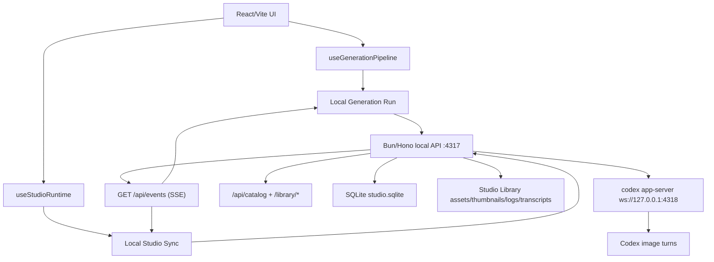

# Arquitectura

## Vista General

La aplicacion conserva la SPA React/Vite original como interfaz principal, pero toda la generacion real ocurre en un backend local Bun/Hono que supervisa `codex app-server`, persiste SQLite y emite eventos SSE. El frontend combina consultas HTTP, stream de eventos y una cache visual en IndexedDB para mantener la UI original mientras el catalogo SQLite se consolida como modelo duradero.

## Fronteras

- `services/studioRuntime.ts`: resuelve `apiBase` y metadatos de runtime (web o desktop) sin acoplar el renderer a Electron.
- `hooks/useStudioRuntime.ts`: agrupa sincronizacion, onboarding, diagnosticos y readiness para que el shell consuma una sola interfaz.
- `hooks/useLocalStudioSync.ts`: hace catch-up inicial por HTTP, se suscribe a `GET /api/events`, refleja jobs/logs del backend e importa imagenes del catalogo al cache visual.
- `services/localGenerationRun.ts`: crea jobs `codex_imagegen`, espera estados terminales via `watchJob()`, consulta `/api/catalog?job_id=...` y devuelve un `GenerationBatch`.
- `services/localStudioService.ts`: unico adaptador HTTP de la UI hacia el backend local.
- `services/studioEventSource.ts`: adaptador SSE compartido para jobs, assets, logs y estado de conexion.
- `lib/studioReadiness.ts` y `lib/studioDiagnostics.ts`: builders puros para onboarding y paneles de diagnostico.
- `apps/local-server/src/appFactory.ts`: expone health, catalogo, jobs, bibliotecas, eventos SSE y rutas publicas de la Studio Library.
- `apps/local-server/src/codex/`: concentra lectura de Local Codex Session, catalogo de modelos, session pooling, RPC y supervision del app-server.
- `packages/shared/src/types.ts`: tipos compartidos para catalogo, jobs, health, session/readiness y eventos.
- `Studio Library`: biblioteca externa configurable; por defecto vive bajo el home del usuario (por ejemplo `%USERPROFILE%\AI-Studio-Library` en Windows) y contiene `assets/`, `thumbnails/`, `references/`, `logs/`, `transcripts/` y `db/studio.sqlite`.

## Flujo de Generacion

1. El usuario trabaja en la UI original: prompt, recetas, adjuntos, batch count y workspace.
2. `useGenerationPipeline` delega en `runLocalGeneration`.
3. `runLocalGeneration` resuelve contexto de receta, crea uno o mas jobs persistentes `codex_imagegen` y reutiliza un stream SSE compartido para esperar su estado terminal.
4. El worker del backend ejecuta un Codex Turn contra `codex app-server`, persiste job, catalogo, transcript, thumbnails y logs.
5. Al completar cada job, el frontend consulta `/api/catalog` filtrando por `jobId` y materializa un `GenerationBatch` para el grid actual.
6. `useLocalStudioSync` mantiene jobs, logs y assets frescos en la UI a traves del stream SSE y hace catch-up por HTTP cuando la conexion se cae o al iniciar.
7. La UI sigue renderizando desde `GenerationBatch[]` en IndexedDB, mientras SQLite y el Image Catalog siguen siendo la fuente duradera de verdad.

## Estado y Persistencia

- SQLite es la fuente local de verdad para jobs, assets catalogados, libraries, projects y system logs.
- IndexedDB sigue siendo la cache visual de la app para `catalog-cache`, `catalog-trash`, workspaces, logs de sesion y preferencias visuales.
- El grid actual sigue usando `Visual Batches`; esos batches se derivan de Catalog Entries y no reemplazan al Catalog como indice duradero.
- Las imagenes y thumbnails viven en disco dentro de la Studio Library y se sirven a la UI via `/library/*`.
- El panel de cola mezcla jobs visuales efimeros de la UI con jobs persistentes del backend.

## Sesion local y readiness

- El producto esta bloqueado a **ChatGPT login** en el Codex CLI local; no usa `OPENAI_API_KEY` ni otros proveedores externos en el flujo principal.
- `/api/codex/session` es la lectura canonica de la Local Codex Session; `/api/codex/account` se mantiene como alias de compatibilidad.
- `Studio Readiness` combina backend reachability, Studio Library, Codex CLI, `codex app-server` y Local Codex Session para guiar el onboarding y los paneles del sistema.
