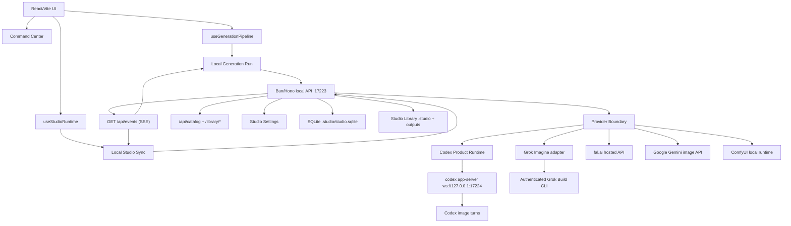

# Architecture

Codex Studio is a local-first image studio. The React/Vite UI is the main product surface, while a local Bun/Hono backend supervises `codex app-server`, persists state in SQLite, serves Studio Library assets, and emits live SSE events.

```mermaid
graph TD
    UI["React/Vite UI"] --> COMMAND["Command Center"]
    UI --> PIPE["useGenerationPipeline"]
    UI --> RUNTIME["useStudioRuntime"]
    PIPE --> RUN["Local Generation Run"]
    RUNTIME --> SYNC["Local Studio Sync"]
    RUN --> API["Bun/Hono local API :17223"]
    SYNC --> API
    API --> EVENTS["GET /api/events (SSE)"]
    EVENTS --> RUN
    EVENTS --> SYNC
    API --> CATALOG["/api/catalog + /library/*"]
    API --> SETTINGS["Studio Settings"]
    API --> DB["SQLite .studio/studio.sqlite"]
    API --> LIB["Studio Library .studio + outputs"]
    API --> PROVIDERS["Provider Boundary"]
    PROVIDERS --> CODEX["Codex Product Runtime"]
    CODEX --> CX["codex app-server ws://127.0.0.1:17224"]
    CX --> TURN["Codex image turns"]
    PROVIDERS --> GROK["Grok Imagine adapter"]
    GROK --> GCLI["Authenticated Grok Build CLI"]
    PROVIDERS --> FAL["fal.ai hosted API"]
    PROVIDERS --> GOOGLE["Google Gemini image API"]
    PROVIDERS --> COMFY["ComfyUI local runtime"]
```

## Product Shape

- **Codex-first:** the default image workflow uses the user's local Codex/ChatGPT session through `codex app-server`.
- **Local-first:** assets, SQLite state, transcripts, thumbnails, and logs live in the Studio Library, outside the repo.
- **Library-backed:** the repo contains source code and public assets; generated user data belongs in the Studio Library.
- **Provider-aware:** supported built-in providers execute behind backend adapters without changing the product center.
- **Catalog-first:** durable and UI image truth is the Image Catalog; the former workspace snapshot shape is produced only on explicit export.

## Core Frontend Seams

- `hooks/useStudioShell.ts` composes navigation, runtime, overlays, page state, catalog state, and generation state into the shell.
- `hooks/useGenerationQueueController.ts`, `hooks/useCatalogModalDetailHydration.ts`, and `hooks/useStudioReset.ts` own the cross-domain Queue, modal hydration, and reset policies; the shell only supplies their adapters.
- `hooks/useStudioRuntime.ts` aggregates backend health, onboarding, diagnostics, session verification, and readiness.
- `hooks/useLocalStudioSync.ts` mirrors jobs, logs, catalog changes, and SSE state.
- `hooks/useCatalog.ts` owns Image Catalog reads, pagination, mutations, trash, queue-result previews, and refresh scopes.
- `lib/catalogRequestGate.ts` gives Catalog replacement, pagination, filter, and detail reads generation-scoped ownership so stale responses cannot publish across view generations.
- `services/studio-api/http.ts` owns the shared typed HTTP/error boundary. Sibling modules split requests by domain: jobs, catalog, workspaces, runtime, settings, providers, recipes, output sources, maintenance, and logs.
- `services/studioEventSource.ts` owns the shared SSE connection.
- `services/localGenerationRun.ts` creates Persistent Jobs, waits for terminal state, and returns catalog-derived results.
- `lib/studioCatalogView.ts` and `lib/studioCatalogImageAdapter.ts` materialize UI images from Catalog Entries.
- `lib/studioLegacyWorkspaceSnapshotExport.ts` derives the export-only legacy workspace JSON shape from Catalog Entries; there is no browser batch store, import, or recovery path.
- `lib/catalogRenderBudget.ts`, `lib/catalogCardActionSurface.ts`, and `lib/imageGridPresentation.ts` keep hot Catalog rendering bounded while preserving card animation, hover/focus commands, and initial-viewport image discovery.
- `lib/routePreloadBudget.ts` owns idle and intent-based route preloads so Home does not import every recipe surface before user intent.
- `lib/buildStudioHeaderToolbarProps.ts` and `lib/commandCenterProjection.ts` project Command Center state.
- `components/shell/StudioViewport.tsx` demand-loads route surfaces.
- `hooks/useStyleRuntimePacks.ts` projects the Style Packs required by the current browser intent; `components/recipes/stylesData.ts` owns the shared value/promise registry and retry boundary.

## Core Backend Seams

- `apps/local-server/src/appFactory.ts` composes the local API.
- `apps/local-server/src/runtimeRoutes.ts` owns health, bootstrap config, and app-server lifecycle routes.
- `apps/local-server/src/codexRoutes.ts` owns Local Codex Session routes.
- `apps/local-server/src/jobRoutes.ts` and `apps/local-server/src/persistentJobIntake.ts` own job creation, validation, provider selection, and enqueue behavior.
- `apps/local-server/src/providerExecutionPolicy.ts` resolves effective execution fields at intake: explicit request, selected-provider default, then bootstrap fallback.
- `apps/local-server/src/catalog.ts` owns Catalog Entry persistence. `apps/local-server/src/db/` separates the SQLite connection, ordered migrations, and domain stores for workspaces, jobs, assets, settings, events/logs, and Codex turns.
- `apps/local-server/src/managedAssetPolicy.ts` validates provider assets against the captured Library root; `apps/local-server/src/workerAssetFinalizer.ts` owns recoverable file/Asset/Catalog/job finalization.
- `apps/local-server/src/eventStreamRoutes.ts` owns SSE.
- `apps/local-server/src/libraryRoutes.ts` owns local asset serving.
- `apps/local-server/src/settingsRoutes.ts` owns editable Studio Settings.
- `apps/local-server/src/providerCapabilities.ts` owns the fixed non-secret capability catalog; `apps/local-server/src/providers/runtimeConfig.ts` owns external runtime preflight; `apps/local-server/src/grokRuntimeDoctor.ts` checks the optional local Grok Build runtime and login.
- `apps/local-server/src/providers/providerInputCompiler.ts`, `apps/local-server/src/providers/externalProvider.ts`, and `apps/local-server/src/workerRouting.ts` use explicit built-in dispatch for compilation, execution, and worker selection.
- `apps/local-server/src/outputSourceRoutes.ts` owns External Output Source registration and import.

## Generation Flow

1. The user works in the UI with a prompt, recipe, attachments, provider choice, batch count, and workspace.
2. `useGenerationPipeline` delegates directly to the local generation runner; no browser queue owns or mirrors job lifecycle.
3. The runner resolves Recipe Module data, builds provider-independent Generation Task Specs, and creates Persistent Jobs.
4. The backend validates intake, captures an immutable Library Context, resolves effective provider execution policy, persists job state, and enqueues work.
5. The Provider Boundary compiles the Generation Task Spec into provider-specific input.
6. The Codex provider runs turns through `codex app-server`; Grok Imagine runs one bounded headless Grok Build session per Job; other providers run only when concrete preflight passes.
7. Completed jobs write Local Assets, Catalog Entries, transcripts, and logs into the Studio Library.
8. The UI refreshes `/api/catalog` by job id and renders catalog-derived images.
9. The legacy workspace JSON shape is derived from current Catalog Entries only when the user explicitly exports it.

## Persistence

- SQLite is the durable source of truth for jobs, cataloged assets, libraries, workspaces, settings, events, and system logs. Ordered schema migrations in `apps/local-server/src/db/migrations.ts` are recorded in `schema_migrations` and applied transactionally. Workspace is the only user-visible organization entity (`/api/workspaces`); Project routes, contracts, columns, and tables are retired.
- `StudioWorkspace` is the shared API contract. Shared Effect schemas validate Workspace and Job intake boundaries before route logic runs.
- Persistent jobs carry immutable Library identity/root context and durable finalization checkpoints. Recovery can resume file, Asset, Catalog, or job completion without duplicating records or events.
- `/api/jobs` and `/api/catalog` are summary-first hot reads; detail paths load full payloads on demand.
- The Studio Library defaults to a local user folder: `C:\Users\<user>\AI-Studio-Library` on Windows, `/Users/<user>/AI-Studio-Library` on macOS, or `/home/<user>/AI-Studio-Library` on Linux.
- Internal Studio Library state lives under `.studio/`.
- Generated outputs, thumbnails, exports, and trash assets live under `outputs/`.
- Browser storage contains bounded transient preferences and input state, not job or image truth.
- External Output Sources are read-only candidates until selected files are explicitly imported as Local Assets.

## Readiness

Studio Readiness combines:

- local backend reachability
- Studio Library health
- Codex CLI availability
- Codex Runtime Doctor path, CLI metadata, and app-server capability
- `codex app-server` lifecycle
- Local Codex Session state

The main product flow is blocked when the local Codex/ChatGPT login cannot run jobs. The default Codex flow does not require `OPENAI_API_KEY`.
Codex job intake uses this same non-secret runtime readiness signal before persisting or requeueing jobs, so known-bad local runtimes fail fast instead of creating doomed queue rows.

Optional Grok readiness is provider-scoped rather than a global onboarding
gate. Its Runtime Doctor checks the native CLI, local login, model catalog,
headless controls, and Imagine capability. Studio never reads or stores the
CLI's authentication material.

Runtime compatibility is capability-first. Runtime Doctor probes the resolved
stable launcher before fallback candidates, RPC requests have bounded
deadlines, and shutdown owns the complete launcher process tree. Passive
readiness refreshes are freshness-aware and single-flight; concurrent Local
Codex Session readers share one handshake with a one-second completed-result
window.

Backend shutdown quiesces the job worker before stopping the managed
`codex app-server`: queued jobs remain durable, active jobs receive an abort and
return to `queued`, and the existing startup recovery scan enqueues them again
on the next launch. Application exit therefore does not become a user
cancellation or leave provider work orphaned.

High-volume projections stay compact and event-driven. Job list rows use
`JobSummary` rather than full prompt-bearing jobs, catalog batch mutations emit
one scoped `catalog.batch_changed` event, and the SSE consumer coalesces batch,
revision-gap, and reconnect reconciliation.

## Provider Boundary

Generation Tasks and Generation Providers stay separate:

- Recipe Modules produce Generation Task Specs.
- Providers compile specs into Compiled Provider Inputs.
- Provider-specific secrets, SDKs, retries, and output discovery stay behind backend adapters.
- Provider Secrets stay outside SQLite-backed Studio Settings, job metadata, logs, transcripts, screenshots, and docs.
- Providers must return the same local contract: job state, Local Assets, Catalog Entries, metadata, logs, and diagnostics.
- Provider assets must already resolve to managed Library outputs, references, or masks. Raw caller-controlled filesystem paths never cross the Provider Boundary.
- Editable per-provider execution defaults contain no secrets. Explicit null clears a stored override and falls back through provider/bootstrap policy at job intake.

Current concrete adapters:

- **Codex:** primary product runtime through `codex app-server`.
- **Grok Imagine:** optional local-agent executor through the authenticated Grok Build CLI. Each image Job uses a fresh strict headless session, an exact `image_gen` or `image_edit` allowlist, no automatic retry, and a copy of the verified session image into the captured Studio Library. It requires no Studio-managed Provider Secret.
- **fal.ai:** hosted executor using `FAL_KEY` or `FAL_API_KEY` from backend env only.
- **Google Gemini image API:** hosted executor using `GOOGLE_API_KEY`, `GEMINI_API_KEY`, or `NANO_BANANA_API_KEY` from backend env only.
- **ComfyUI:** local executor using `COMFY_API_URL` or `COMFYUI_API_URL` plus `COMFY_WORKFLOW_TEMPLATE_PATH`.

## Demand-Mounted Surfaces

Heavy or optional UI should mount only when visible or explicitly requested:

- recipe pages are route-lazy;
- style catalog search mounts on demand;
- Style Pack data loads through one cached single-flight runtime registry; rejected loads are evicted so the visible retry action can recover;
- heavy catalog data, YAML parsing, ZIP export, and Three.js are lazy-loaded;
- settings, diagnostics, activity, and provider internals open from explicit surfaces;
- `ui:source:verify` and `ui:chunks:verify` guard against eager-regression imports.

## Automation Surfaces

Codex SDK and scripts are automation surfaces, not the product runtime. They support audits, migrations, verification, and maintenance:

- `storage:audit`
- `storage:compact`
- `storage:thumbnails:backfill`
- `tooling:logs:prune`
- `catalog:source:verify`
- `providers:verify`
- `recipes:verify`
- `styles:verify`
- `runtime:doctor`
- `providers:preflight`
- `ui:source:verify`
- `ui:chunks:verify`
- `library:layout:verify`
- `architecture:verify` (the aggregate Style, Recipe, Provider, Catalog, Library-layout, UI, Workspace-authority, and render-isolation gate required by CI)

## Storage Maintenance

Studio Settings exposes a demand-mounted Storage Maintenance panel backed by `/api/maintenance`. It can run storage audit, inline-payload compaction plans/writes, historical thumbnail backfill plans/writes, and tooling-log pruning without letting the browser execute arbitrary shell commands.

Storage Repair Plans are dry-run/read-only until a guarded write adapter is selected. Script commands remain the automation equivalent for agents and release checks.

## Open-Source Architecture Goals

- Keep setup local-first and Codex-first.
- Keep user assets and runtime state outside the repo.
- Keep provider secrets out of catalog metadata, logs, transcripts, screenshots, and docs.
- Prefer deep seams with small interfaces over shallow pass-through modules.
- Make diagnostics actionable for first-time users.
