# Style Category Bases Audit

Generated bases: 53/102
Missing bases: 49/102

Objective slice `pack_08..pack_11`:
- Fashion & Costume (pack_08): 5/5 generated
- Texture & Materiality (pack_09): 5/5 generated
- Abstract & Experimental (pack_10): 5/5 generated
- Miscellaneous & Fun (pack_11): 5/5 generated

## Generated

### Photography & Realism / 1. Portrait And Studio

Key: `pack_01__portrait_and_studio`

Representative presets: Studio Headshot, High Key Portrait, Environmental Portrait, Glamour Shot, Selfie Style, Soft Editorial Window, Golden Hour, Blue Hour, Butterfly Lighting, Candlelight, God Rays (Volumetric), Bioluminescence

Review: PENDING

### Photography & Realism / 2. Lighting Techniques

Key: `pack_01__lighting_techniques`

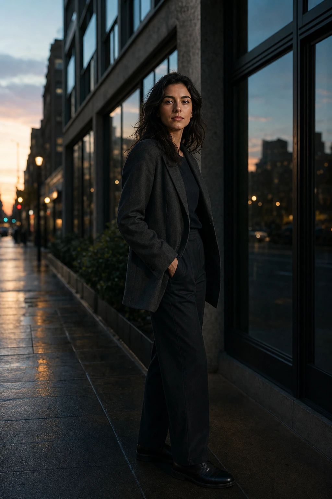

Representative presets: Low Key Portrait, Silhouette Portrait, Double Exposure Portrait, Rembrandt Lighting, Ring Light, Hard Flash, Projector Light, Neon Noir, Split Lighting, Silhouette (Backlit), Strobe Light, Light Painting

Review: PENDING

### Photography & Realism / 3. Film And Analog Process

Key: `pack_01__film_and_analog_process`

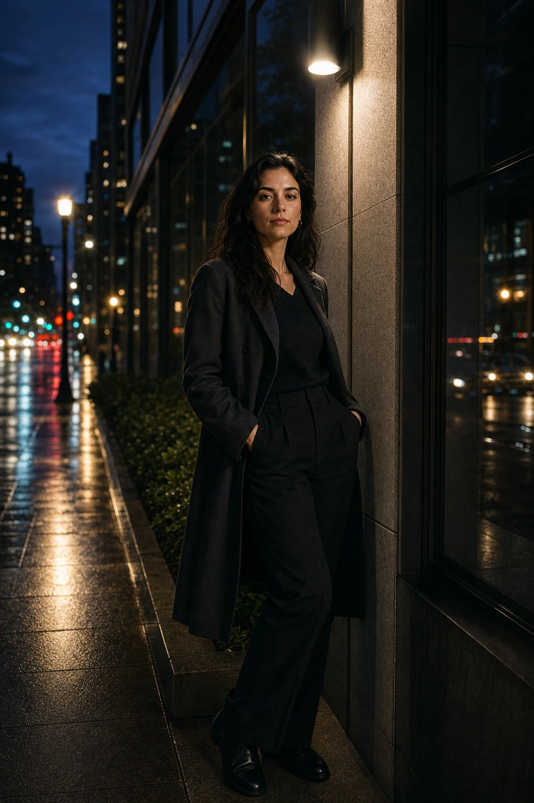

Representative presets: Cinematic Close-up, Cinestill 800T, Ilford HP5 Plus, Kodachrome 64, Kodak Portra 400, Fujifilm Velvia 50, Polaroid 600, Lomo LC-A, Infrared Film, Expired Film, Concert Photography, Large Format (4x5)

Review: PENDING

### Photography & Realism / 4. Documentary And Street

Key: `pack_01__documentary_and_street`

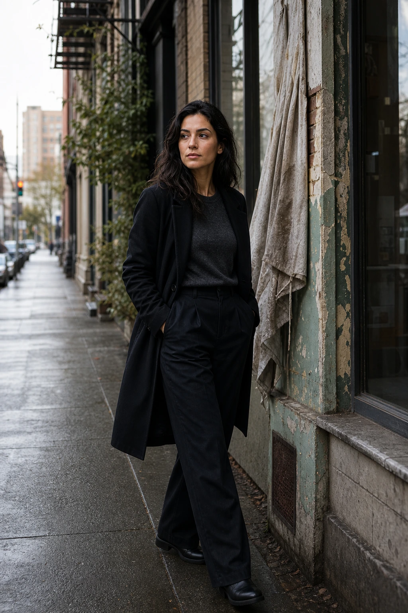

Representative presets: Candid Street Portrait, Street Photography, Urbex (Urban Exploration)

Review: PENDING

### Photography & Realism / 5. Commercial And Product

Key: `pack_01__commercial_and_product`

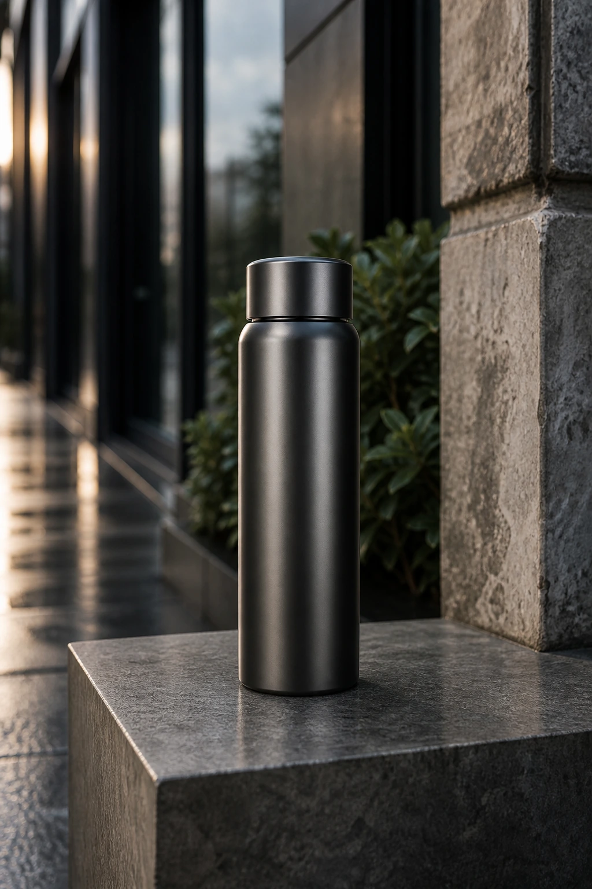

Representative presets: Product Photography, Seamless Packshot, Luxury Macro Gleam, Cosmetic Gloss Still Life, Tech Hardware Hero, Cold Condensation Commercial, E-Commerce White Sweep

Review: PENDING

### Photography & Realism / 6. Nature And Wildlife

Key: `pack_01__nature_and_wildlife`

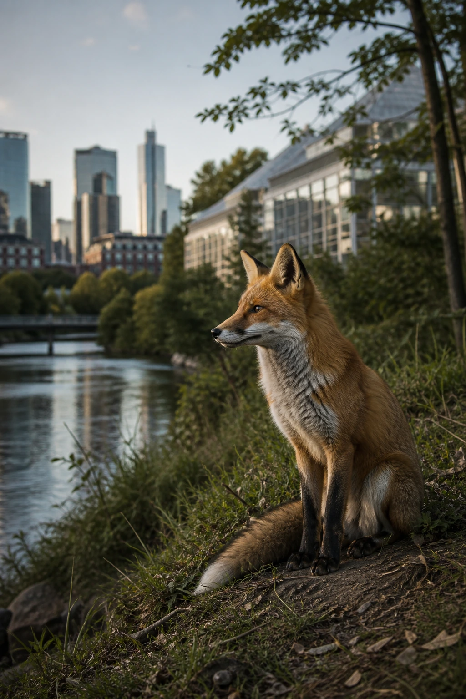

Representative presets: Food Photography, Wildlife Photography, Landscape (Ansel Adams), Abstract Photo, GoPro Wide, Drone Aerial, Thermal Camera

Review: PENDING

### Cinematic & Media / 1. Cinematic Lighting And Lenses

Key: `pack_02__cinematic_lighting_and_lenses`

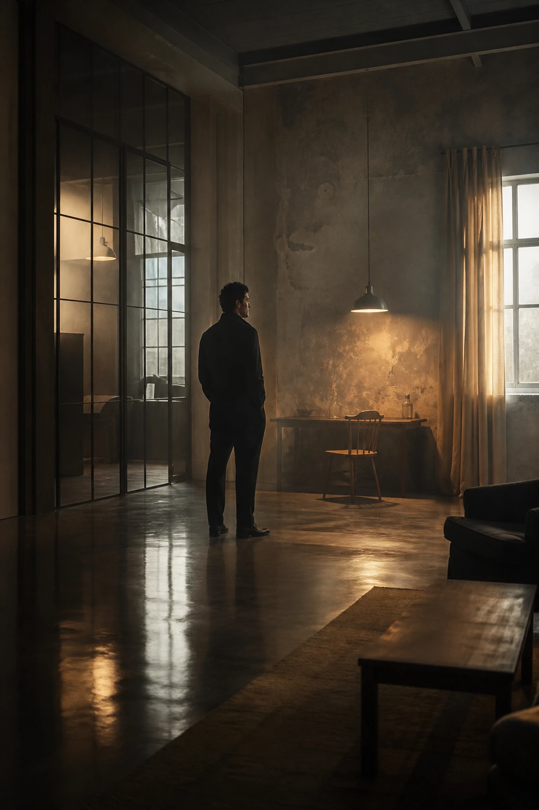

Representative presets: Blockbuster Teal & Orange, French New Wave, Found Footage Horror, Kung Fu Studio Epic (Shaw Brothers), Kaiju Movie (Suitmation), Spaghetti Western, Giallo Horror, Space Opera (70s), Film Noir, Silent Film, Mumblecore, Wes Anderson Symmetrical Storybook Cinema

Review: PENDING

### Cinematic & Media / 3. Broadcast And Tv Look

Key: `pack_02__broadcast_and_tv_look`

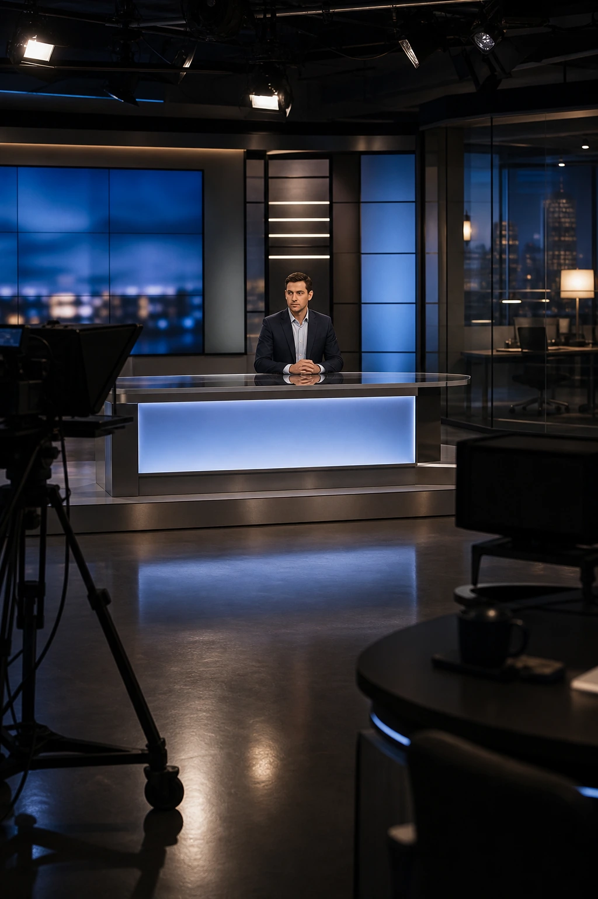

Representative presets: Home Movies - Marker-Edge Improvised Sitcom, Analog Sitcom Multicam, Local News Chroma Key Package, Public Access Cable Crawl, VHS Sports Replay Broadcast, Weather Radar Doppler Graphic, Late Night Infomercial Gloss, Interlaced Music Video Glow, Emergency Broadcast Signal Break

Review: PENDING

### 3D & CGI Rendering / 1. Hard Surface And Industrial Cgi

Key: `pack_03__hard_surface_and_industrial_cgi`

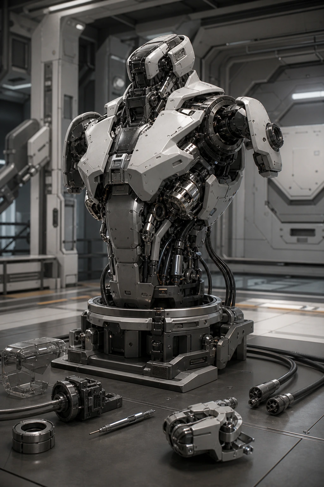

Representative presets: X-Ray Shader, Nurbs Surface, Kitbash, Glassmorphism UI, Neon Sign 3D, Hard Surface Modeling, Cybernetic Implant

Review: PENDING

### 3D & CGI Rendering / 2. Organic And Character Cgi

Key: `pack_03__organic_and_character_cgi`

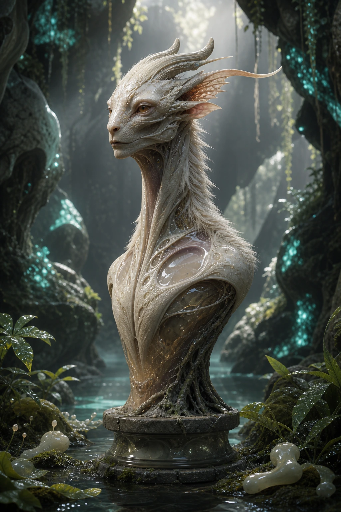

Representative presets: Liquid Simulation, Fur & Hair, Global Illumination, Volumetric Fog, Bioluminescent Forest, Metaballs, Glitch 3D, NFT Collectible Avatar Render, 3D Typography, Exploded View, Balloon Art (Inflatable), Origami 3D

Review: PENDING

### 3D & CGI Rendering / 3. Environment And Worldbuilding

Key: `pack_03__environment_and_worldbuilding`

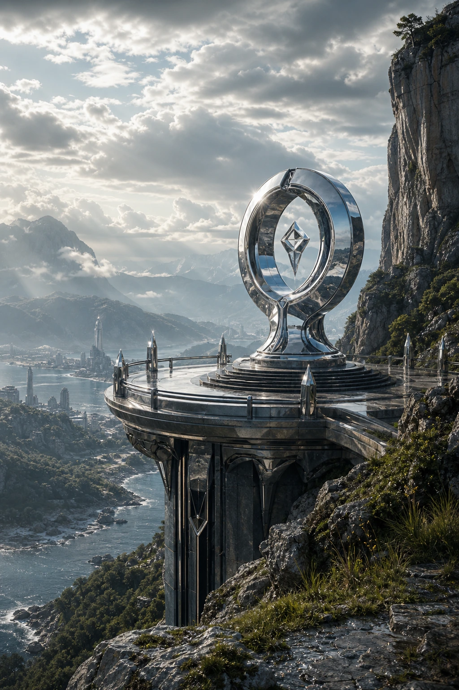

Representative presets: Chrome & Metal, HDRI Environment, God Rays (Volumetric), 3D Scan (Photogrammetry), Virtual Reality Environment, Jewelry Render, 3D Map

Review: PENDING

### 3D & CGI Rendering / 4. Lookdev And Render Pipelines

Key: `pack_03__lookdev_and_render_pipelines`

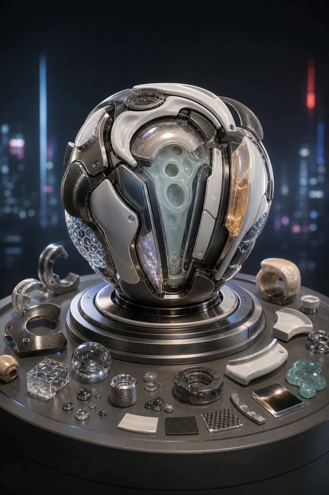

Representative presets: Claymation (Stop Motion), Subsurface Scattering (SSS), Glass & Crystal, Slime & Goo, Hologram, Porcelain, Carbon Fiber, Studio Lighting (3 Point), Rim Lighting, Caustics, Ambient Occlusion Pass, Diorama Lighting

Review: PENDING

### 3D & CGI Rendering / 5. Stylized 3d

Key: `pack_03__stylized_3d`

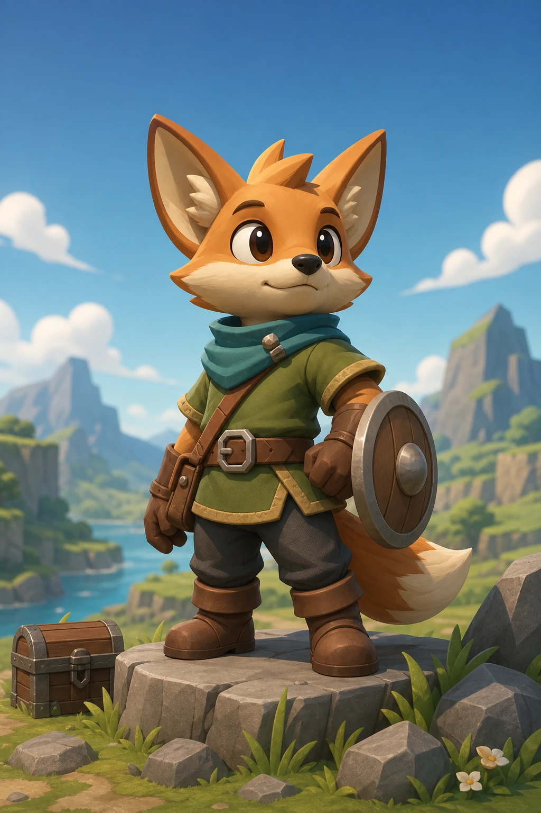

Representative presets: Toon Shader (Cel Shaded), Low Poly

Review: PENDING

### Illustration & Graphic Novel / 1. Comics And Graphic Novel

Key: `pack_04__comics_and_graphic_novel`

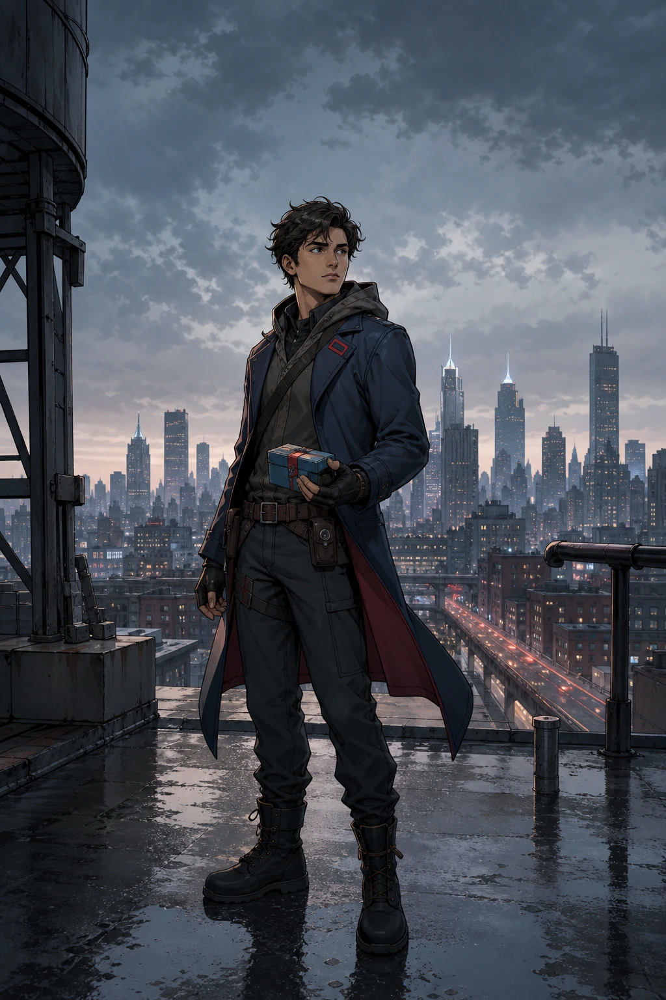

Representative presets: Manga (Shonen), Graphic Novel (Painted), Webtoon Style, Golden Age Comic, Modern Superhero (Digital), Franco-Belgian (Ligne Claire), Silver Age Comic, Manga (Shojo), Sin City Noir Comic (High Contrast), Tech Noir Comic, Junji Ito Horror Manga (Obsessive Ink), Moebius Retro Sci-Fi Comic (Dreamline)

Review: PENDING

### Illustration & Graphic Novel / 2. Editorial Illustration

Key: `pack_04__editorial_illustration`

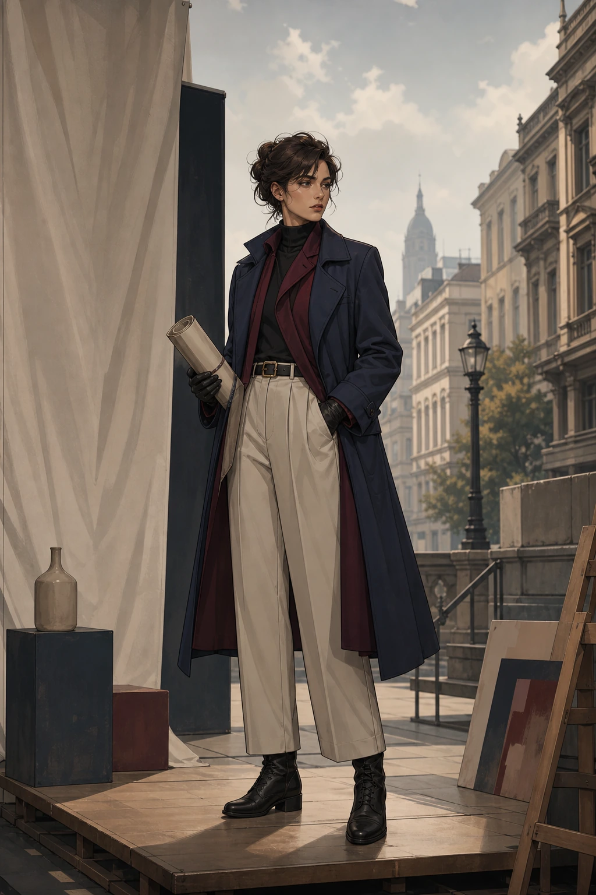

Representative presets: Pulp Magazine Cover, Fashion Illustration, Album Cover (Surreal), Infographic, Weapon Design, Character Sheet

Review: PENDING

### Illustration & Graphic Novel / 3. Childrens And Educational

Key: `pack_04__childrens_and_educational`

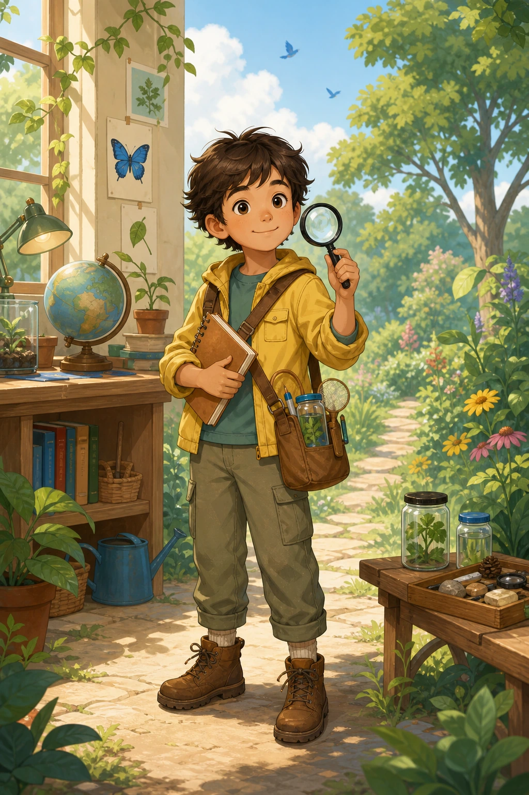

Representative presets: Chibi Style, Risograph Print, Watercolor Storybook, Paper Cutout (Collage), Whimsical Ink, Gouache Illustration, Scientific Botanical, Kurzgesagt Vector Flat (Infographic), Architecture Massing Model, Material Texture Exploration Sheet, Monster Size Comparison Chart, Anatomy Reference Sheet

Review: PENDING

### Illustration & Graphic Novel / 4. Printmaking And Ink

Key: `pack_04__printmaking_and_ink`

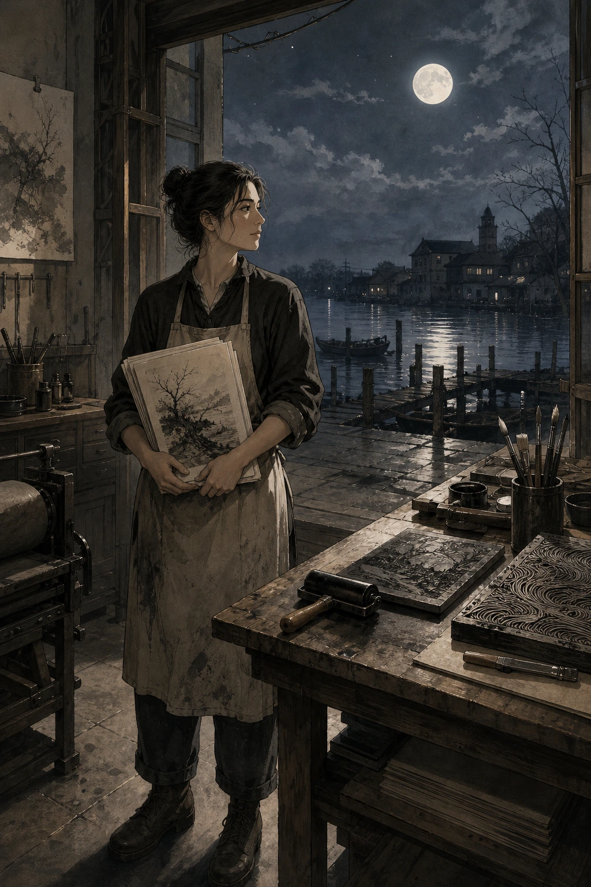

Representative presets: Scratchboard, Composition Thumbnail Grid, UI/HUD Wireframe Concept, Creature Design Iteration, Etching (Engraving), Lithograph, Monotype, Linocut Print, Hokusai Woodcut (Floating World), Brush Pen Ink

Review: PENDING

### Illustration & Graphic Novel / 5. Fantasy And Concept Illustration

Key: `pack_04__fantasy_and_concept_illustration`

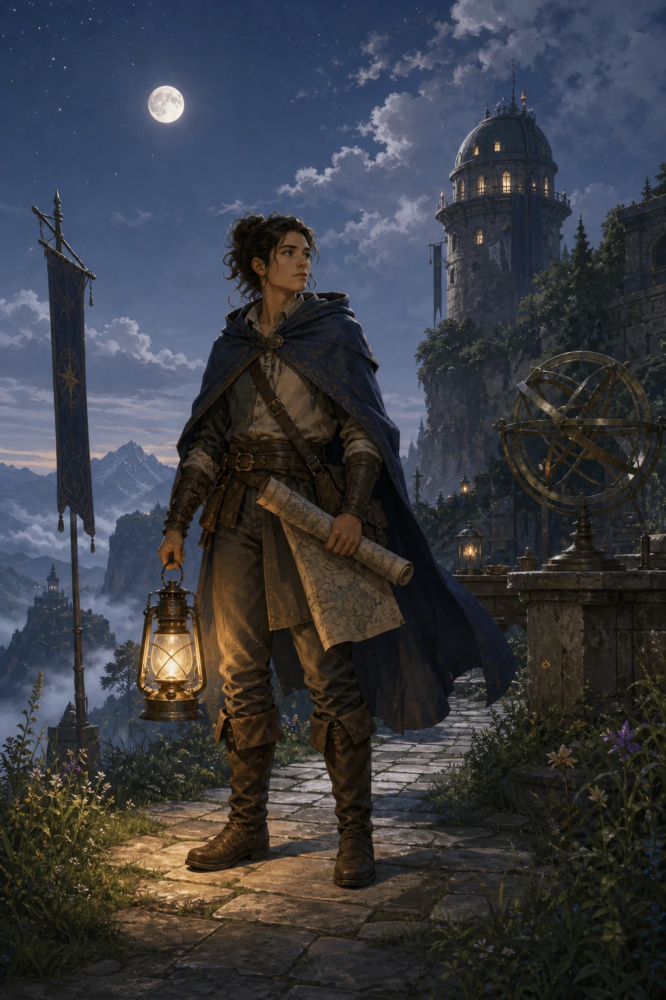

Representative presets: Felt Tip Marker, Pop-Up Book, Chalk Pastel, Crayon Drawing, Colored Pencil, Claymation Style, Sticker Art, Movie Poster (Painted), Travel Poster (Vintage), Art Deco Poster, Mucha Art Nouveau Poster, Propaganda Poster

Review: PENDING

### Anime 01 — Anime Battle & Worlds / 1. Modern Shonen & Action

Key: `pack_05__modern_shonen_and_action`

Representative presets: Bright Hero Academy, Mashle - Brickwall Comedy Spell-School Brawl, Sakamoto Days - Convenience-Store Assassin Sprint, Gritty Urban Curses, Gritty Wallbound Survival, Colossal War Drama, Tactical Adventure Shonen, Demon Slayer - Lantern Bloodline Sword Ballet, Blue Lock - Predator-Ego Sports Assault, Bleach: Thousand-Year Blood War - Royal Black Blade Opera, Wind Breaker - Delinquent Street Protector Rush, Undead Unluck - Rule-Breaker Curse Impact

Review: PENDING

### Anime 01 — Anime Battle & Worlds / 7. Mecha & Cyberpunk

Key: `pack_05__mecha_and_cyberpunk`

Representative presets: Geometric Ignition Urgency, Municipal Machine Procedure, Sterile Arcology Severity, White Machine Elegy, Compact Attrition Hardware, Tokusatsu Digital Grid Scale, Tri-Fire Riot Geometry, Neon Kinetic Alloy Sprint, Surveillance Verdict Grid, Luminous Beam Opera, Gothic Tech Existential Dread, Sleek Collapse Romance

Review: PENDING

### Anime 01 — Anime Battle & Worlds / 8. Isekai & High Fantasy

Key: `pack_05__isekai_and_high_fantasy`

Representative presets: Frieren – Afterquest Melancholy Fantasy, Shield Hero – Defensive Underdog Fantasy, Delicious in Dungeon - Stove-Top Monster Cuisine, Campfire Cooking in Another World - Merchant Road Stew, Tsukimichi - Moonlit Merchant Wanderer, Handyman Saitou in Another World - Toolbox Party Quest, Ranking of Kings - Storybook Crown Courage, Princess Connect! Re:Dive - Banquet Quest Pastel, Sword Art Online – Glowing VR Adventure, Re:Zero – Reset-Loop Dark Fantasy, Mushoku Tensei – Wandering Mage Chronicle, Konosuba – Party-Quest Comedy

Review: PENDING

### Anime 01 — Anime Battle & Worlds / 9. Dark Fantasy & Seinen

Key: `pack_05__dark_fantasy_and_seinen`

Representative presets: Mineral Loneliness Fracture Style, Eclipse Scar Weight Style, Moral Suspicion Realism Style, Black Signal Nihilism Style, Clinical Innocence Rupture Style, Rose-Black Baroque Decadence Style, Black Particle Fugitive Style, Blood-Ink Severance Style, Neon Despair Pressure Style, Smoke-Filled Calculation Style, Cursed Severance Compassion Style, Sun-Reclaimed Concrete Mystery Style

Review: PENDING

### Anime 01 — Anime Battle & Worlds / 3. Action

Key: `pack_05__action`

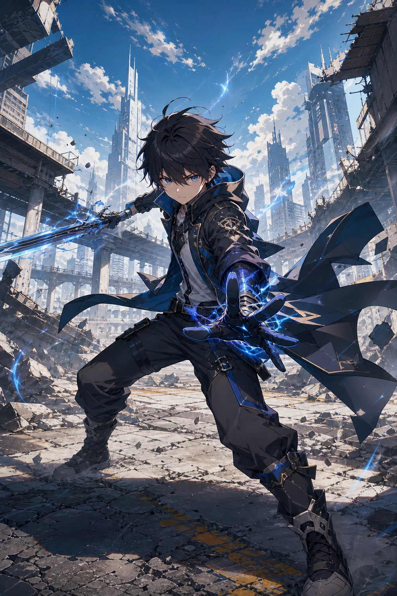

Representative presets: Action Burst Alley Rush, Vertigo Energy Cross Style, Neon Vector Discharge Style, Monumental Impact Burst Style, Upward Thunder Momentum Style

Review: PENDING

### Anime 02 — Anime Character & Lifestyle / 4. Shojo, Magical Girl & Visionary Classics

Key: `pack_13__shojo_magical_girl_and_visionary_classics`

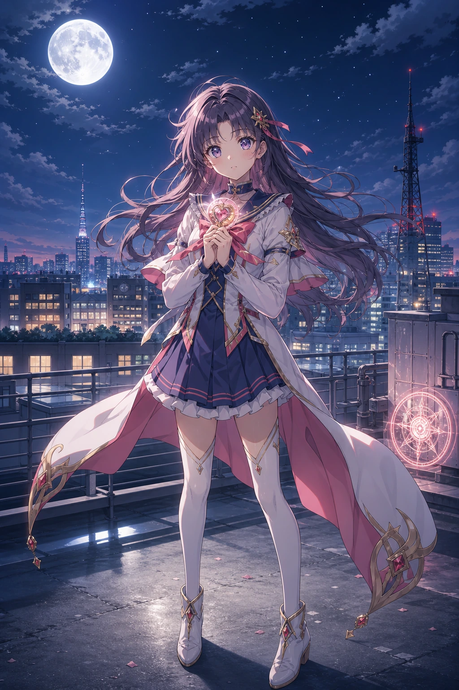

Representative presets: Psychological Biomech Drama, Sailor Moon - Moonlit Ribbon Justice, Neon Genesis Evangelion - Red Alert Psychological Collapse, Slayers - Arcane Chaos Roadtrip, The Vision of Escaflowne - Tarot Mecha Fantasy, Magic Knight Rayearth - Jewel Armor Quest, Martian Successor Nadesico - Cheerful Bridge-Deck Mecha, Blue Seed - Mythic Tokyo Purge, Wired Existential Glitch, Dream Card Enchanter, Kimi ni Todoke - Shy Hallway Bloom, Ao Haru Ride - Clean Uniform Reunion Ache

Review: PENDING

### Anime 02 — Anime Character & Lifestyle / 5. Slice of Life & Moe

Key: `pack_13__slice_of_life_and_moe`

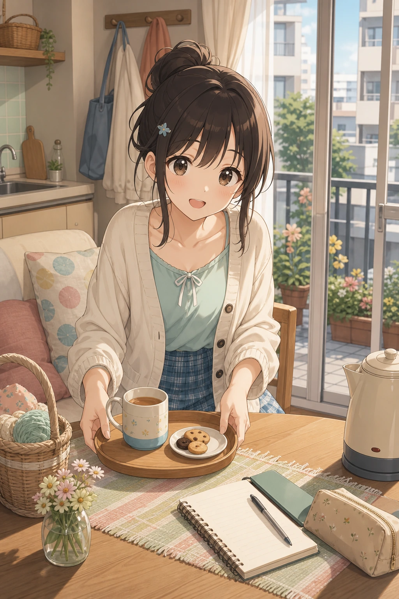

Representative presets: KyoAni Shared-Warmth Microacting, Market-Festival Community Softness, Beginner-Made DIY Glow, Cold-Warm Restorative Comfort, Deadline-Cheer Workflow Density, Utilitarian Quiet-Freedom Minimalism, Looped-Routine Healing Pastel, Bundled Warmth Pocket, Rough-Ideation Motion Overlay, Deadpan-Explosion Absurd Timing, Low-Stakes Banter Flatness, Ordinary-Cosmic Whimsy Pivot

Review: PENDING

### Anime 02 — Anime Character & Lifestyle / 12. Anime Style Spectrum

Key: `pack_13__anime_style_spectrum`

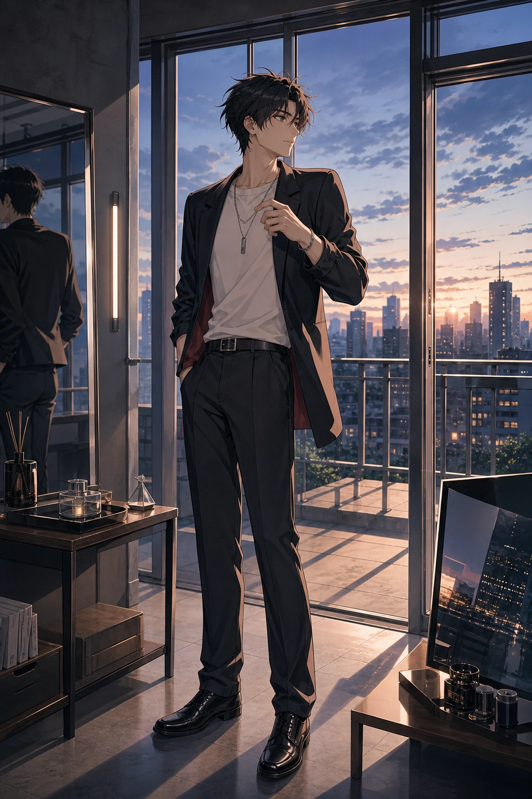

Representative presets: Elastic Rom-Com Slapstick Timing, Prism-Glamour Transformation Polish, Chrome Impact Spectacle, Emergency Storyboard Tension, Adult Suspense Microgesture, Reality-Slip Reflection Continuity, Hiroyuki Okiura - Quiet Human Naturalism, Haruko Ichikawa - Mineral Void Serenity, Hiromu Arakawa - Mechanical Warmth Ensemble, Retrofuture Distance Melancholy, Kinetic Impact-Line Choreography, Takeshi Koike - Razorline Velocity Poster

Review: PENDING

### Anime 02 — Anime Character & Lifestyle / 1. Core Anime

Key: `pack_13__core_anime`

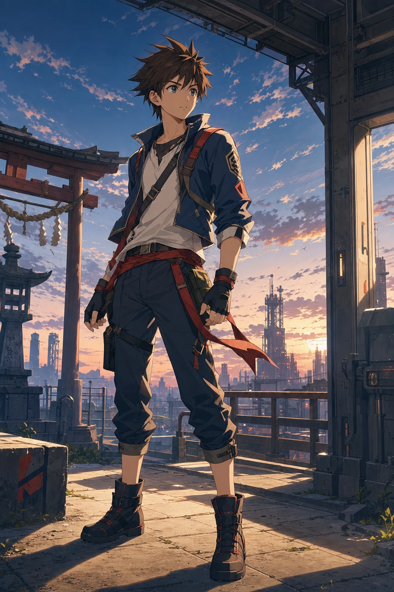

Representative presets: Cel Heroic Dawn, Neon City Vigil, Mecha Hangar Ignition, Spirit Shrine Twilight, Sports Climax Arena, Gothic Vampire Manor, Magical Girl Prism Burst, Isekai Forest Caravan, Meikyuu Dungeon Glow, Retro Mecha VHS Grain, Ronin Alley Duel, Battle Mage Stormcast

Review: PENDING

### Anime 02 — Anime Character & Lifestyle / 2. Slice of Life / School / Music

Key: `pack_13__slice_of_life_school_music`

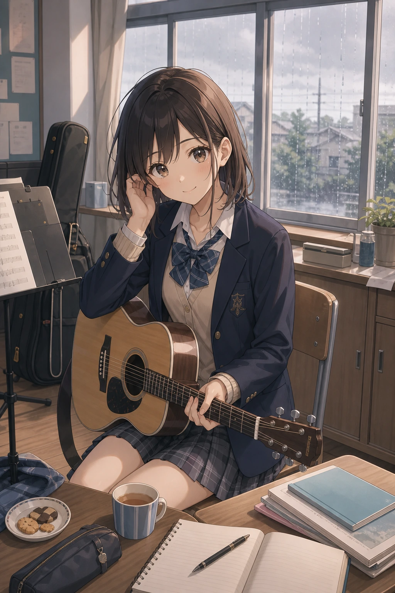

Representative presets: Soft Shojo Spring, Rainy Slice of Life, Rainy Idol Backstage, Dessert Cafe Comedy, Festival Lantern Summer

Review: PENDING

### Essential Art Styles / 4. Digital Art

Key: `pack_06__digital_art`

Representative presets: Digital Painting, Matte Painting Extension, Concept Art, Low Poly, Speedpaint, Isometric, Double Exposure, Paper Cutout (Digital), Pixel Art (16-bit), Synthwave, ASCII Art, Glitch Art

Review: PENDING

### Essential Art Styles / 1. Traditional Painting

Key: `pack_06__traditional_painting`

Representative presets: Oil Painting (Classic), Casein Paint, Acrylic (Modern), Watercolor (Soft), Gouache (Flat), Tempera (Egg), Encaustic (Wax), Fresco (Wall), Impressionist Oil, Pointillism, Palette Knife, Spray Paint (Aerosol)

Review: PENDING

### Essential Art Styles / 2. Drawing & Sketching

Key: `pack_06__drawing_and_sketching`

Representative presets: Ink (Pen & Ink), Marker (Copic), Graphite Pencil, Charcoal (Expressive), Colored Pencil, Pastel (Soft), Chalk Dust Drawing, Scratchboard, Silhouette, Continuous Line, Ballpoint Pen, Oil Pastel

Review: PENDING

### Essential Art Styles / 5. Mixed Media

Key: `pack_06__mixed_media`

Representative presets: Assemblage, Embroidery on Photo, Coffee Painting, Trash Polka, Zine Aesthetic, Moodboard Color Story, Pinned Planning Board, Torn Paper Mosaic, Tape Art, Paint over Photo, Gold Leaf Art, Stencil Art

Review: PENDING

### Essential Art Styles / 3. Printmaking

Key: `pack_06__printmaking`

Representative presets: Etching, Linocut, Woodcut, Screenprint (Serigraphy), Monotype, Aquatint, Mezzotint, Rubber Stamp, Security Engraving, Drypoint, Risograph, Halftone (Newspaper)

Review: PENDING

### Fashion & Costume / 2. Subcultures

Key: `pack_08__subcultures`

Representative presets: Boho Festival, Streetwear Hypebeast, Field Utility Textile, Cottagecore, Rockabilly, Pastel Goth, Punk Rock, Dark Academia, Road-Worn Biker Leather, Skater Style, Raver (90s), Lolita Fashion

Review: PENDING

### Fashion & Costume / 1. Contemporary Fashion

Key: `pack_08__contemporary_fashion`

Representative presets: Haute Couture, Red Carpet Gown, Business Casual, Athleisure Sport, Tech-Industry Uniform, Pop-Performance Tailoring, Minimalist Chic, Normcore, Preppy Ivy League

Review: PENDING

### Fashion & Costume / 3. Historical & Fantasy

Key: `pack_08__historical_and_fantasy`

Representative presets: Ancient Egyptian, Frontier Workwear, Samurai Armor, Renaissance Royal, Victorian Mourning, Vintage 1950s, Roaring 20s (Flapper), Roman Ceremonial Regalia, Disco (70s), French Revolution, Norse Seafaring Regalia

Review: PENDING

### Fashion & Costume / 4. Fantasy Sci-Fi Costume

Key: `pack_08__fantasy_sci_fi_costume`

Representative presets: Space Suit (Retro), Convention Craft Costume, Ethereal Fantasy, Steampunk Engineering Attire, Technical Modular Outerwear, Refractive Concealment Veil, Neon Light Suit, Hologram, Shadow Form, Wizard Robes, Zombie Survivor, Space Opera Royal

Review: PENDING

### Fashion & Costume / 5. Fabric & Texture Focus

Key: `pack_08__fabric_and_texture_focus`

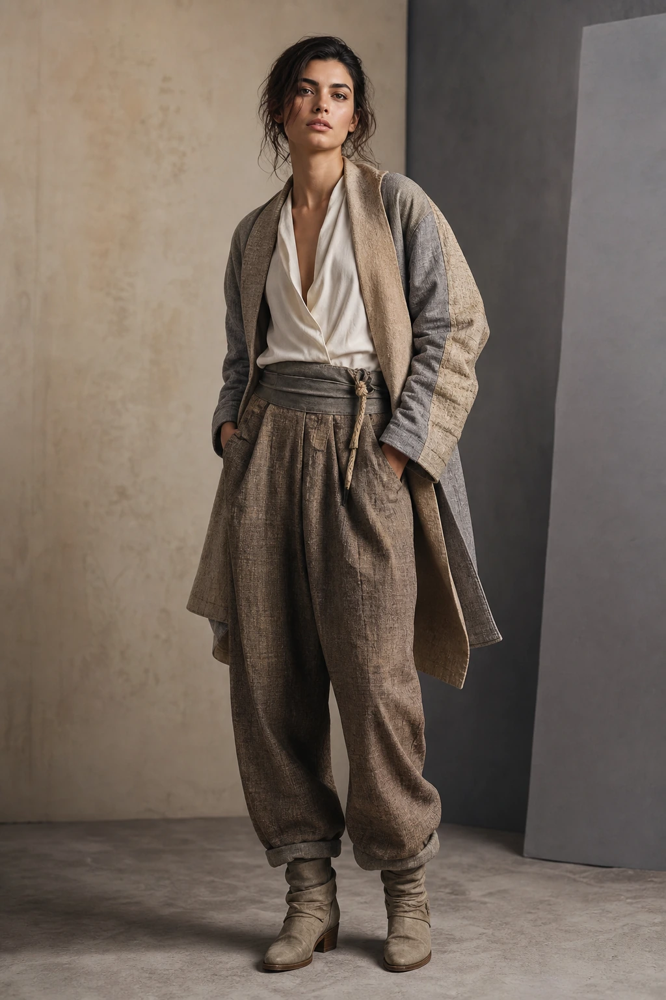

Representative presets: Stone Statue, Denim on Denim, High-Gloss Polymer, Fur Coat, Liquid Satin Drape, Transparent Plastic, Body Paint, Tweed Suit, Tattoo Skin, Leather Armor, Bandage/Mummy, Burlap/Rags

Review: PENDING

### Texture & Materiality / 1. Metals And Minerals

Key: `pack_09__metals_and_minerals`

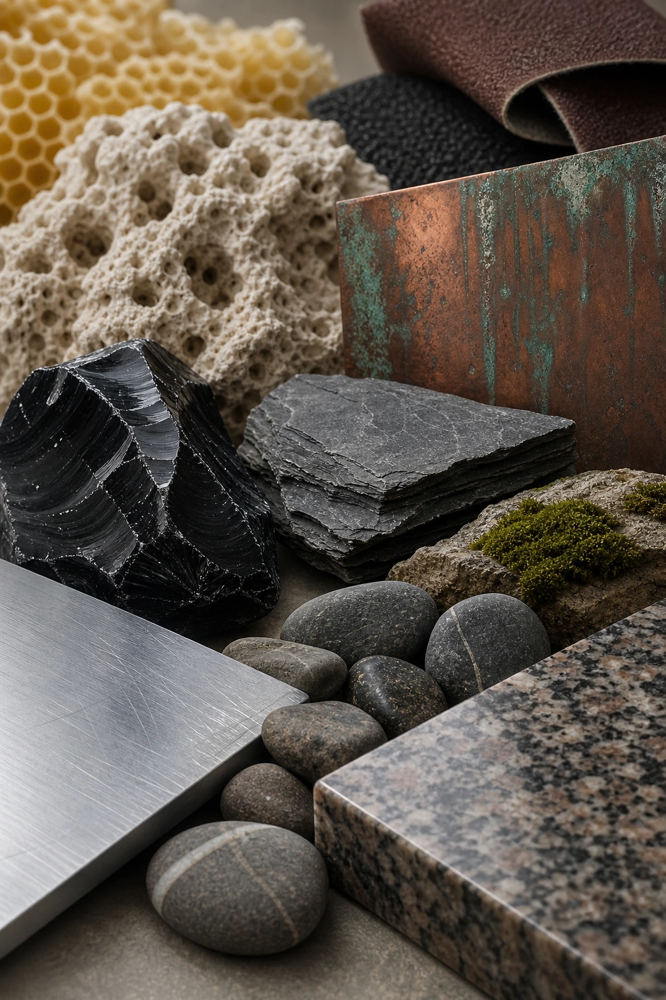

Representative presets: Birch Bark, Granite (Polished), Slate (Split), Mossy Rock, River Stones, Obsidian, Coral Reef, Honeycomb Wax, Gold Leaf, Copper Patina, Brushed Aluminum, Rusty Iron

Review: PENDING

### Texture & Materiality / 2. Organic And Bio Materials

Key: `pack_09__organic_and_bio_materials`

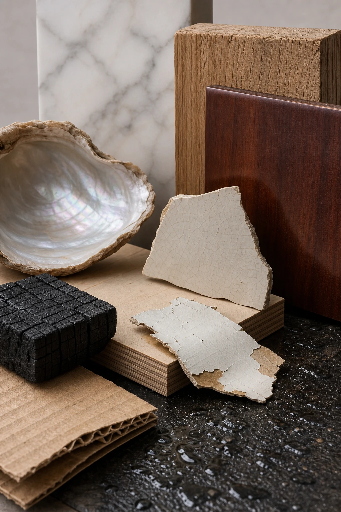

Representative presets: Marble (Carrara), Oak Wood (Raw), Mahogany (Polished), Snake Scales, Porcelain (Cracked), Latex (Shiny), Cardboard, Asphalt (Wet), Peeling Paint, Burnt Wood (Shou Sugi Ban), Fire & Magma, Mother of Pearl

Review: PENDING

### Texture & Materiality / 3. Fabric And Soft Materials

Key: `pack_09__fabric_and_soft_materials`

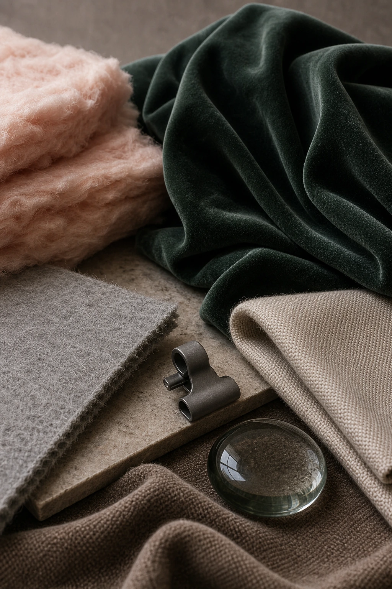

Representative presets: Velvet Fabric, Felt Fabric, Fiberglass Insulation

Review: PENDING

### Texture & Materiality / 4. Surface Wear And Aging

Key: `pack_09__surface_wear_and_aging`

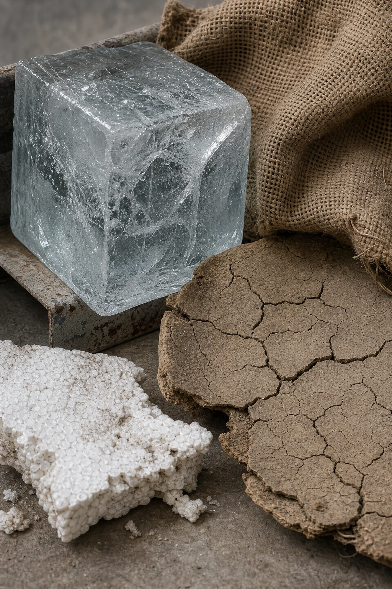

Representative presets: Glacier Ice, Burlap Sack, Mud (Cracked), Polystyrene (Styrofoam)

Review: PENDING

### Texture & Materiality / 5. Fx And Procedural Materiality

Key: `pack_09__fx_and_procedural_materiality`

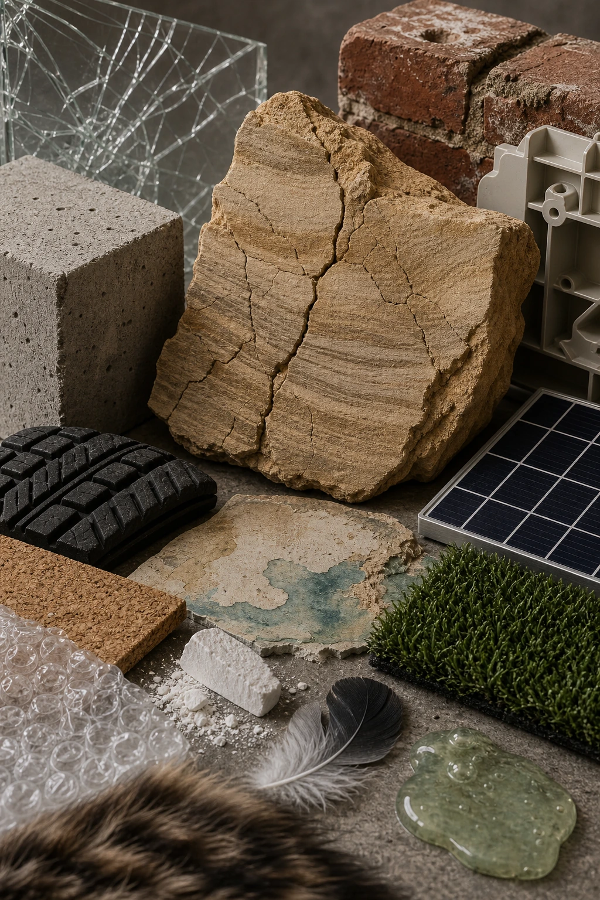

Representative presets: Sandstone (Rough), Wolf Fur, Bird Feathers, Glass (Shattered), Carbon Fiber (Forged), Concrete (Raw), Brick Wall (Aged), Plastic (Injection Molded), Rubber (Tire), Fur (Synthetic), Chalk (Dry), Slime/Goo

Review: PENDING

### Abstract & Experimental / 1. Geometric Abstraction

Key: `pack_10__geometric_abstraction`

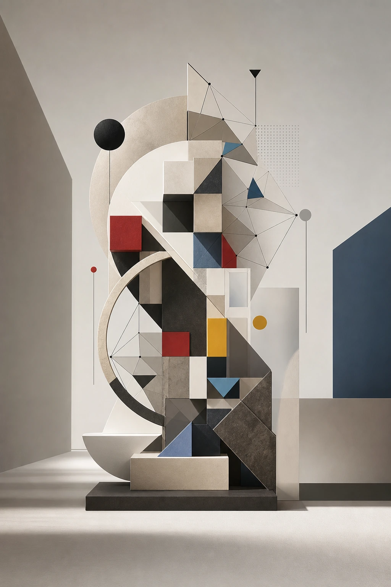

Representative presets: Cubism, Mondrian (De Stijl), Bauhaus Style, Constructivism, Op Art (Optical), Suprematism, Islamic Geometric, Voronoi Pattern, Low Poly Abstract, Fractal Geometry

Review: PENDING

### Abstract & Experimental / 2. Fluid & Organic

Key: `pack_10__fluid_and_organic`

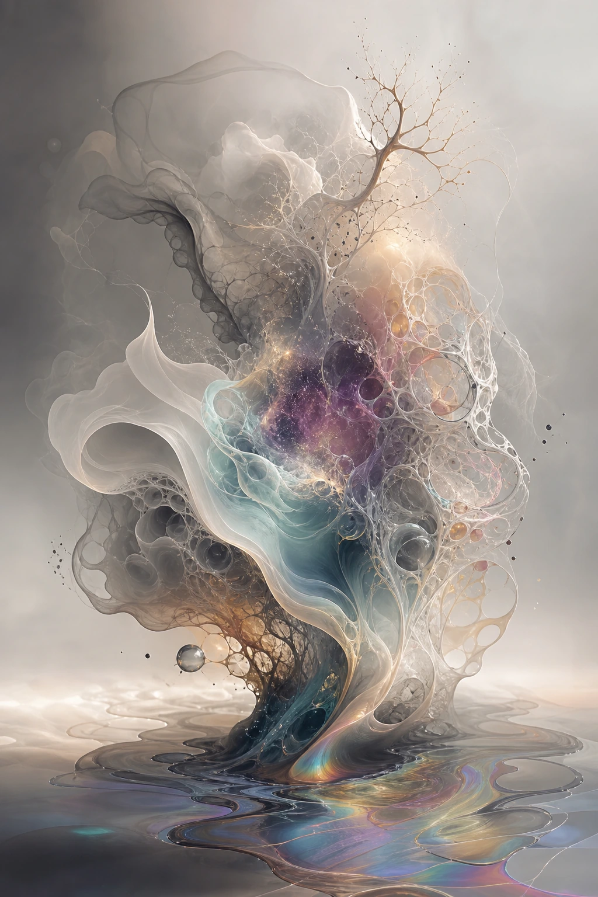

Representative presets: Smoke Photography, Ferrofluid, Acrylic Pour, Reaction Diffusion, Cymatics (Sound), Nebula Cloud, Alcohol Ink, Macro Bubble, Mycelium Network, Oil Slick

Review: PENDING

### Abstract & Experimental / 5. Pattern & Texture

Key: `pack_10__pattern_and_texture`

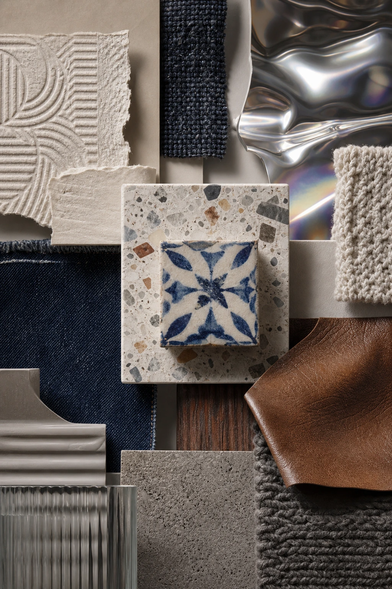

Representative presets: Azulejo Tile, Damask Pattern, Houndstooth, Terrazzo, Carbon Fiber, Tartan (Plaid), Leather Texture, Letterpress, Mosaic (Tile), Paisley Pattern, Camouflage, Tie Dye

Review: PENDING

### Abstract & Experimental / 4. Surrealism & Dream

Key: `pack_10__surrealism_and_dream`

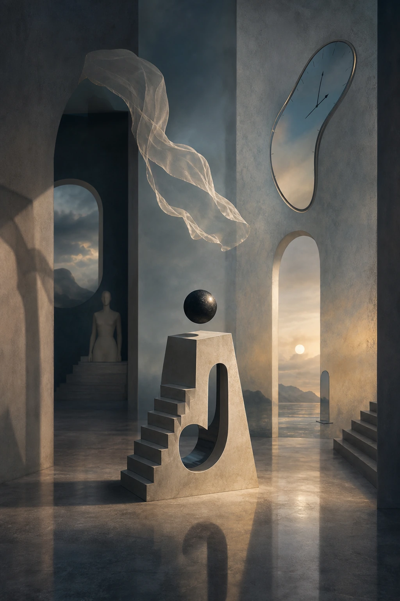

Representative presets: Surrealism (Dali), Dreamcore, Magical Realism, Lowbrow (Pop Surrealism), Vaporwave, Biomechanical (Giger), Liminal Space, Psychedelic Art, Double Exposure, Escher Style, Solarpunk, Weirdcore

Review: PENDING

### Abstract & Experimental / 3. Digital Glitch & Noise

Key: `pack_10__digital_glitch_and_noise`

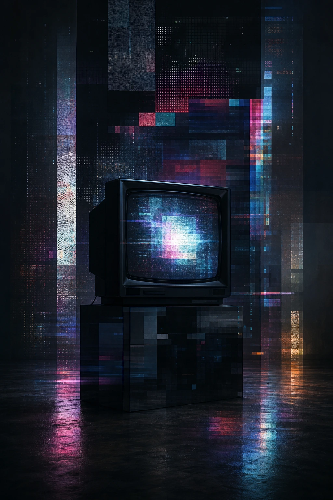

Representative presets: Datamosh, Chromatic Aberration, Pixel Sorting, ASCII Art, JPEG Artifacts, Scanography, VHS Glitch, CRT Monitor, Halftone Pattern, Dithering (1-bit)

Review: PENDING

### Miscellaneous & Fun / 1. Toys And Miniatures

Key: `pack_11__toys_and_miniatures`

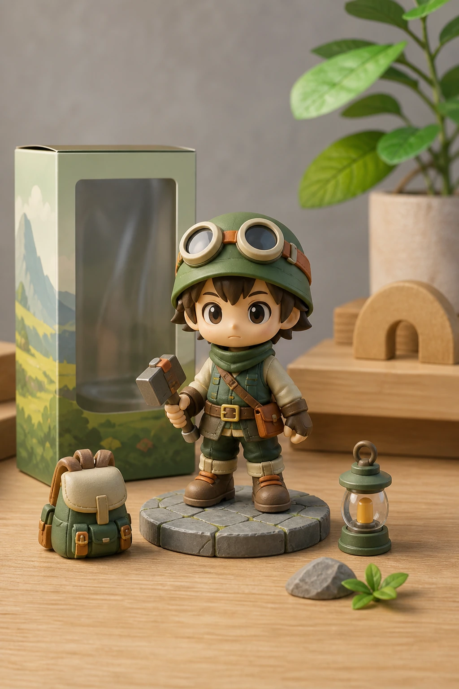

Representative presets: Cocktail Macro, Action Figure (90s), Lego Toy Brick Build, Funko Pop Vinyl Collectible Figure, Clay Stop-Motion Comedy, Tin Toy, Diorama Box, Plushie, Amigurumi Crochet, Wooden Toy, Button Eye Doll, Sticker Art

Review: PENDING

### Miscellaneous & Fun / 2. Food And Commercial Fun

Key: `pack_11__food_and_commercial_fun`

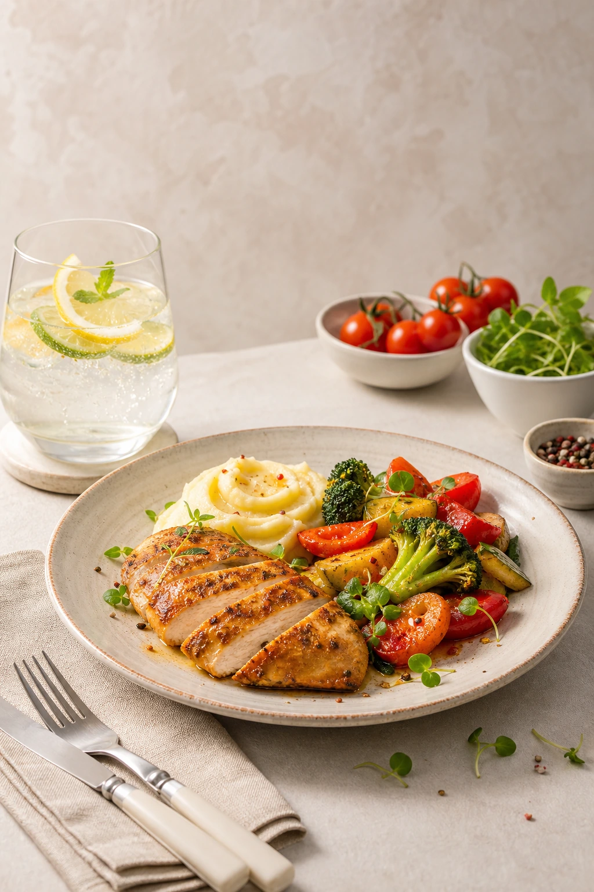

Representative presets: Fast Food Commercial, Michelin Fine-Dining Editorial, Pizza Melt, Chocolate Flow, Bento Box, Candy Land, Emoji 3D, Kawaii Pastel

Review: PENDING

### Miscellaneous & Fun / 3. Science And Bio Curiosities

Key: `pack_11__science_and_bio_curiosities`

Representative presets: Play-Doh Clay, Mosaic Tile, Embroidery, X-Ray, Solarpunk, Dieselpunk, Steampunk, Gothic Horror, Biopunk, Snowflake, Fungi/Mold, Electron Microscope

Review: PENDING

### Miscellaneous & Fun / 4. Retro Pop And Kitsch

Key: `pack_11__retro_pop_and_kitsch`

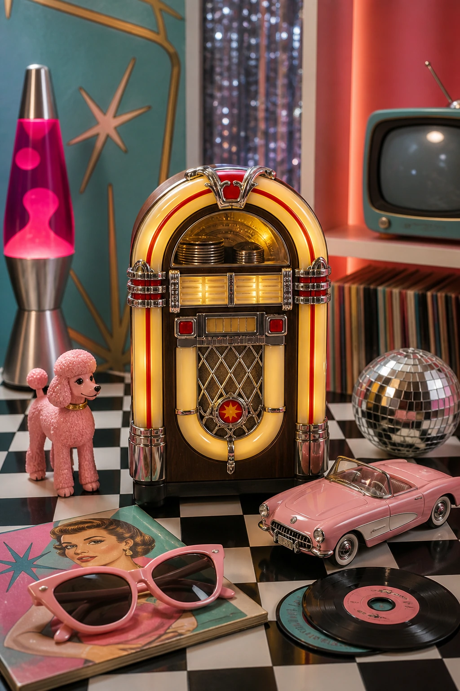

Representative presets: Felt Signal Handmade Broadcast, Gas-Tube Halo Typography, Aerosol Velocity Layering, Indexed Pixel Constraint, Silkscreen Icon Impact, Liminal Consumer Vapor, Liquid Optic Recursion, Postmodern Pattern Clash, Chrome Horizon Voltage, Holographic Flake Scatter

Review: PENDING

### Miscellaneous & Fun / 5. Oddities And Novelty

Key: `pack_11__oddities_and_novelty`

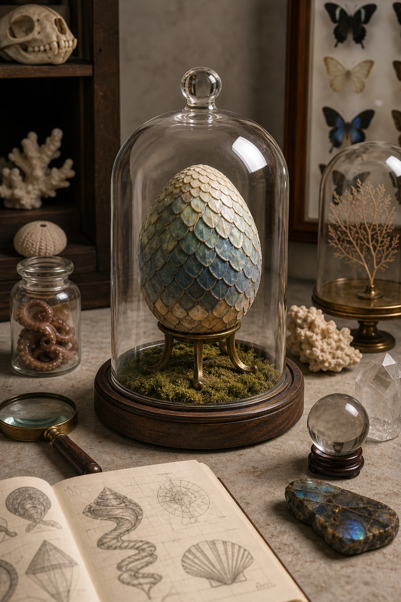

Representative presets: Bakery Window, Fruit Explosion, Sushi Platter, Papercraft Low Poly, Balloon Art, Stained Glass, Latte Art, Chalkboard Art, Sand Art, Ice Carving, Tattoo Flash (Old School), Blueprint

Review: PENDING

## Missing

- Anime 03 — Anime Classics & Prestige / 2. 2000s Classics -> `pack_16__2000s_classics.webp`
- Anime 03 — Anime Classics & Prestige / 3. 90s Golden Era -> `pack_16__90s_golden_era.webp`
- Anime 03 — Anime Classics & Prestige / 6. Sports, Competition & Performance -> `pack_16__sports_competition_and_performance.webp`
- Anime 03 — Anime Classics & Prestige / 10. Studio Masterpieces -> `pack_16__studio_masterpieces.webp`
- Anime 03 — Anime Classics & Prestige / 11. 70s & 80s Retro Anime -> `pack_16__70s_and_80s_retro_anime.webp`
- Anime 03 — Anime Classics & Prestige / 4. Samurais & Medieval -> `pack_16__samurais_and_medieval.webp`
- Anime 03 — Anime Classics & Prestige / 5. Horror -> `pack_16__horror.webp`
- Essential Art Styles / 6. Retro Game Visual Systems -> `pack_06__retro_game_visual_systems.webp`
- Essential Art Styles / 7. Game Art Directions & UI -> `pack_06__game_art_directions_and_ui.webp`
- Architecture & Interior / 1. Interior Design Systems -> `pack_07__interior_design_systems.webp`
- Architecture & Interior / 2. Architectural Movements And Vernaculars -> `pack_07__architectural_movements_and_vernaculars.webp`
- Architecture & Interior / 3. Civic Infrastructure And Specialty Spaces -> `pack_07__civic_infrastructure_and_specialty_spaces.webp`
- Architecture & Interior / 4. Landscape And Garden Systems -> `pack_07__landscape_and_garden_systems.webp`
- Architecture & Interior / 5. Fantasy And Mythic Architecture -> `pack_07__fantasy_and_mythic_architecture.webp`
- Architecture & Interior / 6. Toy Craft And Miniature Architecture -> `pack_07__toy_craft_and_miniature_architecture.webp`
- Architecture & Interior / 7. Megastructure And Impossible Space -> `pack_07__megastructure_and_impossible_space.webp`
- Video Game Originals Vault / 1. Neon Urban & Night Ops -> `pack_12__neon_urban_and_night_ops.webp`
- Video Game Originals Vault / 6. Wilderness Hunts & Harsh Frontiers -> `pack_12__wilderness_hunts_and_harsh_frontiers.webp`
- Video Game Originals Vault / 3. Sci-Fi Frontiers & Mech Zones -> `pack_12__sci_fi_frontiers_and_mech_zones.webp`
- Video Game Originals Vault / 8. Puzzle Chambers & Adventure Setpieces -> `pack_12__puzzle_chambers_and_adventure_setpieces.webp`
- Video Game Originals Vault / 2. Arcane Temples & Mythic Realms -> `pack_12__arcane_temples_and_mythic_realms.webp`
- Video Game Originals Vault / 4. Sieges, Warfronts & Last Stands -> `pack_12__sieges_warfronts_and_last_stands.webp`
- Video Game Originals Vault / 5. Speed, Sport & Competitive Arenas -> `pack_12__speed_sport_and_competitive_arenas.webp`
- Video Game Originals Vault / 7. Heists, Horror & Underworld Runs -> `pack_12__heists_horror_and_underworld_runs.webp`
- Mythic Noir Curated Vault / 1. Mythic — Symbolism -> `pack_14__mythic_symbolism.webp`
- Mythic Noir Curated Vault / 2. Mythic — Ritual Noir -> `pack_14__mythic_ritual_noir.webp`
- Mythic Noir Curated Vault / 3. Mythic — Pantheons & Legends -> `pack_14__mythic_pantheons_and_legends.webp`
- Mythic Noir Curated Vault / 4. Mythic — Cosmology & Omens -> `pack_14__mythic_cosmology_and_omens.webp`
- Mythic Noir Curated Vault / 5. Mythic — Greek Epics -> `pack_14__mythic_greek_epics.webp`
- Mythic Noir Curated Vault / 6. Mythic — African Cosmologies -> `pack_14__mythic_african_cosmologies.webp`
- Mythic Noir Curated Vault / 7. Mythic — Japanese Yokai & Kami -> `pack_14__mythic_japanese_yokai_and_kami.webp`
- Mythic Noir Curated Vault / 8. Mythic — Norse Sagas -> `pack_14__mythic_norse_sagas.webp`
- Mythic Noir Curated Vault / 9. Mythic — Mesoamerican Suns -> `pack_14__mythic_mesoamerican_suns.webp`
- Punk Spectrum Vault / 1. Classic Industrial Punks -> `pack_15__classic_industrial_punks.webp`
- Punk Spectrum Vault / 2. Neon, Net & Signal Punks -> `pack_15__neon_net_and_signal_punks.webp`
- Punk Spectrum Vault / 3. Eco, Repair & Climate Punks -> `pack_15__eco_repair_and_climate_punks.webp`
- Punk Spectrum Vault / 4. Bio, Myco & Body Punks -> `pack_15__bio_myco_and_body_punks.webp`
- Punk Spectrum Vault / 5. Ocean, Ice & Terrain Punks -> `pack_15__ocean_ice_and_terrain_punks.webp`
- Punk Spectrum Vault / 6. Street, Riot & DIY Punks -> `pack_15__street_riot_and_diy_punks.webp`
- Punk Spectrum Vault / 7. Media, Vapor & Glitch Punks -> `pack_15__media_vapor_and_glitch_punks.webp`
- Punk Spectrum Vault / 8. Occult, Myth & Gothic Punks -> `pack_15__occult_myth_and_gothic_punks.webp`
- Punk Spectrum Vault / 9. Space, Atomic & Ray Punks -> `pack_15__space_atomic_and_ray_punks.webp`
- Punk Spectrum Vault / 10. Primitive, Stone & Salvage Punks -> `pack_15__primitive_stone_and_salvage_punks.webp`
- Medieval Fantasy & Dungeon Zine / 1. Dark Fantasy Realms -> `pack_17__dark_fantasy_realms.webp`
- Medieval Fantasy & Dungeon Zine / 2. Hunter Gothic & Plague Courts -> `pack_17__hunter_gothic_and_plague_courts.webp`
- Medieval Fantasy & Dungeon Zine / 3. Acid Dungeon Zine -> `pack_17__acid_dungeon_zine.webp`
- Medieval Fantasy & Dungeon Zine / 4. Futuristic Medieval & Rune Tech -> `pack_17__futuristic_medieval_and_rune_tech.webp`
- Medieval Fantasy & Dungeon Zine / 5. Apocalyptic Wargame & Inked Dungeon -> `pack_17__apocalyptic_wargame_and_inked_dungeon.webp`
- Medieval Fantasy & Dungeon Zine / 6. Monochrome Tarot & Bestiary Plates -> `pack_17__monochrome_tarot_and_bestiary_plates.webp`
