# Style Category Bases Audit

Generated bases: 44/60
Missing bases: 16/60

## Generated

### Photography & Realism / 1. Portrait Styles

Key: `pack_01__portrait_styles`

Representative presets: Studio Headshot, Candid Street Portrait, Environmental Portrait, Glamour Shot, Cinematic Close-up, Selfie Style, Silhouette Portrait, Double Exposure Portrait, High Key Portrait, Low Key Portrait

Review: PENDING

### Photography & Realism / 2. Film Stocks

Key: `pack_01__film_stocks`

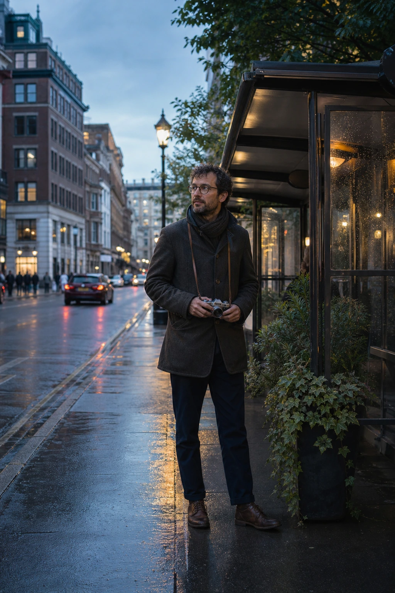

Representative presets: Kodak Portra 400, Fujifilm Velvia 50, Ilford HP5 Plus, Cinestill 800T, Kodachrome 64, Polaroid 600, Lomo LC-A, Wet Plate Collodion, Infrared Film, Expired Film

Review: PENDING

### Photography & Realism / 3. Camera Types

Key: `pack_01__camera_types`

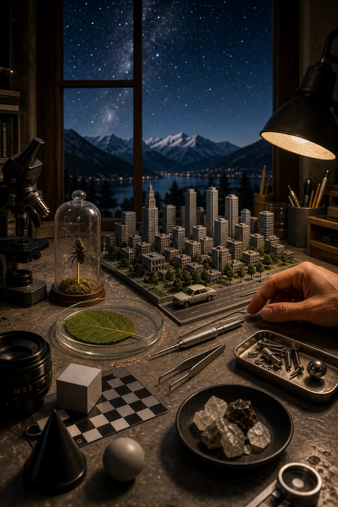

Representative presets: Large Format (4x5), Disposable Camera, GoPro Wide, Drone Aerial, CCTV Security, Pinhole Camera, Dashcam, Thermal Camera, Microscope (SEM), Telescope (Hubble)

Review: PENDING

### Photography & Realism / 4. Lighting

Key: `pack_01__lighting`

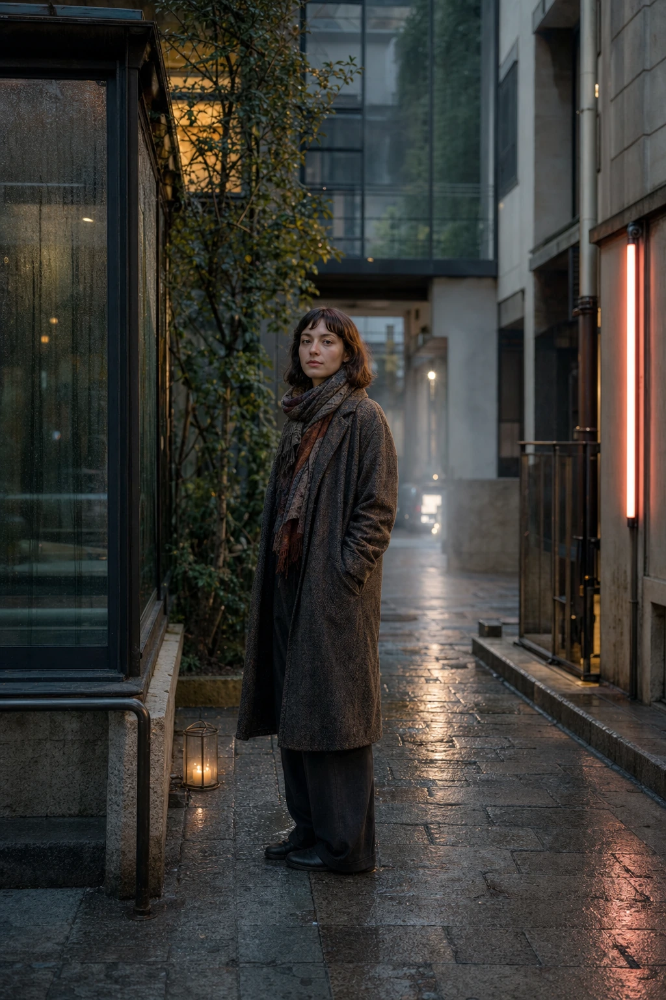

Representative presets: Golden Hour, Blue Hour, Hard Flash, Neon Noir, Rembrandt Lighting, Split Lighting, Silhouette (Backlit), Butterfly Lighting, Candlelight, God Rays (Volumetric), Bioluminescence, Strobe Light

Review: PENDING

### Photography & Realism / 5. Genres

Key: `pack_01__genres`

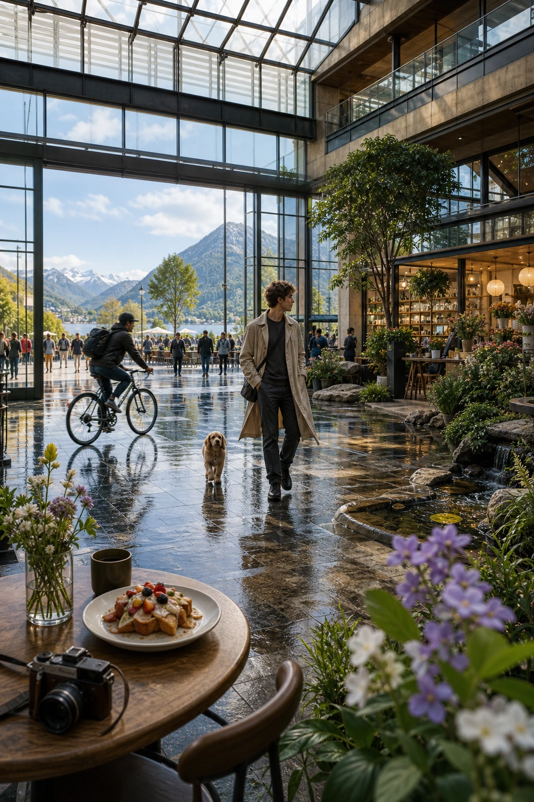

Representative presets: Street Photography, Landscape (Ansel Adams), Macro Photography, Food Photography, Product Photography, Fashion Editorial, Sports Action, Wildlife Photography, Astrophotography, Underwater, Architecture (Modern), Interior Design

Review: PENDING

### Cinematic & Media / 1. Film Genres

Key: `pack_02__film_genres`

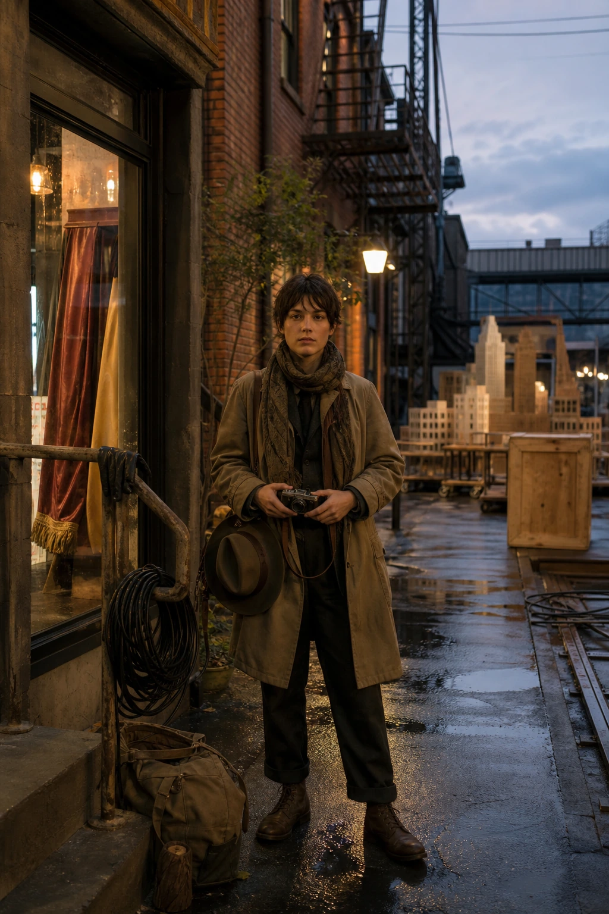

Representative presets: Film Noir, Spaghetti Western, 80s Sci-Fi, Technicolor Musical, French New Wave, Grindhouse Cinema, Silent Film, Found Footage Horror, Kaiju Suitmation, Kung Fu Studio Epic, 90s Cyberpunk Anime, Symmetrical Storybook Cinema

Review: PENDING

### Cinematic & Media / 2. TV & Broadcast

Key: `pack_02__tv_and_broadcast`

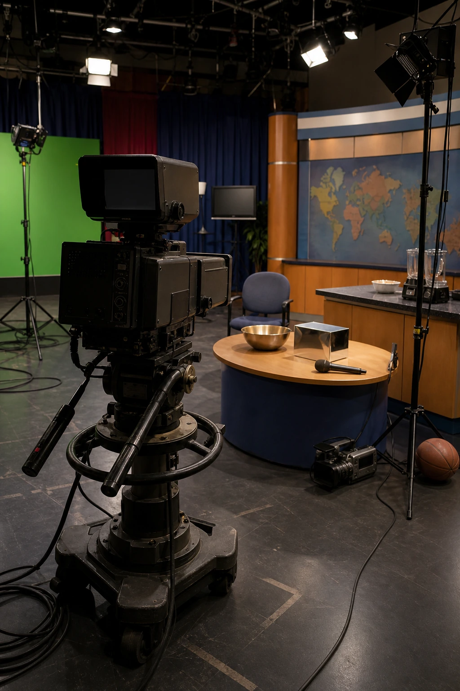

Representative presets: 90s Sitcom, News Broadcast, Soap Opera, Reality TV Confessional, Stylized Music Video, CCTV/Security Cam, VHS Home Video, Public Access TV, Infomercial, Sports Broadcast, Weather Channel, 90s Grunge Broadcast

Review: PENDING

### Cinematic & Media / 3. Animation Styles

Key: `pack_02__animation_styles`

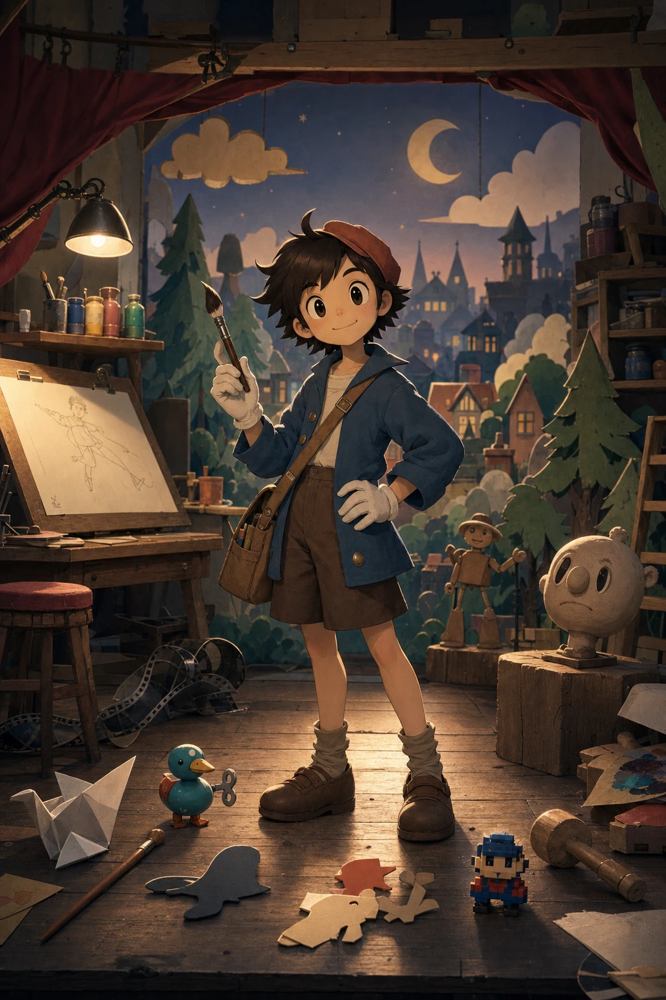

Representative presets: Golden Age Cel Feature, Painterly Nature Anime, Family Feature CG, Moody Stop-Motion, Golden Age Cartoon Frenzy, Rubber Hose Cartoon, Anime (90s Aesthetic), Comic Offset 3D, Mid-Century Flat Animation, Cutout TV Cartoon, Painterly Rotoscope, Papercraft Animation

Review: PENDING

### Cinematic & Media / 4. Photography Eras

Key: `pack_02__photography_eras`

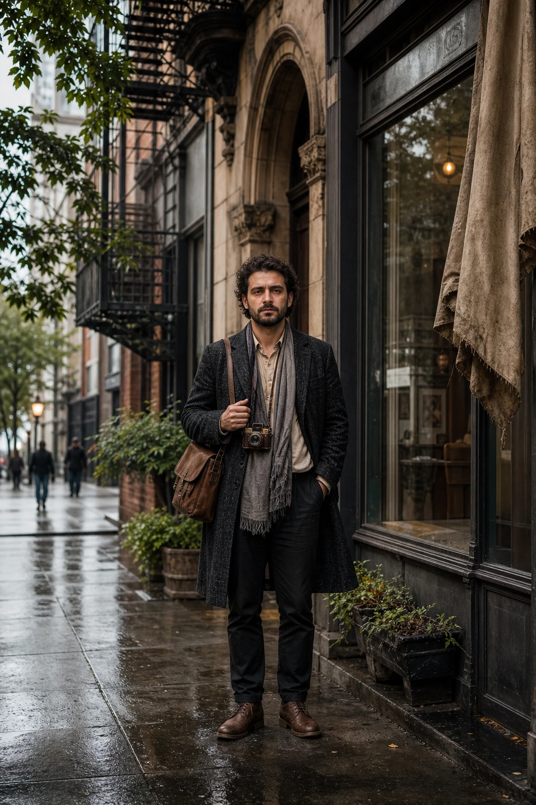

Representative presets: Daguerreotype (1840s), Tintype (Civil War), Autochrome (1900s), Kodachrome (50s), Polaroid (Instant), Disposable Camera (90s), Lomography, Wet Plate Collodion, Infrared Film (Aerochrome), Cyanotype (Photo), Early Digital (2000s), Pinhole Camera

Review: PENDING

### Cinematic & Media / 5. Lighting & Atmosphere

Key: `pack_02__lighting_and_atmosphere`

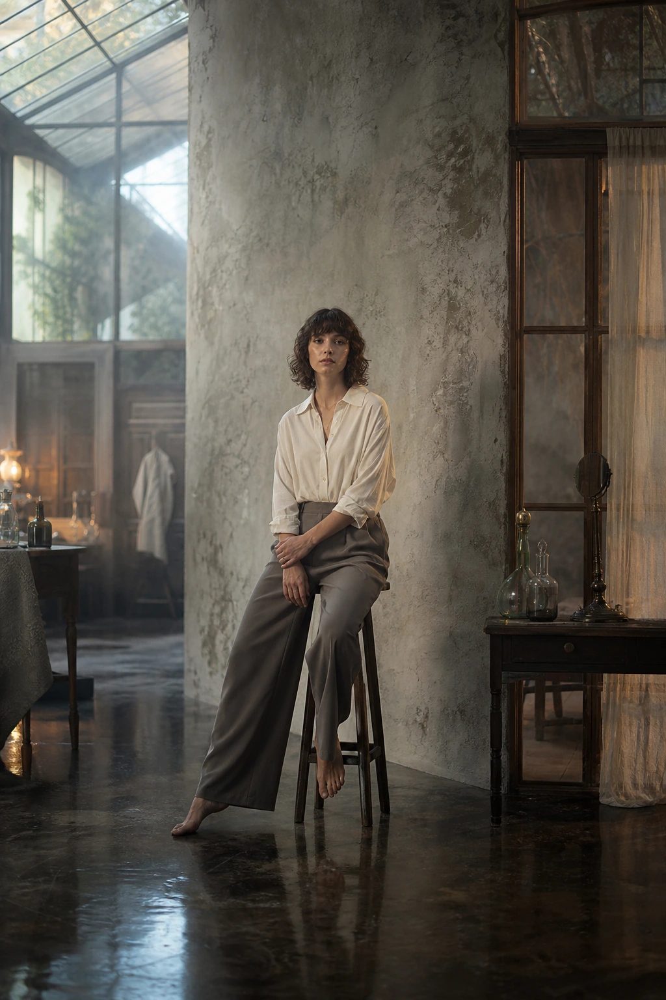

Representative presets: Golden Hour, Blue Hour, Rembrandt Lighting, Neon Noir, God Rays (Volumetric), Silhouette, Double Exposure, Bokeh (Macro), Split Lighting, Butterfly Lighting, Day for Night, Candlelight

Review: PENDING

### 3D & CGI Rendering / 1. Render Engines

Key: `pack_03__render_engines`

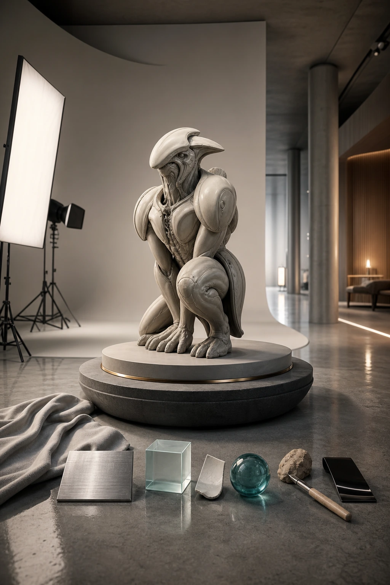

Representative presets: Spectral GPU Path Tracer, Next-Gen Real-Time Engine, Biased GPU Renderer, Feature Film Path Tracer, Open Path Tracer, ArchViz Raytracer, Product Studio Renderer, Feature Animation Renderer, Digital Clay Sculpt, High-End Game Pipeline

Review: PENDING

### 3D & CGI Rendering / 2. Materials

Key: `pack_03__materials`

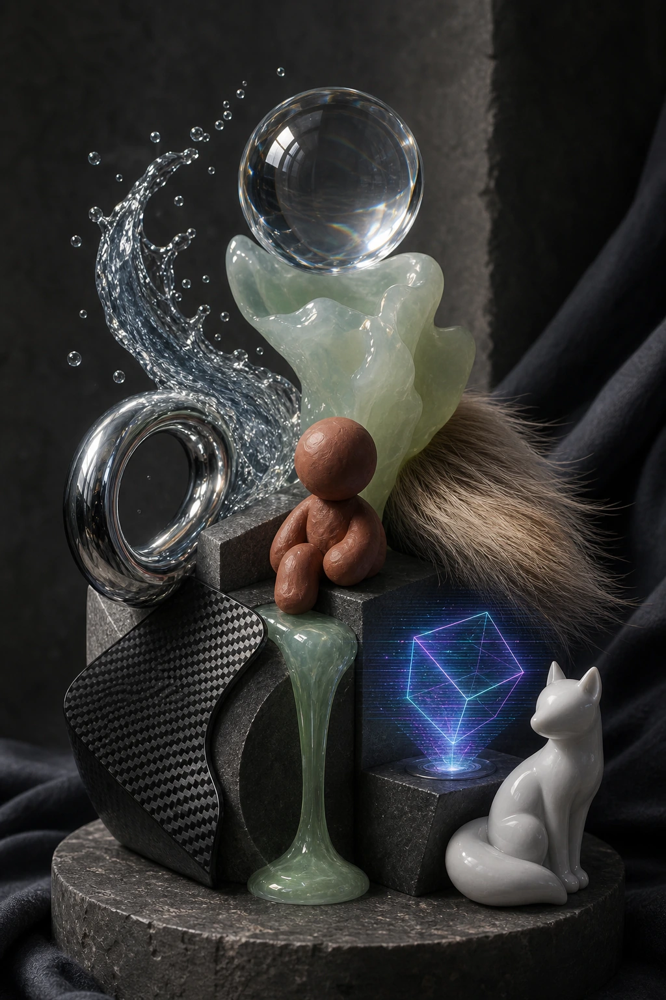

Representative presets: Glass & Crystal, Liquid Simulation, Subsurface Scattering (SSS), Chrome & Metal, Claymation (Stop Motion), Fur & Hair, Slime & Goo, Carbon Fiber, Hologram, Porcelain

Review: PENDING

### 3D & CGI Rendering / 3. 3D Styles

Key: `pack_03__3d_styles`

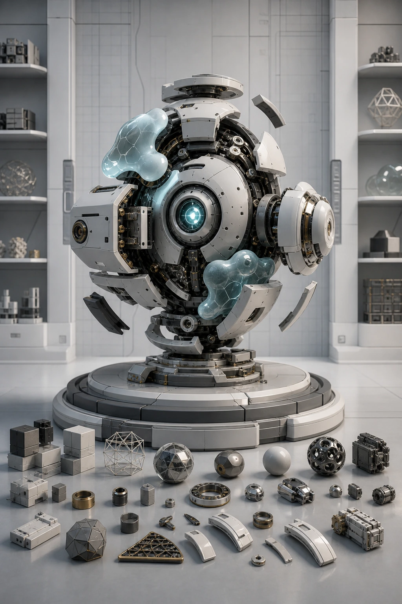

Representative presets: Low Poly, Voxel Art, Isometric 3D, Wireframe Render, Kitbash, Knolling (Flat Lay), Metaballs, Nurbs Surface, Fractal 3D, Glitch 3D

Review: PENDING

### 3D & CGI Rendering / 4. Lighting & Atmosphere

Key: `pack_03__lighting_and_atmosphere`

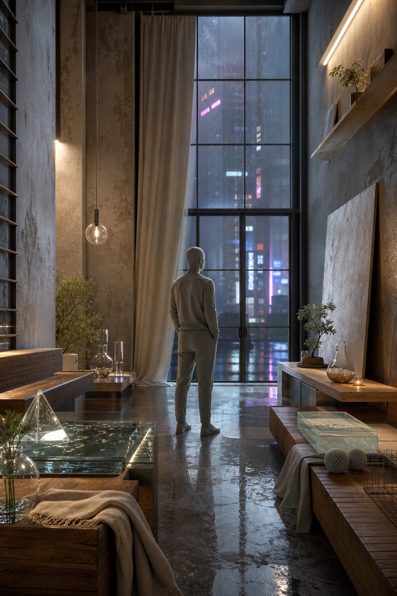

Representative presets: Global Illumination, Volumetric Fog, Neon City (Cyberpunk), Studio Lighting (3 Point), HDRI Environment, Caustics, Ambient Occlusion Pass, Rim Lighting, Bioluminescent Forest, Toon Shader (Cel Shaded), God Rays (Volumetric), Diorama Lighting

Review: PENDING

### 3D & CGI Rendering / 5. Applications

Key: `pack_03__applications`

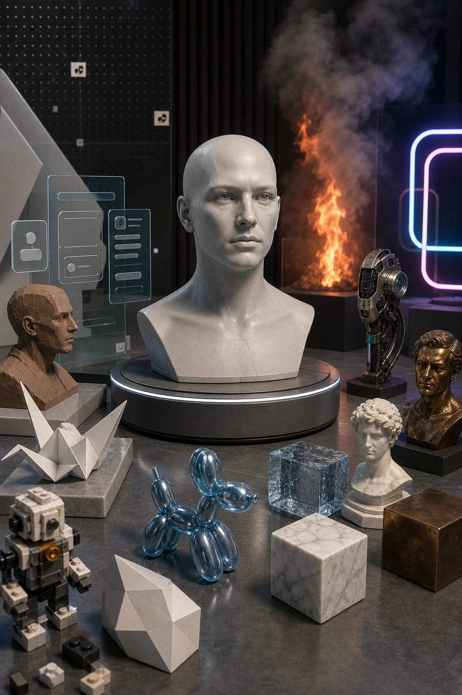

Representative presets: Game Asset (PBR), Architectural Visualization, Product Render, Character Design (T-Pose), Motion Graphics, Medical Illustration 3D, Automotive Render, Jewelry Render, Food CGI, Virtual Reality Environment, Scientific Visualization, NFT Art Style

Review: PENDING

### Illustration & Graphic Novel / 1. Comic Book Styles

Key: `pack_04__comic_book_styles`

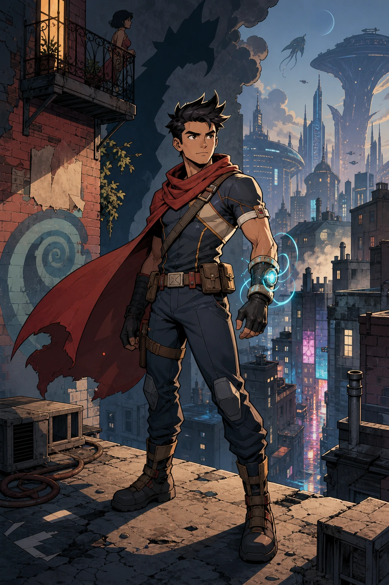

Representative presets: Golden Age Comic, Silver Age Comic, Modern Superhero (Digital), Manga (Shonen), Manga (Shojo), Webtoon Style, Franco-Belgian (Ligne Claire), Noir Comic (Sin City), Underground Comix, Graphic Novel (Painted), Horror Manga (Junji Ito), Retro Sci-Fi Comic (Moebius)

Review: PENDING

### Illustration & Graphic Novel / 2. Children's Illustration

Key: `pack_04__children_s_illustration`

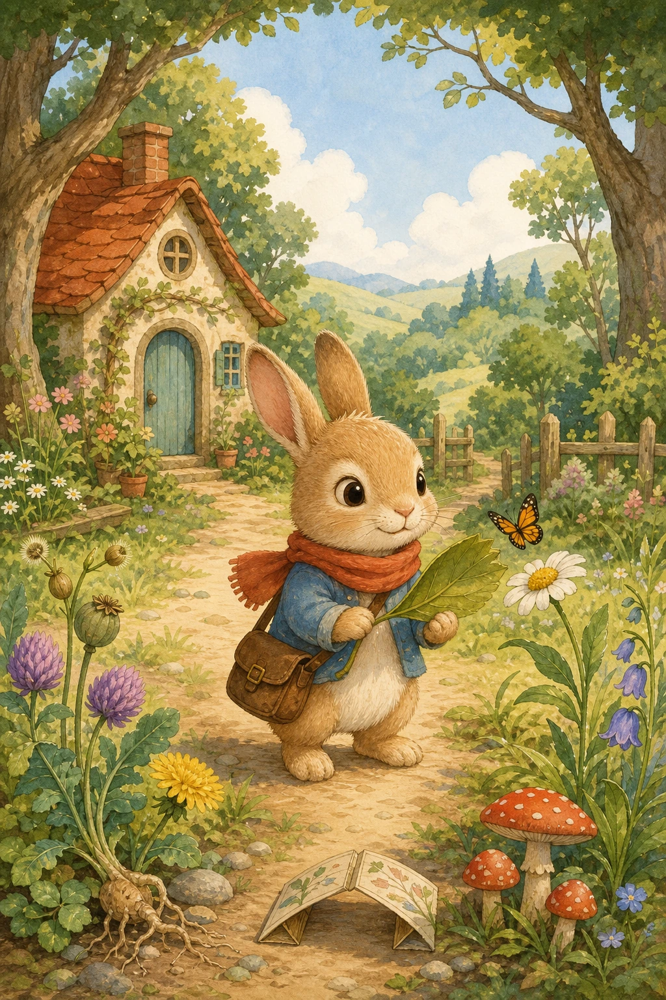

Representative presets: Watercolor Storybook, Paper Cutout (Collage), Crayon Drawing, Vector Flat (Kurzgesagt), Gouache Illustration, Colored Pencil, Scratchboard, Claymation Style, Felt Tip Marker, Pop-Up Book, Whimsical Ink, Chalk Pastel

Review: PENDING

### Illustration & Graphic Novel / 3. Editorial & Poster

Key: `pack_04__editorial_and_poster`

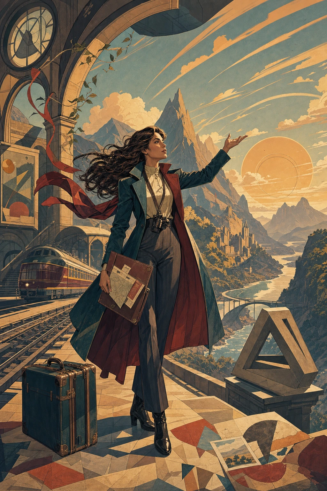

Representative presets: Art Deco Poster, Art Nouveau Poster, Propaganda Poster, Psychedelic Poster (60s), Minimalist Vector, Collage Art (Dada), Bauhaus Poster, National Park Poster (WPA), Movie Poster (Painted), Infographic, Fashion Illustration, Album Cover (Surreal)

Review: PENDING

### Illustration & Graphic Novel / 4. Concept Art

Key: `pack_04__concept_art`

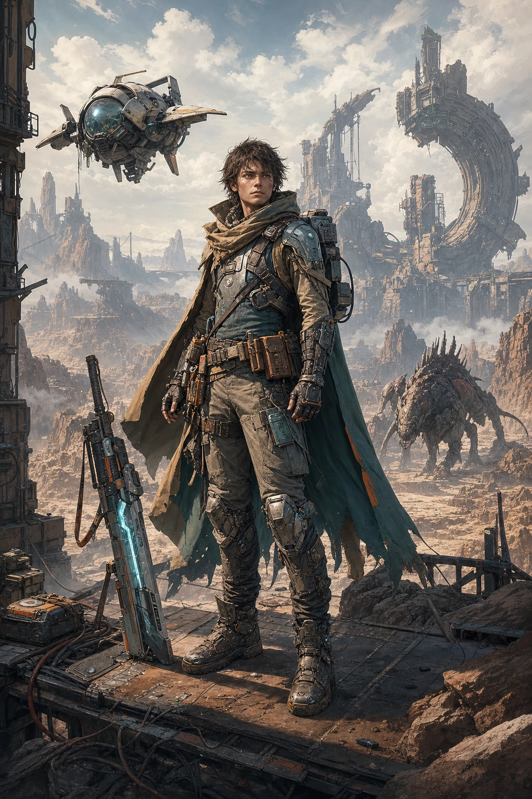

Representative presets: Speedpaint, Matte Painting, Character Sheet, Environment Concept, Vehicle Design, Creature Design, Isometric Game Art, Storyboard Sketch, Prop Design, Keyframe Art, Photobash, Blueprint Schematic

Review: PENDING

### Illustration & Graphic Novel / 5. Ink & Print

Key: `pack_04__ink_and_print`

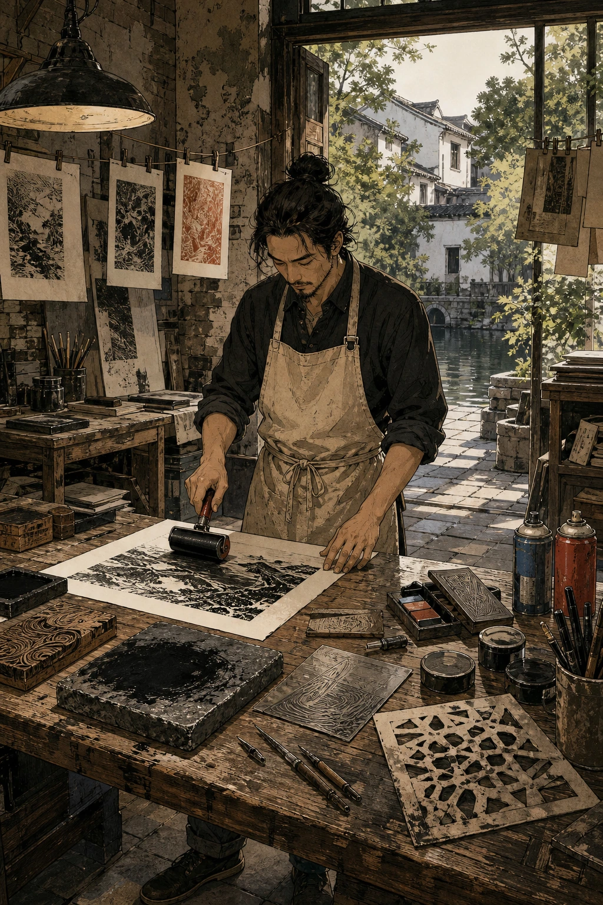

Representative presets: Linocut Print, Etching (Engraving), Woodcut (Ukiyo-e), Stipple (Dotwork), Lithograph, Screenprint (Serigraph), Monotype, Cyanotype (Blueprint), Rubber Stamp, Mezzotint, Aquatint, Ballpoint Pen

Review: PENDING

### Anime & Manga Universes / 1. 70s & 80s Retro Anime

Key: `pack_05__70s_and_80s_retro_anime`

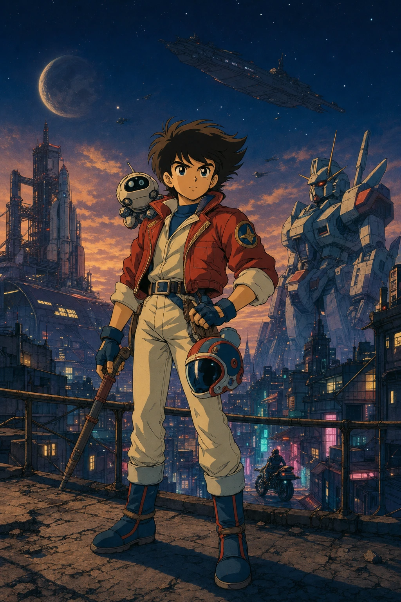

Representative presets: Astro Boy (1960s/70s), Mazinger Z, Lupin III (Part 1/2), Captain Harlock, Mobile Suit Gundam (0079), Macross (SDF-1), Fist of the North Star, City Hunter, Akira, Dragon Ball (Classic)

Review: PENDING

### Anime & Manga Universes / 2. 90s Golden Era

Key: `pack_05__90s_golden_era`

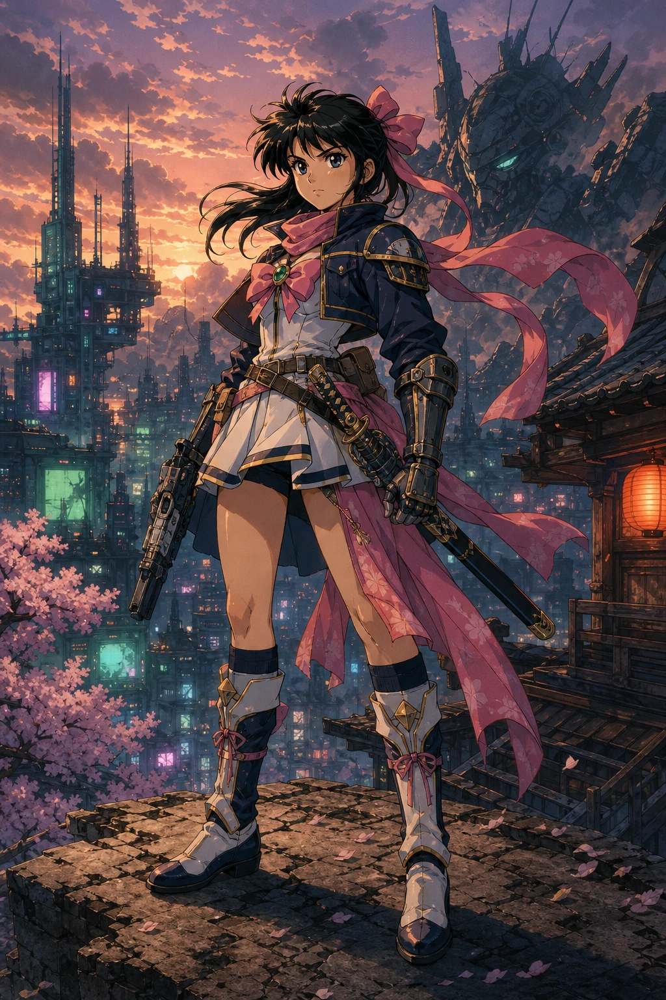

Representative presets: Aura Battle Shonen, Sparkling Magical Team, Psychological Biomech Drama, Jazzy Space Noir, Philosophical Cyber Ops, Spirit Tournament Action, Wandering Swordsman Drama, Desert Space Gunslinger, Wired Existential Glitch, Dream Card Enchanter

Review: PENDING

### Anime & Manga Universes / 3. 2000s Classics

Key: `pack_05__2000s_classics`

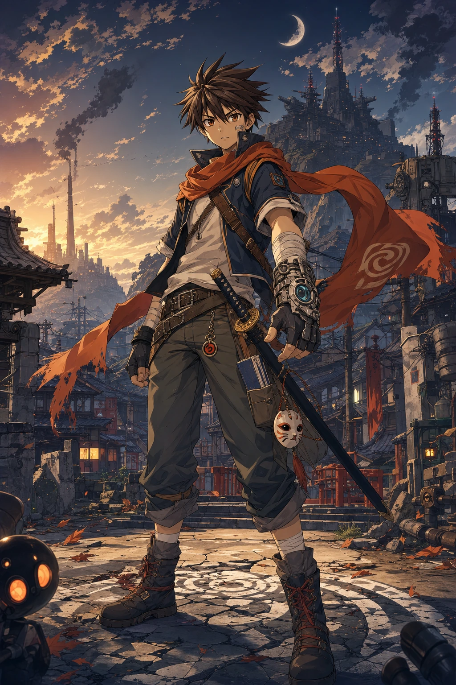

Representative presets: Headband Ninja Journey, Urban Spirit Blade, Grand Pirate Adventure, Alchemy Brotherhood Epic, Shadow Notebook Thriller, Masked Rebellion Mecha, Spiral Overdrive Mecha, Lo-Fi Sword Roadtrip, Chaotic Indie Adolescence, Gothic Academy Action

Review: PENDING

### Anime & Manga Universes / 4. Modern Shonen & Action

Key: `pack_05__modern_shonen_and_action`

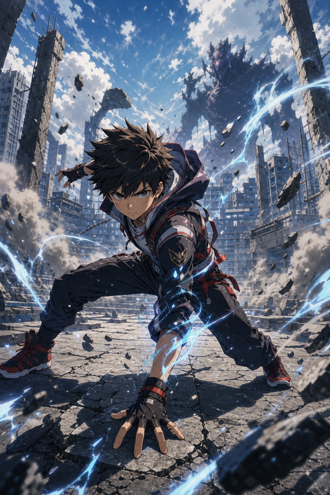

Representative presets: Painterly Blade Fantasy, Gritty Urban Curses, Chaotic Splatter Action, Bright Hero Academy, Gritty Wallbound Survival, Colossal War Drama, Impact Frame Comedy Hero, Psychedelic Psychic Minimalism, Tactical Adventure Shonen, Blade Field Urban Fantasy

Review: PENDING

### Anime & Manga Universes / 5. Classic & Modern Shojo

Key: `pack_05__classic_and_modern_shojo`

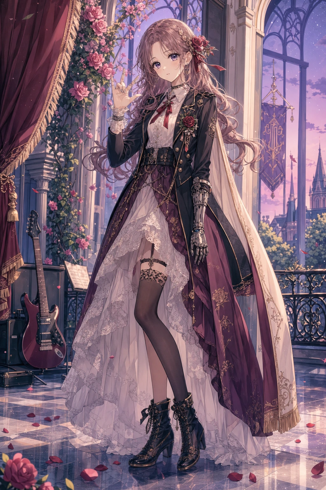

Representative presets: Ornate Palace Shojo, Theatrical Duel Symbolism, Soft Healing Ensemble, Punk Romance Drama, Rose-Petal Comedy Club, Luminous Letter Drama, Airy First-Love Tenderness, Crimson Hair Quest Romance, Velvet Gothic Academy, Cozy Sign-Language Romance

Review: PENDING

### Anime & Manga Universes / 6. Mecha & Cyberpunk

Key: `pack_05__mecha_and_cyberpunk`

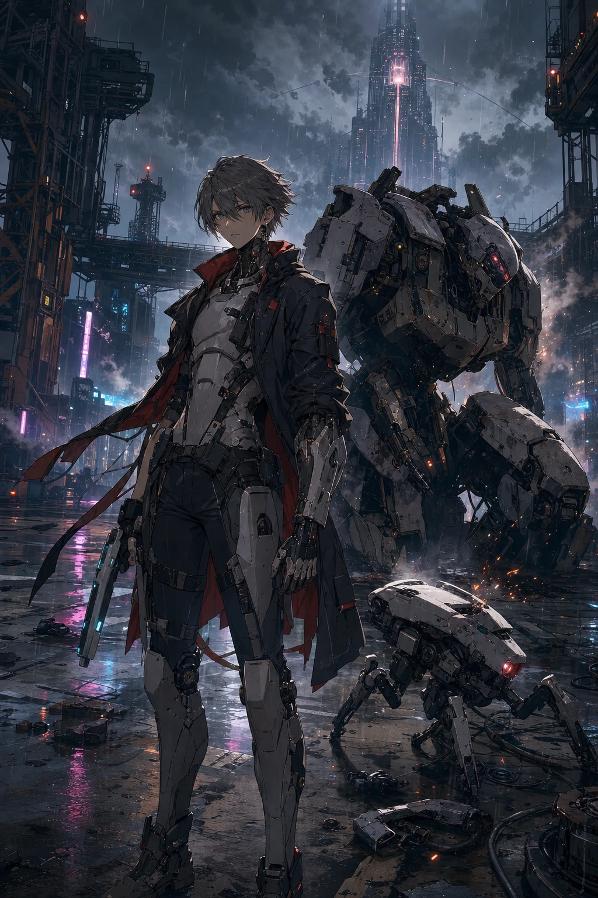

Representative presets: Neon Tragic Sprint, Dystopian Policing Grid, Heavy Industrial Mecha, Beam Opera Mecha, Gothic Tech Existentialism, Geometric Neon Rescue, Sleek Post-Apoc Mecha Romance, Spider-Mech War Drama, Tactical Network Cybercrime, Orbital Rival Mecha

Review: PENDING

### Anime & Manga Universes / 7. Dark Fantasy & Seinen

Key: `pack_05__dark_fantasy_and_seinen`

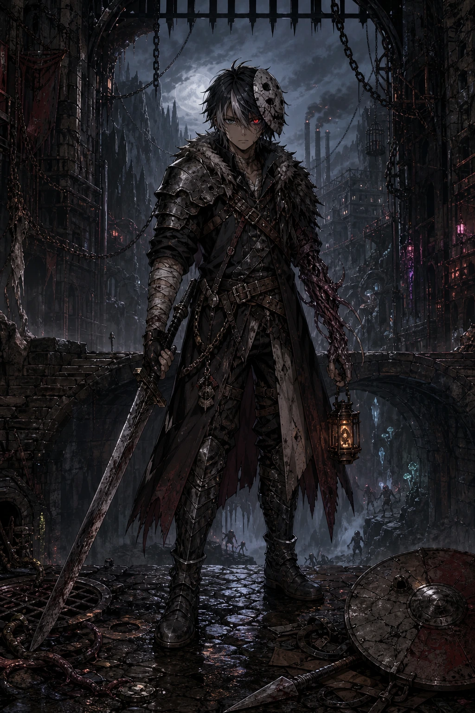

Representative presets: Crosshatched Doom Fantasy, Urban Monstrous Hunger, Crimson Gothic Hunt, Northern Historical Epic, Pale Blade Horror, Body-Horror Parasite Thriller, Lush Abyssal Wonder-Horror, Industrial Masked Chaos, Dungeon Exterminator Grit, Neon Tragic Metamorphosis

Review: PENDING

### Anime & Manga Universes / 8. Studio Masterpieces

Key: `pack_05__studio_masterpieces`

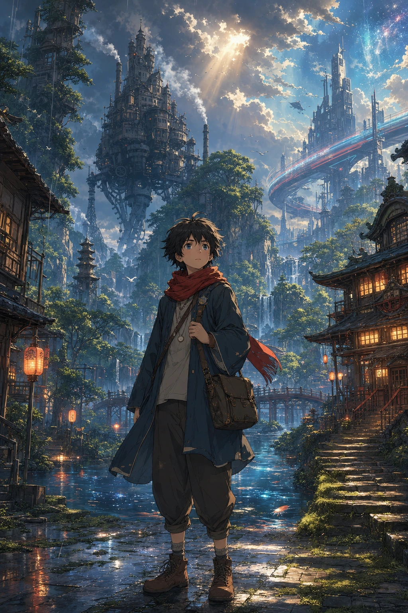

Representative presets: Bathhouse Reverie Fantasy, Forest Spirits Epic, Wandering Clockwork Castle, Skyglow Longing Drama, Rainlight City Romance, Parade Dream Surrealism, Mirror Identity Thriller, Light-Trail Mega-City, Hyperkinetic Cosmic Racing, Cosmic Ocean Lyrical

Review: PENDING

### Anime & Manga Universes / 9. Slice of Life & Moe

Key: `pack_05__slice_of_life_and_moe`

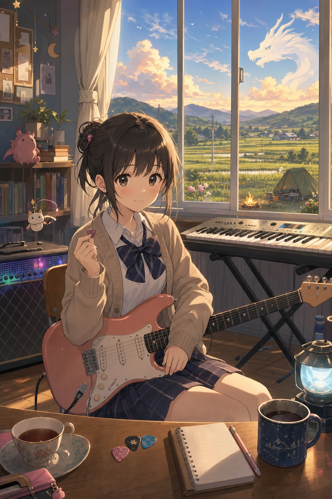

Representative presets: Cozy Band Practice, Absurd School Comedy, Otaku Chat Slice, School Sci-Fi Whimsy, Anxiety Glitch Music Comedy, Campfire Comfort, Rural Quietude, Domestic Fantasy Chaos, Soft Surreal Classroom, Soft-Eyed Melodrama

Review: PENDING

### Anime & Manga Universes / 10. Isekai & High Fantasy

Key: `pack_05__isekai_and_high_fantasy`

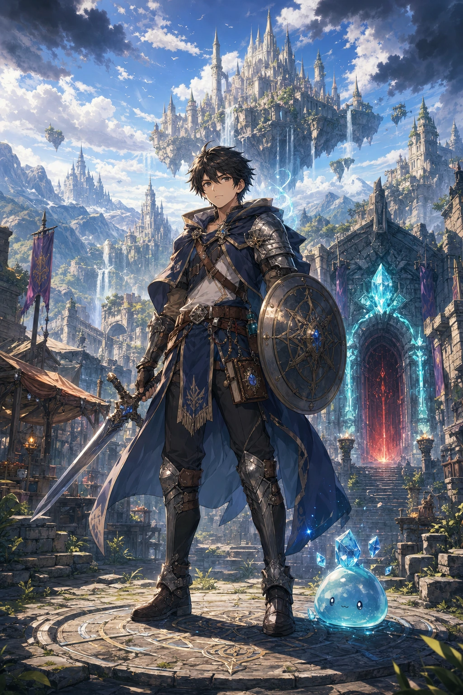

Representative presets: Glowing VR Adventure, Reset-Loop Dark Fantasy, Wandering Mage Chronicle, Party-Quest Comedy, Afterquest Melancholy Fantasy, Hyper-Saturated Strategy Fantasy, Bone Throne Dark Dominion, Monster-Nation Bright Fantasy, Defensive Underdog Fantasy, Dungeon Lantern Adventure

Review: PENDING

### Essential Art Styles / 1. Traditional Painting

Key: `pack_06__traditional_painting`

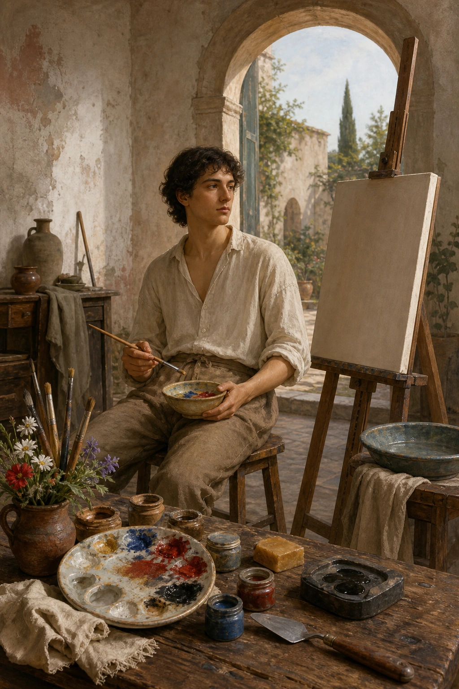

Representative presets: Oil Painting (Classic), Watercolor (Soft), Acrylic (Modern), Gouache (Flat), Tempera (Egg), Encaustic (Wax), Fresco (Wall), Ink Wash (Sumi-e), Impressionist Oil, Pointillism, Palette Knife, Spray Paint (Graffiti)

Review: PENDING

### Essential Art Styles / 2. Drawing & Sketching

Key: `pack_06__drawing_and_sketching`

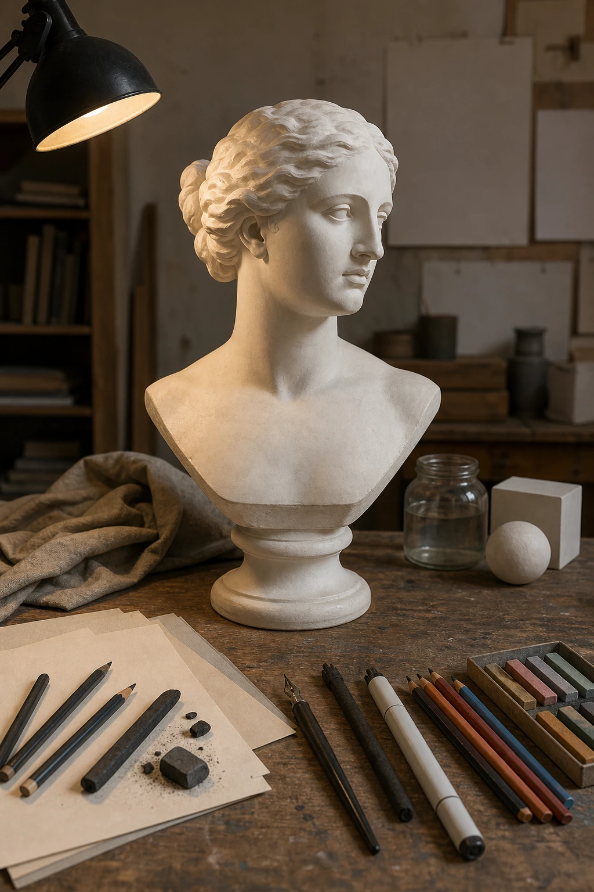

Representative presets: Graphite Pencil, Charcoal (Expressive), Ink (Pen & Ink), Ballpoint Pen, Colored Pencil, Pastel (Soft), Oil Pastel, Silverpoint, Conte Crayon, Technical Pen, Marker (Copic), Chalk (Blackboard)

Review: PENDING

### Essential Art Styles / 3. Printmaking

Key: `pack_06__printmaking`

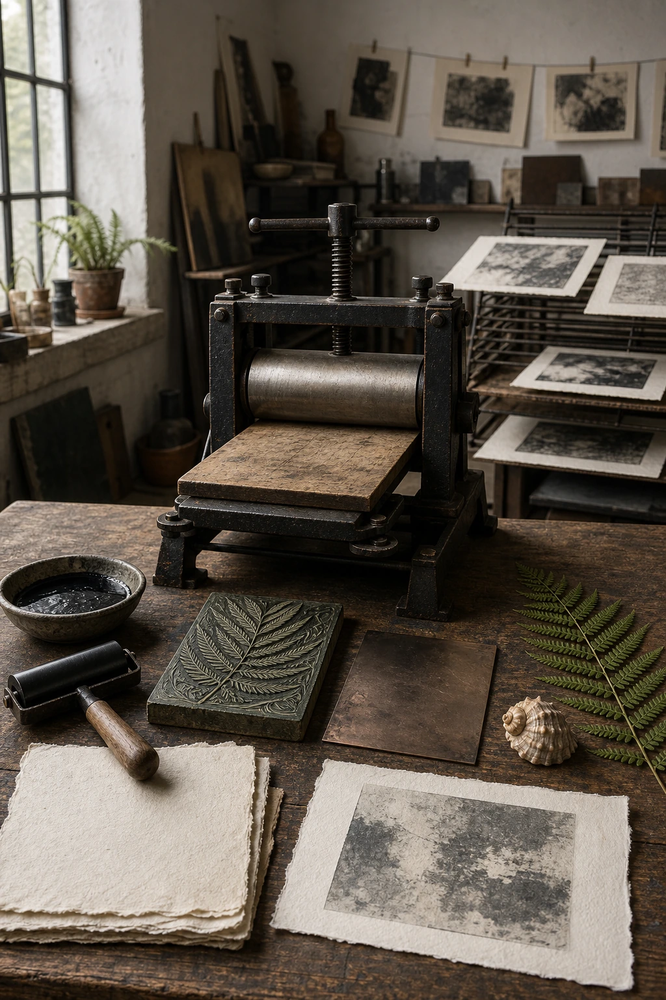

Representative presets: Etching, Woodcut, Linocut, Lithography, Screenprint (Serigraphy), Monotype, Aquatint, Mezzotint, Risograph, Cyanotype, Rubber Stamp, Halftone (Newspaper)

Review: PENDING

### Essential Art Styles / 4. Digital Art

Key: `pack_06__digital_art`

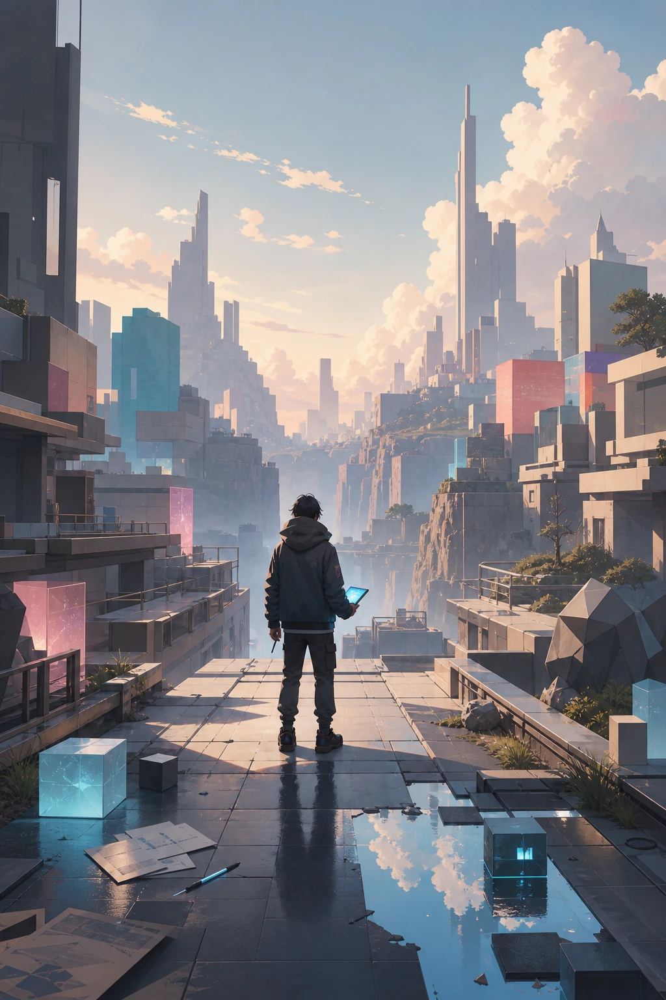

Representative presets: Digital Painting, Speedpaint, Matte Painting, Vector Art (Flat), Pixel Art (16-bit), Low Poly, Voxel Art, Concept Art, Isometric, Glitch Art, Synthwave, Double Exposure

Review: PENDING

### Essential Art Styles / 5. Mixed Media

Key: `pack_06__mixed_media`

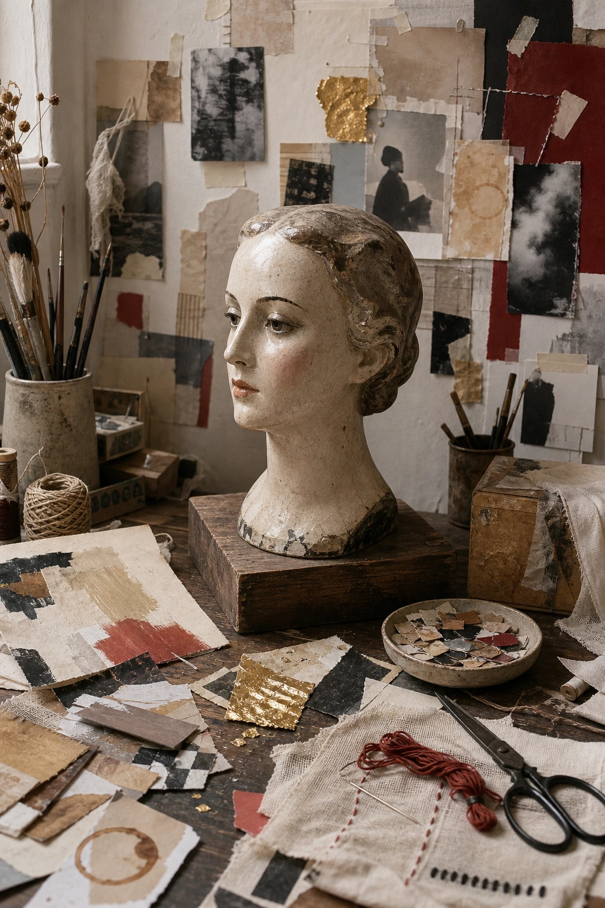

Representative presets: Collage (Analog), Photomontage, Decoupage, Assemblage, Scrapbook, Trash Polka, Mixed Media Canvas, Zine Aesthetic, Moodboard, Vision Board, Mosaic (Paper), Tape Art

Review: PENDING

### Architecture & Interior / 1. Interior Design

Key: `pack_07__interior_design`

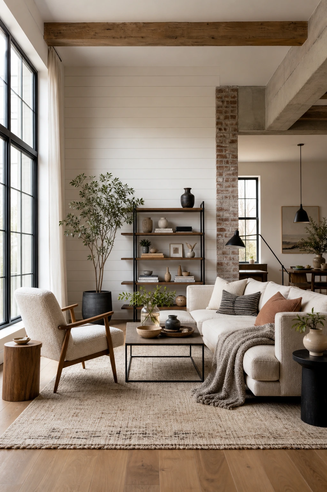

Representative presets: Modern Minimalist, Industrial Loft, Mid-Century Modern, Scandinavian Hygge, Bohemian Eclectic, Bauhaus Interior, Maximalist Decor, Farmhouse Chic, Art Nouveau Interior, Memphis Design

Review: PENDING

### Architecture & Interior / 2. Architectural Styles

Key: `pack_07__architectural_styles`

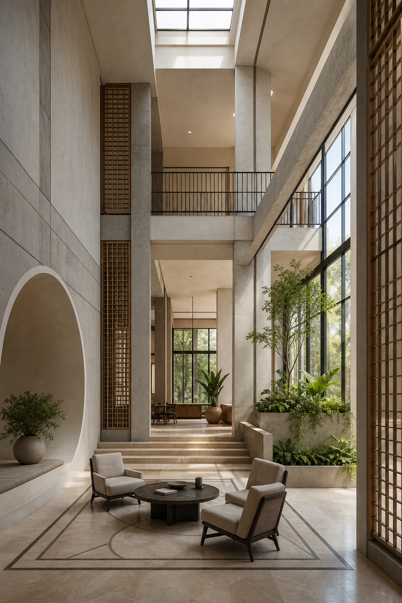

Representative presets: Brutalist Architecture, Art Deco, Japanese Zen, Gothic Revival, Futuristic Pod, Deconstructivism, Neoclassical, Parametric Architecture, Victorian Painted Lady, Bauhaus Architecture, Googie Architecture, Tudor Revival

Review: PENDING

### Architecture & Interior / 3. Environment

Key: `pack_07__environment`

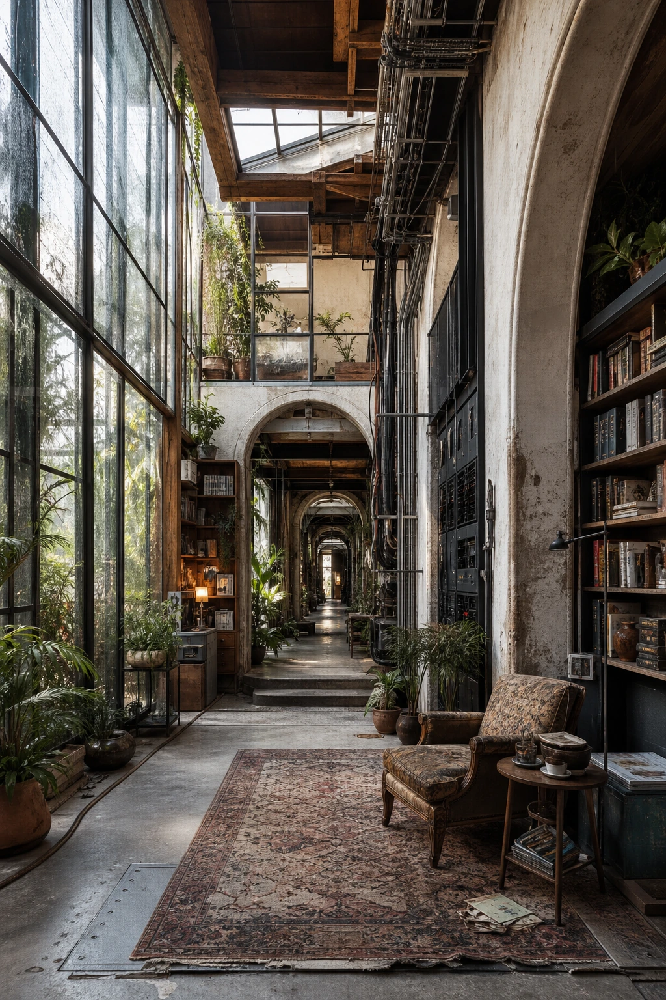

Representative presets: Luxury Penthouse, Rustic Cabin, Mediterranean Villa, Cyberpunk Apartment, Victorian Mansion, Space Station Interior, Subway Station, Greenhouse/Conservatory, Abandoned Asylum, Library (Old), Casino Floor, Aquarium Tunnel

Review: PENDING

### Architecture & Interior / 4. Landscape Architecture

Key: `pack_07__landscape_architecture`

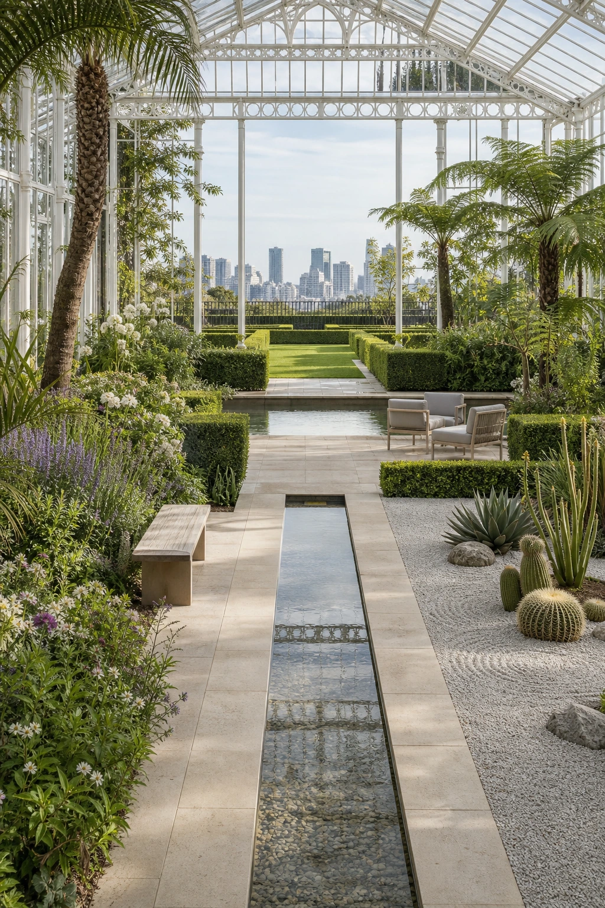

Representative presets: French Formal Garden, English Cottage Garden, Zen Rock Garden, Urban Park (High Line), Desert Xeriscape, Tropical Resort Pool, Maze/Labyrinth, Rooftop Garden, Golf Course, Botanical Glasshouse

Review: PENDING

### Architecture & Interior / 5. Fantasy Architecture

Key: `pack_07__fantasy_architecture`

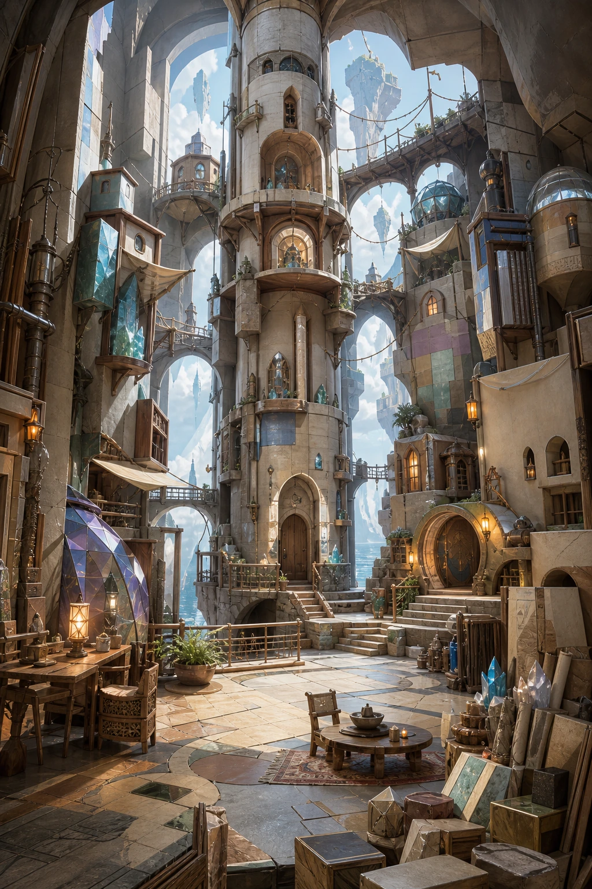

Representative presets: Elven City (Rivendell), Dwarven Fortress, Floating Castle, Cyberpunk Slums, Candy Kingdom, Underwater City, Steampunk City, Crystal Spire, Hobbit Hole, Haunted House (Cartoon), Ice Palace, Tree Village (Ewok)

Review: PENDING

### Fashion & Costume / 1. Contemporary Fashion

Key: `pack_08__contemporary_fashion`

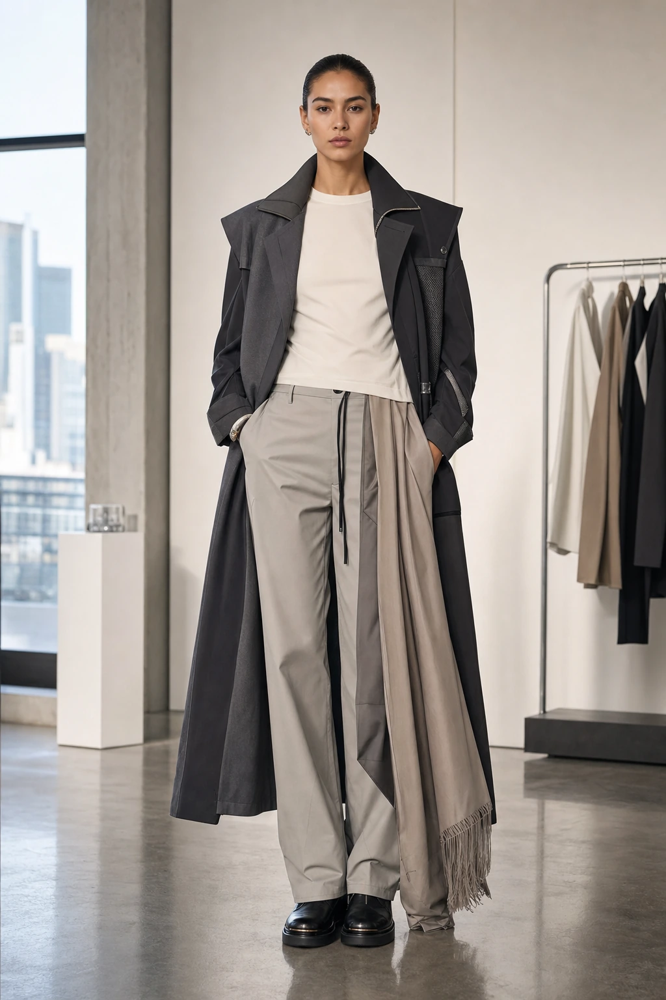

Representative presets: Haute Couture, Streetwear Hypebeast, Minimalist Chic, Boho Festival, Athleisure Sport, Normcore, Tech CEO, K-Pop Idol, Business Casual, Red Carpet Gown

Review: PENDING

### Fashion & Costume / 2. Subcultures

Key: `pack_08__subcultures`

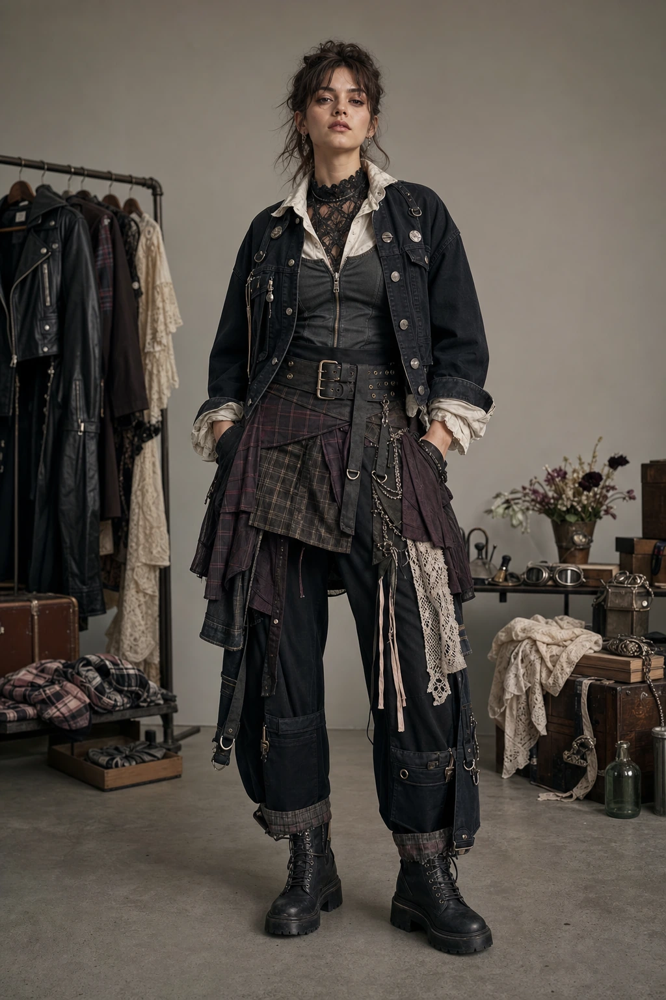

Representative presets: Cyberpunk Techwear, Goth Darkwave, Punk Rock, Steampunk Inventor, Preppy Ivy League, Pastel Goth, Grunge (90s), Lolita Fashion, Rockabilly, Hippie (60s), Biker Gang, Skater Style

Review: PENDING

### Fashion & Costume / 3. Historical & Fantasy

Key: `pack_08__historical_and_fantasy`

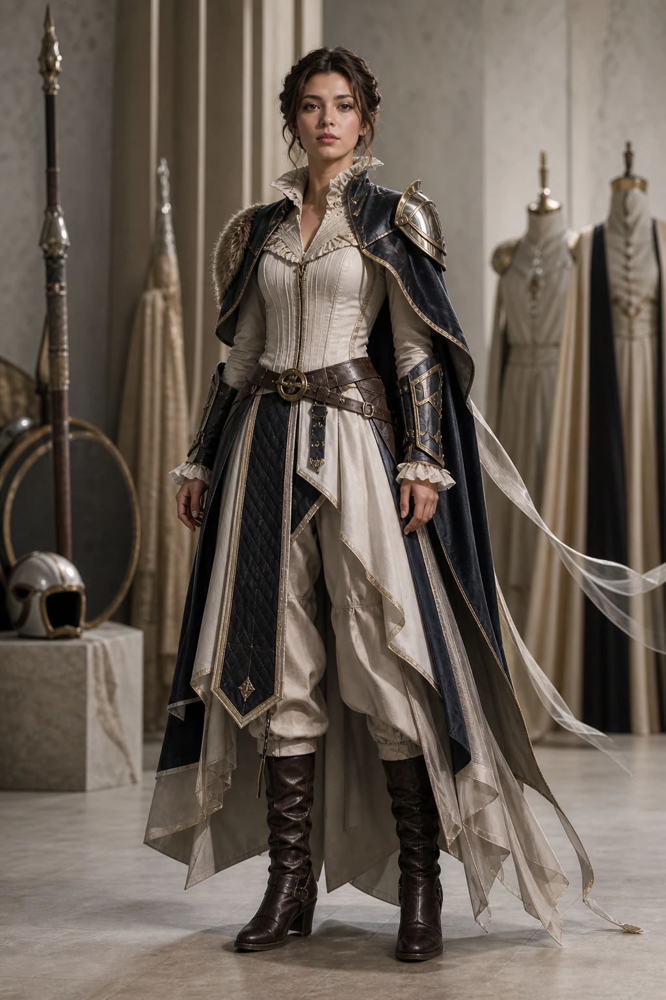

Representative presets: Vintage 1950s, Renaissance Royal, Ethereal Fantasy, Military Surplus, Cosplay Anime, Roaring 20s (Flapper), Victorian Mourning, Ancient Egyptian, Roman Gladiator, Samurai Armor, Viking Warrior, Wild West Cowboy

Review: PENDING

### Fashion & Costume / 4. Fantasy/Sci-Fi Costume

Key: `pack_08__fantasy_sci_fi_costume`

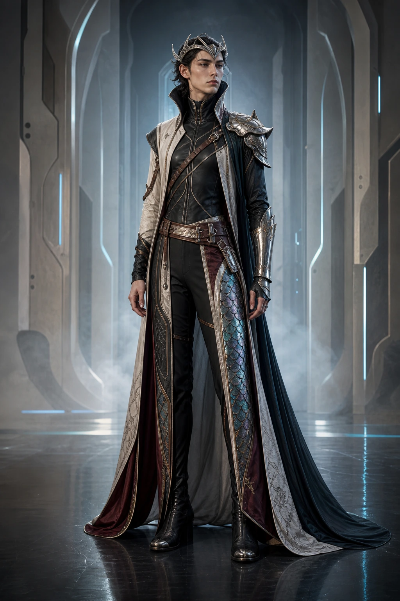

Representative presets: Cybernetic Implant, Post-Apocalyptic Scavenger, Space Opera Royal, Wizard Robes, Superhero Spandex, Mech Pilot Suit, Vampire Lord, Zombie Survivor, Mermaid Tail, Alien Fashion

Review: PENDING

## Missing

- Fashion & Costume / 5. Fabric & Texture Focus -> `pack_08__fabric_and_texture_focus.webp`
- Texture & Materiality / 1. Natural Materials -> `pack_09__natural_materials.webp`
- Texture & Materiality / 2. Man-Made Materials -> `pack_09__man_made_materials.webp`
- Texture & Materiality / 3. Weathering & Decay -> `pack_09__weathering_and_decay.webp`
- Texture & Materiality / 4. Tactile Surfaces -> `pack_09__tactile_surfaces.webp`
- Texture & Materiality / 5. Elemental & FX -> `pack_09__elemental_and_fx.webp`
- Abstract & Experimental / 1. Geometric Abstraction -> `pack_10__geometric_abstraction.webp`
- Abstract & Experimental / 2. Fluid & Organic -> `pack_10__fluid_and_organic.webp`
- Abstract & Experimental / 3. Digital Glitch & Noise -> `pack_10__digital_glitch_and_noise.webp`
- Abstract & Experimental / 4. Surrealism & Dream -> `pack_10__surrealism_and_dream.webp`
- Abstract & Experimental / 5. Pattern & Texture -> `pack_10__pattern_and_texture.webp`
- Miscellaneous & Fun / 1. Toys & Crafts -> `pack_11__toys_and_crafts.webp`
- Miscellaneous & Fun / 2. Artistic Mediums -> `pack_11__artistic_mediums.webp`
- Miscellaneous & Fun / 3. Aesthetics -> `pack_11__aesthetics.webp`
- Miscellaneous & Fun / 4. Food & Drink -> `pack_11__food_and_drink.webp`
- Miscellaneous & Fun / 5. Micro/Macro -> `pack_11__micro_macro.webp`
