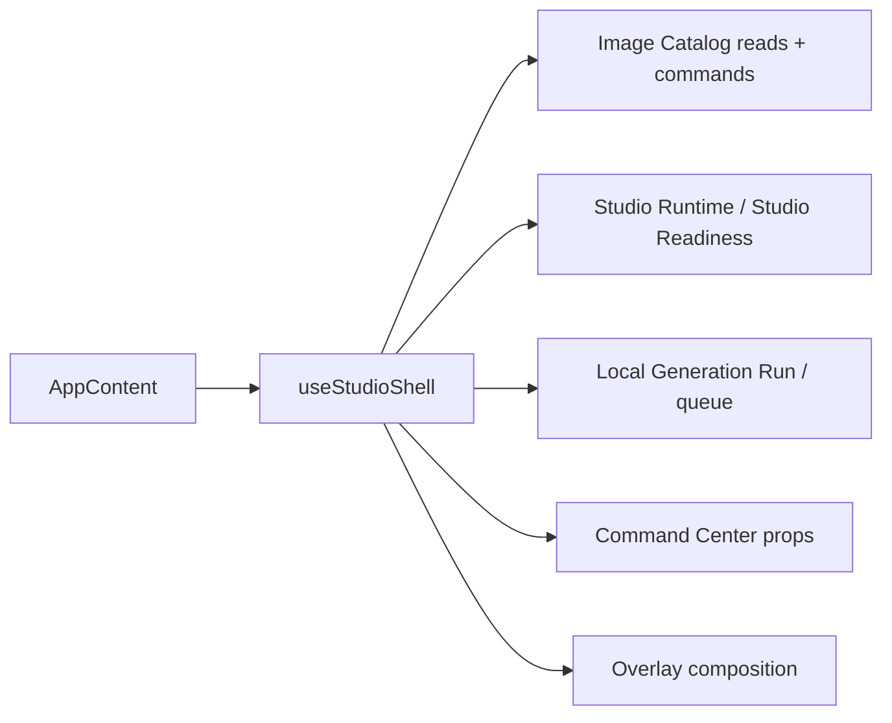
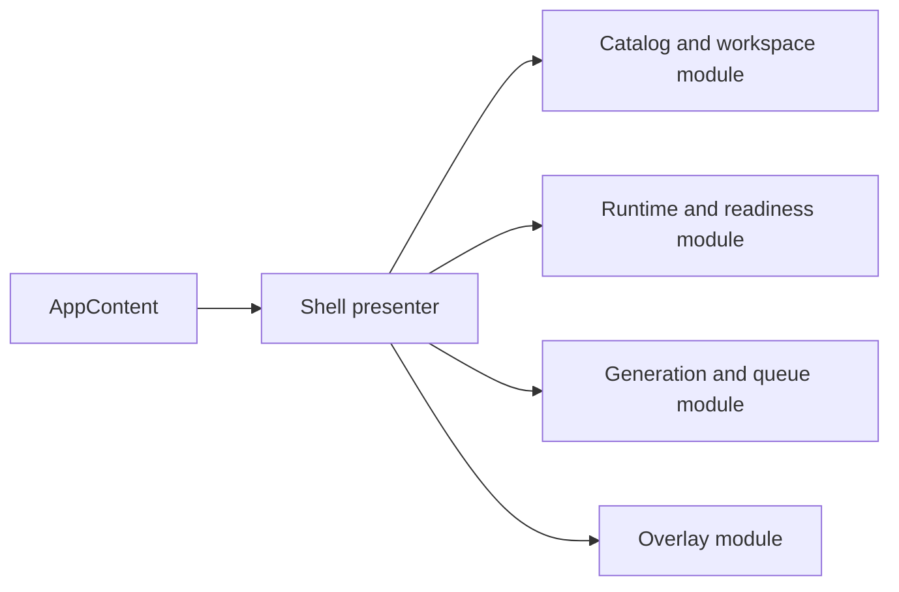

# Architecture review - Codex Studio

Date: 2026-05-27

## Summary

- Real current friction concentrates in four modules: `hooks/useStudioShell.ts`, `lib/recipeModules.ts` + `lib/recipeContext.ts`, `services/localGenerationRun.ts` + `hooks/useGenerationPipeline.ts`, and `apps/local-server/src/worker.ts`.
- These modules are shallow in different ways: some expose an interface nearly as large as their implementation; others advertise a seam but still leak implementation details across it.
- Existing ADRs already point in the right direction. The work here is to finish the deepening, not to change the product story.
- I did not promote the Provider Boundary compiler as a top recommendation. `apps/local-server/src/providers/providerInputCompiler.ts` already gives that area a real seam with one place to compile `Compiled Provider Input` by provider id.
- I did not promote `lib/studioReadiness.ts` as a top recommendation. It is already a reasonably deep pure module; the friction sits in the wider modules around it.
- I did not promote Legacy Visual Batch cleanup as a top recommendation. The remaining compatibility surface is now localized to export and recovery modules, which lowers urgency even though it still deserves closure.

## Recommendations

### 1. Deepen the Studio Shell orchestration module

**Recommendation strength**: Strong

**Files**

- `hooks/useStudioShell.ts`
- `components/AppContent.tsx`
- `lib/buildStudioHeaderToolbarProps.ts`
- `lib/buildStudioPageController.ts`

**Problem**

The `Studio Shell` module is still shallow. `components/AppContent.tsx` has only one real caller of `useStudioShell()`, but that hook still composes routing, `Image Catalog` reads, `Catalog Entry` mutation commands, `Studio Runtime` and `Studio Readiness` wiring, workspace actions, `Local Generation Run` session state, overlay composition, and `Command Center` props.

The interface nearly mirrors the implementation. `StudioShellController` exposes `root`, `background`, `toasts`, `headerToolbar`, `viewport`, `generationDock`, and `overlays`, while the implementation must still know about three catalog queries, a long list of shell hooks, inline archive and restore commands, and multiple page and overlay builders. The module earns some value, but not enough leverage for how much interface a caller still has to learn.

This is also the cheapest place to deepen now: one adapter means a hypothetical seam, and `AppContent` is the only adapter. The seam has not spread yet.

**Solution**

Split the `Studio Shell` module into a small number of deeper modules aligned with concepts already defined in `CONTEXT.md`:

- a shell navigation and presentation module;
- an `Image Catalog` and workspace-actions module;
- a `Local Generation Run` and queue module;
- an overlay-composition module.

_Progress note (2026-05-27): this deepening is now underway via
`useStudioCatalogController()`, `buildStudioPageController()`,
`buildStudioViewportController()`, `buildStudioHeaderToolbarProps()`,
`buildStudioShellOverlayController()`, the grouped `useStudioViewState()` seam,
the grouped `useStudioNavigation()` seam, `startQueuedJobExecution()` in
`lib/queueStateMachine.ts`, and the grouped `useStudioGenerationSession()`,
`useStudioSettings()`, and `useStudioActivitySession()` seams._

Keep `useStudioShell()` as a thin presenter only if it still adds leverage after the split. Otherwise delete it and let `AppContent` compose the deeper modules directly.

Also pull the inline `Catalog Entry` mutation choreography out of `useStudioShell.ts` so refresh, error mapping, and toast behaviour live in one place instead of inside the main shell implementation.

**Benefits**

- locality: shell bugs stop sending maintainers through one broad module.
- leverage: `AppContent`, `StudioViewport`, `HeaderToolbar`, and overlay tests learn smaller interfaces.
- interface is the test surface: shell-facing tests can cross one focused seam at a time.
- existing helpers such as `buildStudioHeaderToolbarProps()` and `buildStudioPageController()` already show the right direction; this recommendation finishes that move.

**Before / After**

Before, one shell module owns almost all top-level orchestration:

After, the shell seam becomes smaller and deeper:

**Dependencies / sequencing**

- Do this first.
- Extends ADR-0011 and ADR-0024; no ADR conflict found.
- Unblocks more focused integration tests around the `Studio Shell`, `Command Center`, and overlay behaviour.
- Creates a safer moment to sharpen `Studio Runtime` and `Studio Readiness` naming later if that still feels necessary.

**Documentation follow-ups**

- Update `docs/ARCHITECTURE.md` main seams section.
- Update the `AppContent` note in `docs/TECHNICAL_DEBT.md`.
- Add status and sequencing notes to `docs/architecture/DEEPENING-ROADMAP.md`.
- Only add a new ADR if the final shell seams become durable repo conventions rather than a one-off refactor.

### 2. Move Recipe Module behaviour out of the static registry

**Recommendation strength**: Strong

**Files**

- `lib/recipeModules.ts`
- `lib/recipeContext.ts`
- `components/recipes/recipeModuleUi.ts`
- `services/localGenerationRun.ts`
- `scripts/provider-input-audit.ts`

**Problem**

The `Recipe Module` seam is split across a static registry and separate helper modules. `lib/recipeModules.ts` holds a large registry, default-value logic, validation logic, provider and task compatibility checks, and `Generation Task Spec` building. `lib/recipeContext.ts` then reaches into a separate `RECIPE_CONTEXT_BUILDERS` registry to build recipe context. `components/recipes/recipeModuleUi.ts` exists mostly to wrap registry helpers for UI callers.

The result is a shallow interface. Callers still need to know which helper gives them defaults, which helper validates params, which helper builds recipe context, and which helper builds the `Generation Task Spec`. Search also shows that UI code, the `Local Generation Run` module, and audit scripts all import these helpers directly, so the seam is already real and spread across several adapters.

Two registries for one concept reduce locality. A recipe change can force edits in the central registry, recipe-context builders, and callers that know too much about the helper set.

**Solution**

Deepen the `Recipe Module` seam so recipe-specific behaviour lives with the recipe instead of in a growing central registry. Keep the `Recipe Module Catalog` as a read model for discovery and tooling, but move defaults, validation, recipe-context building, directives, and `Generation Task Spec` production behind the `Recipe Module` module itself.

The central registry should become a composition and lookup module, not the place where recipe-specific implementation keeps accumulating.

**Benefits**

- locality: a recipe change concentrates in one module instead of three places.
- leverage: UI, `Local Generation Run`, and audit scripts cross one recipe seam instead of a bag of helpers.
- interface is the test surface: recipe tests can exercise one `Recipe Module` seam directly.
- the `Recipe Module Catalog` remains useful as a query module without owning recipe implementation.

**Before / After**

Before, recipe behaviour is split like this:

- one registry for recipe metadata and some behaviour;
- one registry for recipe-context builders;
- one central helper that builds `Generation Task Spec` for every recipe;
- thin UI helpers that mostly adapt registry calls.

After, the registry becomes thin and the `Recipe Module` becomes deep:

- recipe discovery stays centralized;
- recipe-specific implementation lives with the recipe;
- shared tooling keeps querying the catalog, not reaching into recipe internals.

**Dependencies / sequencing**

- Do this second.
- Extends ADR-0012 and ADR-0020; no ADR conflict found.
- Coordinate with `recipes:verify`, `recipes:source:verify`, and provider-input audit scripts so the seam stays enforced after the refactor.
- This should happen before reshaping `Local Generation Run`, because that module already consumes `buildGenerationTaskSpecFromRecipe()`.

**Documentation follow-ups**

- Update the recipe and provider sections in `docs/ARCHITECTURE.md`.
- Add a concrete debt item in `docs/TECHNICAL_DEBT.md` if the repo wants to track recipe deepening explicitly.
- Add status and sequencing notes to `docs/architecture/DEEPENING-ROADMAP.md`.
- Only add a new ADR if the repo adopts a durable composition pattern for `Recipe Module` authoring.

### 3. Deepen the Local Generation Run lifecycle seam

**Recommendation strength**: Strong

**Files**

- `services/localGenerationRun.ts`
- `hooks/useGenerationPipeline.ts`
- `contexts/GenerationContext.tsx`

**Problem**

The `Local Generation Run` seam is split between a run module and a hook that still owns a large part of the lifecycle. `services/localGenerationRun.ts` creates `Persistent Job` work, paces batch loops, waits on SSE-backed completion, queries the `Image Catalog`, and handles abort helpers. `hooks/useGenerationPipeline.ts` then repeats control flow for start and finish bookkeeping, toast policy, modal policy, generate-vs-edit branching, and error translation. `GenerationContext.tsx` republishes that hook across the app.

Search shows `runLocalGeneration()` has one real caller today. That means the seam is still cheap to reshape, yet its interface already leaks `AbortSignal`, `onJobCreated`, `onProgress`, `preventModal`, and separate edit and generate paths to its only adapter.

The interface is therefore shallow: callers still need to understand too much about run lifecycle instead of crossing one deeper seam.

**Solution**

Deepen the `Local Generation Run` module so one module owns run lifecycle, cancellation, batch pacing, terminal outcome mapping, and `Catalog Entry` materialization. Let the hook translate that deeper module into toolbar and modal state instead of owning duplicated control flow.

The goal is not to add ceremony. The goal is to stop splitting one lifecycle across a run module, a hook, and a context when only one caller exists today.

**Benefits**

- locality: cancellation, retry, and failure bugs stop bouncing between hook, context, and run module.
- leverage: both generate and edit paths cross one seam.
- interface is the test surface: tests can assert run outcomes instead of wiring callback-heavy control flow.
- `GenerationContext` becomes a smaller publication module rather than a place where lifecycle detail spreads.

**Before / After**

Before:

- the run module owns backend choreography;
- the hook owns UI lifecycle policy;
- the context republishes that hook shape to the rest of the app.

After:

- one deeper `Local Generation Run` module owns lifecycle semantics;
- the hook becomes a thin UI adapter;
- the context publishes a smaller interface with more leverage.

**Dependencies / sequencing**

- Do this third.
- Extends ADR-0007 and the `Local Generation Run` definition in `CONTEXT.md`.
- Safer after recommendation 2, because `runLocalGeneration()` already depends on the current `Recipe Module` seam.
- Unblocks stronger integration tests around cancellation, retry, and terminal outcomes.

**Documentation follow-ups**

- Update the generation-flow section in `docs/ARCHITECTURE.md`.
- Add a concrete item in `docs/TECHNICAL_DEBT.md` for cancellation and lifecycle deepening if accepted.
- Add status and sequencing notes to `docs/architecture/DEEPENING-ROADMAP.md`.
- Only add a new ADR if the repo wants one durable long-running-run pattern shared beyond image generation.

### 4. Finish the WorkerController dependency seam promised by ADR-0014

**Recommendation strength**: Strong

**Files**

- `apps/local-server/src/worker.ts`
- `apps/local-server/src/appFactory.ts`
- `apps/local-server/src/workerCatalogContext.ts`
- `apps/local-server/src/workerRouting.ts`

**Problem**

`createWorkerController()` already advertises a seam through `CreateWorkerControllerDependencies`, but the implementation still knows too much about its own collaborators. `worker.ts` continues to call `readEditableStudioSettings()`, `resolveJobCatalogContext()`, and `resolveWorkerRuntimeTarget()` directly, and it still owns Node file choreography inline.

That makes the seam shallower than it looks. Tests can inject some collaborators, but not enough to control the full implementation through the public interface. One adapter means a hypothetical seam, and this one is only half real today.

The mismatch between the advertised interface and the actual implementation also hurts locality: when job execution fails, maintainers still have to inspect hidden imports instead of following an explicit collaborator list.

**Solution**

Finish the seam ADR-0014 already describes. Make `appFactory.ts` the clear composition point and let `worker.ts` depend on collaborators rather than importing settings resolution, catalog-context resolution, runtime-target resolution, and asset-finalization behaviour directly.

This is not a request to abstract everything. It is a request to make the seam the implementation actually uses.

**Benefits**

- locality: worker behaviour and worker collaborators change in one place each.
- leverage: backend tests can cross the `WorkerController` seam without patching module imports or touching the real file system.
- interface is the test surface: worker tests verify behaviour through explicit collaborators.
- the `Provider Boundary` becomes easier to reason about because provider selection no longer hides inside ambient worker knowledge.

**Before / After**

Before, `appFactory.ts` injects a few collaborators, but `worker.ts` still reaches out to several of its own imports for runtime decisions and file choreography.

After, `appFactory.ts` becomes the full composition module and `worker.ts` becomes a deeper module with less ambient knowledge and a more honest seam.

**Dependencies / sequencing**

- Do this fourth.
- Directly extends ADR-0014; no ADR conflict found.
- It can run in parallel with recommendation 2, but it is cleaner after recommendation 3 reduces churn around job execution semantics.
- Unblocks more isolated backend tests and future runtime experiments.

**Documentation follow-ups**

- Update the backend seams section in `docs/ARCHITECTURE.md`.
- Update the dependency-injection note in `docs/TECHNICAL_DEBT.md`.
- Add status and sequencing notes to `docs/architecture/DEEPENING-ROADMAP.md`.
- Update ADR-0014 status when the seam is truly real across settings, routing, catalog context, and asset finalization.

### 5. Finish catalog-first cleanup at the legacy export and recovery edge

**Recommendation strength**: Worth exploring

**Files**

- `hooks/useVaultTransfer.ts`
- `lib/studioWorkspaceExport.ts`
- `lib/studioStorageRecovery.ts`
- `lib/studioLegacyVisualBatchStore.ts`

**Problem**

This is no longer the main source of daily friction, but the remaining legacy compatibility edge still keeps a second mental model alive. `useVaultTransfer()` exports a legacy snapshot through `buildLegacyVisualBatchSnapshot()`, while recovery code still scans old storage keys and parses legacy payloads.

The good news is that the compatibility code is now localized. The bad news is that neutral public naming still lets another caller mistake this migration edge for normal architecture. That reduces leverage from ADR-0013 because the repo still has to carry both the `Image Catalog` story and the legacy snapshot story in contributor headspace.

**Solution**

Keep the compatibility edge, but deepen it as an explicitly legacy module. Make the export and recovery path visibly legacy-only, keep new callers out, and decide whether snapshot export still has product value or should become a migration-only tool.

This recommendation is mostly about clarity and guardrails, not about inventing a new seam.

**Benefits**

- locality: legacy behaviour stays in one clearly marked place.
- leverage: the rest of the `Image Catalog` path no longer needs to carry the second model in its interface.
- contributor clarity: new work crosses the `Catalog Entry` seam by default.

**Before / After**

Before, the legacy edge is localized, but names like `exportWorkspaceSnapshot()` still hide that it exports a legacy shape.

After, the legacy edge is explicit, small, and clearly temporary.

**Dependencies / sequencing**

- Do this last.
- Extends ADR-0013 and the catalog-first notes in `docs/TECHNICAL_DEBT.md`.
- This is mostly cleanup and guardrail work after the higher-leverage shell, recipe, run, and worker changes.

**Documentation follow-ups**

- Update the catalog-first migration note in `docs/TECHNICAL_DEBT.md`.
- Add status and sequencing notes to `docs/architecture/DEEPENING-ROADMAP.md`.
- Only add ADR text if the team chooses to keep legacy snapshot export as a deliberate long-term compatibility seam.

## Suggested execution order

1. **Deepen the Studio Shell orchestration module.** This is the highest-leverage frontend move and the cheapest seam to reshape because `AppContent` is the only adapter.
2. **Move Recipe Module behaviour out of the static registry.** `Local Generation Run`, UI helpers, and audit scripts already depend on this seam, so deepening it early reduces cross-file churn later.
3. **Deepen the Local Generation Run lifecycle seam.** Once the `Recipe Module` seam is smaller, the run lifecycle can stop carrying recipe-specific implementation detail through its interface.
4. **Finish the WorkerController dependency seam.** This extends an existing ADR and becomes easier once job lifecycle semantics are less volatile.
5. **Finish catalog-first cleanup at the legacy export and recovery edge.** This is the right final pass because it is mostly cleanup, naming, and guardrail work around a now-localized compatibility surface.

## Documentation fan-out

- `docs/ARCHITECTURE.md`: update the `Studio Shell`, `Local Generation Run`, recipe, and backend seam descriptions.
- `docs/TECHNICAL_DEBT.md`: replace broad debt bullets with accepted recommendations and current status.
- `docs/architecture/DEEPENING-ROADMAP.md`: track acceptance, sequencing, and completion state for the recommendations above.
- `docs/adr/`: only add new ADRs for accepted recommendations that create durable, hard-to-reverse seams or naming decisions.
  no-many-boolean-props | components/StudioSettingsModal.tsx:102:14 | Component "StudioSettingsModal" takes 7 boolean-like props (isOpen, isLoading, isSaving)  consider compound components or explicit variants instead of stacking flags
  no-render-in-render | components/recipes/StylesRecipe.tsx:469:74 | Inline render function "renderResultButton()" ÔÇö extract to a separate component for proper reconciliation
  no-giant-component | components/recipes/StylesRecipe.tsx:725:14 | Component "StylesRecipe" is 984 lines ÔÇö consider breaking it into smaller focused components
  no-initialize-state | components/recipes/StylesRecipe.tsx:843:5 | Avoid initializing state in an effect. Instead, initialize "browserState"'s `useState()` with "undefined". For SSR hydration, prefer `useSyncExternalStore()`.
  no-event-handler | components/recipes/StylesRecipe.tsx:736:23 | Avoid using props and effects as an event handler. Instead, move the handler to the parent component.
  no-pass-data-to-parent | components/recipes/StylesRecipe.tsx:978:25 | Avoid passing data to parents in an effect. Instead, fetch the data in the parent and pass it down to the child as a prop.
  no-pass-live-state-to-parent | components/recipes/StylesRecipe.tsx:978:25 | Avoid passing live state to parents in an effect. Instead, lift the state to the parent and pass it down to the child as a prop.
  jsx-no-new-function-as-prop | components/recipes/StylesRecipe.tsx:1276:11 | JSX prop receives a new Function on every render ÔÇö extract it or memoize (`useCallback`) to avoid re-renders.
  no-inline-prop-on-memo-component | components/recipes/StylesRecipe.tsx:1276:33 | JSX attribute values should not contain functions created in the same scope ÔÇö StylePresetCard is wrapped in memo(), so new references cause unnecessary re-renders
  no-chain-state-updates | components/Toolbar.tsx:353:9 | Avoid chaining state changes. When possible, update all relevant state simultaneously.
  no-derived-state | components/Toolbar.tsx:353:9 | Avoid storing derived state. Compute "localPrompt" directly during render, optionally with `useMemo` if it's expensive.
  no-giant-component | components/recipes/SpritesheetRecipe.tsx:50:14 | Component "SpritesheetRecipe" is 311 lines ÔÇö consider breaking it into smaller focused components
  no-giant-component | components/ImageEditorModal.tsx:15:14 | Component "ImageEditorModal" is 344 lines ÔÇö consider breaking it into smaller focused components
  no-giant-component | components/OnboardingModal.tsx:88:14 | Component "OnboardingModal" is 304 lines ÔÇö consider breaking it into smaller focused components
  no-many-boolean-props | components/OnboardingModal.tsx:88:14 | Component "OnboardingModal" takes 5 boolean-like props (isChecking, isDesktopRuntime, isOpen)  consider compound components or explicit variants instead of stacking flags
  no-giant-component | components/recipes/CameraAnglesRecipe.tsx:45:14 | Component "CameraAnglesRecipe" is 327 lines ÔÇö consider breaking it into smaller focused components
  async-await-in-loop | hooks/useQueueManager.ts:191:9 | Async callback in .forEach  return values are dropped, so awaits don't actually wait. Use a `forof` loop or `await Promise.all(items.map(async (item) => {...}))`
  rerender-state-only-in-handlers | contexts/GlobalContext.tsx:82:9 | useState "isHydrated" is updated but never read in the component's return ÔÇö use useRef so updates don't trigger re-renders
  no-flush-sync | hooks/useModalManager.ts:2:10 | flushSync from react-dom skips View Transition snapshots and concurrent rendering ÔÇö prefer startTransition for non-urgent updates
  no-many-boolean-props | components/studio/StudioGridSurface.tsx:39:14 | Component "StudioGridSurface" takes 4 boolean-like props (isModalOpen, isGenerating, hasProcessingJobs)  consider compound components or explicit variants instead of stacking flags
  no-cascading-set-state | hooks/useCameraViewport.ts:189:3 | 3 setState calls in a single useEffect ÔÇö consider using useReducer or deriving state
  no-event-handler | hooks/useStudioNavigation.ts:85:11 | Avoid using props and effects as an event handler. Instead, move the handler to the parent component.
  no-event-handler | hooks/useStudioNavigation.ts:72:33 | Avoid using props and effects as an event handler. Instead, move the handler to the parent component.
  async-await-in-loop | scripts/provider-boundary-source-audit.ts:54:22 | await inside a forof loop runs the calls sequentially  for independent operations, collect them and use `await Promise.all(items.map(...))` to run them concurrently
  async-await-in-loop | scripts/provider-boundary-source-audit.ts:71:20 | await inside a forof loop runs the calls sequentially  for independent operations, collect them and use `await Promise.all(items.map(...))` to run them concurrently
  async-await-in-loop | scripts/generate-style-defaults.ts:565:7 | await inside a forof loop runs the calls sequentially  for independent operations, collect them and use `await Promise.all(items.map(...))` to run them concurrently
  async-await-in-loop | scripts/generate-style-defaults.ts:581:18 | await inside a while-loop runs the calls sequentially ÔÇö for independent operations, collect them and use `await Promise.all(items.map(...))` to run them concurrently
  async-await-in-loop | scripts/generate-style-defaults.ts:676:27 | await inside a forof loop runs the calls sequentially  for independent operations, collect them and use `await Promise.all(items.map(...))` to run them concurrently
  async-await-in-loop | scripts/generate-style-defaults.ts:691:20 | await inside a forof loop runs the calls sequentially  for independent operations, collect them and use `await Promise.all(items.map(...))` to run them concurrently
  async-await-in-loop | scripts/generate-style-defaults.ts:726:23 | await inside a for-loop runs the calls sequentially ÔÇö for independent operations, collect them and use `await Promise.all(items.map(...))` to run them concurrently
  js-set-map-lookups | scripts/generate-style-defaults.ts:764:12 | array.includes() in a loop is O(n) per call ÔÇö convert to a Set for O(1) lookups
  async-await-in-loop | scripts/generate-style-defaults.ts:798:5 | await inside a while-loop runs the calls sequentially ÔÇö for independent operations, collect them and use `await Promise.all(items.map(...))` to run them concurrently
  async-await-in-loop | scripts/generate-style-defaults.ts:807:26 | await inside a forof loop runs the calls sequentially  for independent operations, collect them and use `await Promise.all(items.map(...))` to run them concurrently
  async-await-in-loop | scripts/generate-style-category-bases.ts:60:7 | await inside a forof loop runs the calls sequentially  for independent operations, collect them and use `await Promise.all(items.map(...))` to run them concurrently
  async-await-in-loop | scripts/generate-style-category-bases.ts:76:18 | await inside a while-loop runs the calls sequentially ÔÇö for independent operations, collect them and use `await Promise.all(items.map(...))` to run them concurrently
  async-await-in-loop | scripts/generate-style-category-bases.ts:186:9 | await inside a forof loop runs the calls sequentially  for independent operations, collect them and use `await Promise.all(items.map(...))` to run them concurrently
  async-await-in-loop | scripts/evaluate-recipe-prompts-live.ts:547:20 | await inside a while-loop runs the calls sequentially ÔÇö for independent operations, collect them and use `await Promise.all(items.map(...))` to run them concurrently
  async-await-in-loop | scripts/evaluate-recipe-prompts-live.ts:622:25 | await inside a for-loop runs the calls sequentially ÔÇö for independent operations, collect them and use `await Promise.all(items.map(...))` to run them concurrently
  async-await-in-loop | scripts/generate-style-runtime-data.ts:167:40 | await inside a for-loop runs the calls sequentially ÔÇö for independent operations, collect them and use `await Promise.all(items.map(...))` to run them concurrently
  async-await-in-loop | scripts/generate-style-runtime-data.ts:226:34 | await inside a forof loop runs the calls sequentially  for independent operations, collect them and use `await Promise.all(items.map(...))` to run them concurrently
  async-await-in-loop | scripts/generate-style-runtime-data.ts:245:34 | await inside a forof loop runs the calls sequentially  for independent operations, collect them and use `await Promise.all(items.map(...))` to run them concurrently
  async-await-in-loop | scripts/generate-recipe-card-defaults.ts:229:7 | await inside a forof loop runs the calls sequentially  for independent operations, collect them and use `await Promise.all(items.map(...))` to run them concurrently
  async-await-in-loop | scripts/generate-recipe-card-defaults.ts:245:18 | await inside a while-loop runs the calls sequentially ÔÇö for independent operations, collect them and use `await Promise.all(items.map(...))` to run them concurrently
  async-await-in-loop | scripts/generate-recipe-card-defaults.ts:349:22 | await inside a while-loop runs the calls sequentially ÔÇö for independent operations, collect them and use `await Promise.all(items.map(...))` to run them concurrently
  async-await-in-loop | scripts/catalog-first-source-audit.ts:84:22 | await inside a forof loop runs the calls sequentially  for independent operations, collect them and use `await Promise.all(items.map(...))` to run them concurrently
  async-await-in-loop | scripts/catalog-first-source-audit.ts:106:20 | await inside a forof loop runs the calls sequentially  for independent operations, collect them and use `await Promise.all(items.map(...))` to run them concurrently
  async-await-in-loop | scripts/catalog-first-source-audit.ts:122:22 | await inside a forof loop runs the calls sequentially  for independent operations, collect them and use `await Promise.all(items.map(...))` to run them concurrently
  async-await-in-loop | scripts/migrate-image-assets-to-webp.ts:79:22 | await inside a forof loop runs the calls sequentially  for independent operations, collect them and use `await Promise.all(items.map(...))` to run them concurrently
  async-await-in-loop | scripts/migrate-image-assets-to-webp.ts:129:25 | await inside a forof loop runs the calls sequentially  for independent operations, collect them and use `await Promise.all(items.map(...))` to run them concurrently
  async-await-in-loop | scripts/migrate-image-assets-to-webp.ts:151:20 | await inside a forof loop runs the calls sequentially  for independent operations, collect them and use `await Promise.all(items.map(...))` to run them concurrently
  async-await-in-loop | scripts/migrate-image-assets-to-webp.ts:171:18 | await inside a forof loop runs the calls sequentially  for independent operations, collect them and use `await Promise.all(items.map(...))` to run them concurrently
  async-await-in-loop | scripts/migrate-image-assets-to-webp.ts:183:7 | await inside a forof loop runs the calls sequentially  for independent operations, collect them and use `await Promise.all(items.map(...))` to run them concurrently
  async-await-in-loop | scripts/migrate-image-assets-to-webp.ts:190:28 | await inside a forof loop runs the calls sequentially  for independent operations, collect them and use `await Promise.all(items.map(...))` to run them concurrently
  js-tosorted-immutable | lib/studioQueueResults.ts:29:10 | [...array].sort() ÔÇö use array.toSorted() for immutable sorting (ES2023)
  async-await-in-loop | scripts/electron-utils.ts:57:24 | await inside a while-loop runs the calls sequentially ÔÇö for independent operations, collect them and use `await Promise.all(items.map(...))` to run them concurrently
  js-tosorted-immutable | lib/studioCatalogView.ts:30:25 | [...array].sort() ÔÇö use array.toSorted() for immutable sorting (ES2023)
  async-await-in-loop | scripts/embed-metadata-bulk.ts:15:20 | await inside a forof loop runs the calls sequentially  for independent operations, collect them and use `await Promise.all(items.map(...))` to run them concurrently
  async-await-in-loop | scripts/audit-style-category-bases.ts:46:15 | await inside a forof loop runs the calls sequentially  for independent operations, collect them and use `await Promise.all(items.map(...))` to run them concurrently
  js-tosorted-immutable | lib/styleDefaultAssetPipeline.ts:222:10 | [...array].sort() ÔÇö use array.toSorted() for immutable sorting (ES2023)
  no-flush-sync | utils/transitionUtils.ts:1:10 | flushSync from react-dom skips View Transition snapshots and concurrent rendering ÔÇö prefer startTransition for non-urgent updates
  async-await-in-loop | scripts/reconcile-style-default-assets.ts:92:14 | await inside a forof loop runs the calls sequentially  for independent operations, collect them and use `await Promise.all(items.map(...))` to run them concurrently
  async-await-in-loop | scripts/reconcile-style-default-assets.ts:123:7 | await inside a forof loop runs the calls sequentially  for independent operations, collect them and use `await Promise.all(items.map(...))` to run them concurrently
  async-await-in-loop | scripts/reconcile-style-default-assets.ts:167:28 | await inside a forof loop runs the calls sequentially  for independent operations, collect them and use `await Promise.all(items.map(...))` to run them concurrently
  async-await-in-loop | scripts/scaffold-style-preset.ts:309:31 | await inside a forof loop runs the calls sequentially  for independent operations, collect them and use `await Promise.all(items.map(...))` to run them concurrently
  async-await-in-loop | scripts/scaffold-style-preset.ts:313:30 | await inside a forof loop runs the calls sequentially  for independent operations, collect them and use `await Promise.all(items.map(...))` to run them concurrently
  async-await-in-loop | scripts/sync-style-default-manifests.ts:95:22 | await inside a forof loop runs the calls sequentially  for independent operations, collect them and use `await Promise.all(items.map(...))` to run them concurrently
  async-await-in-loop | scripts/sync-style-default-manifests.ts:101:24 | await inside a forof loop runs the calls sequentially  for independent operations, collect them and use `await Promise.all(items.map(...))` to run them concurrently
  async-await-in-loop | scripts/style-default-utils.ts:121:24 | await inside a for-loop runs the calls sequentially ÔÇö for independent operations, collect them and use `await Promise.all(items.map(...))` to run them concurrently
  async-await-in-loop | scripts/ui-demand-surface-audit.ts:90:20 | await inside a forof loop runs the calls sequentially  for independent operations, collect them and use `await Promise.all(items.map(...))` to run them concurrently
  async-await-in-loop | utils/fileUtils.ts:61:24 | Async callback in .map ÔÇö sequential awaits inside the callback waterfall. Use `await Promise.all(items.map(async (item) => {...}))` to run them concurrently
  async-await-in-loop | scripts/tooling-task.ts:393:7 | await inside a forof loop runs the calls sequentially  for independent operations, collect them and use `await Promise.all(items.map(...))` to run them concurrently
  async-await-in-loop | scripts/style-manifest-files.ts:73:26 | await inside a forof loop runs the calls sequentially  for independent operations, collect them and use `await Promise.all(items.map(...))` to run them concurrently
  async-await-in-loop | scripts/style-manifest-files.ts:91:20 | await inside a forof loop runs the calls sequentially  for independent operations, collect them and use `await Promise.all(items.map(...))` to run them concurrently
  async-await-in-loop | scripts/style-manifest-files.ts:116:17 | await inside a forof loop runs the calls sequentially  for independent operations, collect them and use `await Promise.all(items.map(...))` to run them concurrently
  async-await-in-loop | scripts/studio-library-layout-source-audit.ts:45:22 | await inside a forof loop runs the calls sequentially  for independent operations, collect them and use `await Promise.all(items.map(...))` to run them concurrently
  async-await-in-loop | scripts/studio-library-layout-source-audit.ts:66:20 | await inside a forof loop runs the calls sequentially  for independent operations, collect them and use `await Promise.all(items.map(...))` to run them concurrently
  async-await-in-loop | services/localGenerationRun.ts:287:24 | await inside a for-loop runs the calls sequentially ÔÇö for independent operations, collect them and use `await Promise.all(items.map(...))` to run them concurrently
  async-await-in-loop | utils/apiUtils.ts:37:14 | await inside a for-loop runs the calls sequentially ÔÇö for independent operations, collect them and use `await Promise.all(items.map(...))` to run them concurrently
  js-set-map-lookups | utils/apiUtils.ts:42:11 | array.includes() in a loop is O(n) per call ÔÇö convert to a Set for O(1) lookups
  js-set-map-lookups | utils/apiUtils.ts:42:40 | array.includes() in a loop is O(n) per call ÔÇö convert to a Set for O(1) lookups
  js-set-map-lookups | utils/apiUtils.ts:50:9 | array.includes() in a loop is O(n) per call ÔÇö convert to a Set for O(1) lookups
  js-set-map-lookups | utils/apiUtils.ts:51:9 | array.includes() in a loop is O(n) per call ÔÇö convert to a Set for O(1) lookups
  js-set-map-lookups | utils/apiUtils.ts:52:9 | array.includes() in a loop is O(n) per call ÔÇö convert to a Set for O(1) lookups
  async-await-in-loop | scripts/style-authoring-source-audit.ts:115:22 | await inside a forof loop runs the calls sequentially  for independent operations, collect them and use `await Promise.all(items.map(...))` to run them concurrently
  async-await-in-loop | scripts/style-authoring-source-audit.ts:142:31 | await inside a forof loop runs the calls sequentially  for independent operations, collect them and use `await Promise.all(items.map(...))` to run them concurrently
  async-await-in-loop | scripts/style-authoring-source-audit.ts:187:22 | await inside a forof loop runs the calls sequentially  for independent operations, collect them and use `await Promise.all(items.map(...))` to run them concurrently
  async-await-in-loop | scripts/style-authoring-source-audit.ts:225:20 | await inside a forof loop runs the calls sequentially  for independent operations, collect them and use `await Promise.all(items.map(...))` to run them concurrently
  async-await-in-loop | scripts/recover-style-default-cache-assets.ts:127:14 | await inside a forof loop runs the calls sequentially  for independent operations, collect them and use `await Promise.all(items.map(...))` to run them concurrently
  async-await-in-loop | scripts/recover-style-default-cache-assets.ts:144:17 | await inside a forof loop runs the calls sequentially  for independent operations, collect them and use `await Promise.all(items.map(...))` to run them concurrently
  async-await-in-loop | scripts/recover-style-default-cache-assets.ts:189:16 | await inside a forof loop runs the calls sequentially  for independent operations, collect them and use `await Promise.all(items.map(...))` to run them concurrently
  async-await-in-loop | scripts/recover-style-default-cache-assets.ts:210:28 | await inside a forof loop runs the calls sequentially  for independent operations, collect them and use `await Promise.all(items.map(...))` to run them concurrently
  async-await-in-loop | scripts/validate-style-preset-templates.ts:136:32 | await inside a forof loop runs the calls sequentially  for independent operations, collect them and use `await Promise.all(items.map(...))` to run them concurrently
  async-await-in-loop | scripts/recipe-module-source-audit.ts:57:22 | await inside a forof loop runs the calls sequentially  for independent operations, collect them and use `await Promise.all(items.map(...))` to run them concurrently
  async-await-in-loop | scripts/recipe-module-source-audit.ts:76:20 | await inside a forof loop runs the calls sequentially  for independent operations, collect them and use `await Promise.all(items.map(...))` to run them concurrently
  --- TOTAL NON-UNUSED-FILE: 114The `Recipe Module` seam is split across a static registry and separate helper modules. `lib/recipeModules.ts` holds a large registry, default-value logic, validation logic, provider and task compatibility checks, and `Generation Task Spec` building. `lib/recipeContext.ts` then reaches into a separate `RECIPE_CONTEXT_BUILDERS` registry to build recipe context. `components/recipes/recipeModuleUi.ts` exists mostly to wrap registry helpers for UI callers.

The result is a shallow interface. Callers still need to know which helper gives them defaults, which helper validates params, which helper builds recipe context, and which helper builds the `Generation Task Spec`. Search also shows that UI code, the `Local Generation Run` module, and audit scripts all import these helpers directly, so the seam is already real and spread across several adapters.

Two registries for one concept reduce locality. A recipe change can force edits in the central registry, recipe-context builders, and callers that know too much about the helper set.

**Solution**

Deepen the `Recipe Module` seam so recipe-specific behaviour lives with the recipe instead of in a growing central registry. Keep the `Recipe Module Catalog` as a read model for discovery and tooling, but move defaults, validation, recipe-context building, directives, and `Generation Task Spec` production behind the `Recipe Module` module itself.

The central registry should become a composition and lookup module, not the place where recipe-specific implementation keeps accumulating.

**Benefits**

- locality: a recipe change concentrates in one module instead of three places.
- leverage: UI, `Local Generation Run`, and audit scripts cross one recipe seam instead of a bag of helpers.
- interface is the test surface: recipe tests can exercise one `Recipe Module` seam directly.
- the `Recipe Module Catalog` remains useful as a query module without owning recipe implementation.

**Before / After**

Before, recipe behaviour is split like this:

- one registry for recipe metadata and some behaviour;
- one registry for recipe-context builders;
- one central helper that builds `Generation Task Spec` for every recipe;
- thin UI helpers that mostly adapt registry calls.

After, the registry becomes thin and the `Recipe Module` becomes deep:

- recipe discovery stays centralized;
- recipe-specific implementation lives with the recipe;
- shared tooling keeps querying the catalog, not reaching into recipe internals.

**Dependencies / sequencing**

- Do this second.
- Extends ADR-0012 and ADR-0020; no ADR conflict found.
- Coordinate with `recipes:verify`, `recipes:source:verify`, and provider-input audit scripts so the seam stays enforced after the refactor.
- This should happen before reshaping `Local Generation Run`, because that module already consumes `buildGenerationTaskSpecFromRecipe()`.

**Documentation follow-ups**

- Update the recipe and provider sections in `docs/ARCHITECTURE.md`.
- Add a concrete debt item in `docs/TECHNICAL_DEBT.md` if the repo wants to track recipe deepening explicitly.
- Add status and sequencing notes to `docs/architecture/DEEPENING-ROADMAP.md`.
- Only add a new ADR if the repo adopts a durable composition pattern for `Recipe Module` authoring.

### 3. Deepen the Local Generation Run lifecycle seam

**Recommendation strength**: Strong

**Files**

- `services/localGenerationRun.ts`
- `hooks/useGenerationPipeline.ts`
- `contexts/GenerationContext.tsx`

**Problem**

The `Local Generation Run` seam is split between a run module and a hook that still owns a large part of the lifecycle. `services/localGenerationRun.ts` creates `Persistent Job` work, paces batch loops, waits on SSE-backed completion, queries the `Image Catalog`, and handles abort helpers. `hooks/useGenerationPipeline.ts` then repeats control flow for start and finish bookkeeping, toast policy, modal policy, generate-vs-edit branching, and error translation. `GenerationContext.tsx` republishes that hook across the app.

Search shows `runLocalGeneration()` has one real caller today. That means the seam is still cheap to reshape, yet its interface already leaks `AbortSignal`, `onJobCreated`, `onProgress`, `preventModal`, and separate edit and generate paths to its only adapter.

The interface is therefore shallow: callers still need to understand too much about run lifecycle instead of crossing one deeper seam.

**Solution**

Deepen the `Local Generation Run` module so one module owns run lifecycle, cancellation, batch pacing, terminal outcome mapping, and `Catalog Entry` materialization. Let the hook translate that deeper module into toolbar and modal state instead of owning duplicated control flow.

The goal is not to add ceremony. The goal is to stop splitting one lifecycle across a run module, a hook, and a context when only one caller exists today.

**Benefits**

- locality: cancellation, retry, and failure bugs stop bouncing between hook, context, and run module.
- leverage: both generate and edit paths cross one seam.
- interface is the test surface: tests can assert run outcomes instead of wiring callback-heavy control flow.
- `GenerationContext` becomes a smaller publication module rather than a place where lifecycle detail spreads.

**Before / After**

Before:

- the run module owns backend choreography;
- the hook owns UI lifecycle policy;
- the context republishes that hook shape to the rest of the app.

After:

- one deeper `Local Generation Run` module owns lifecycle semantics;
- the hook becomes a thin UI adapter;
- the context publishes a smaller interface with more leverage.

**Dependencies / sequencing**

- Do this third.
- Extends ADR-0007 and the `Local Generation Run` definition in `CONTEXT.md`.
- Safer after recommendation 2, because `runLocalGeneration()` already depends on the current `Recipe Module` seam.
- Unblocks stronger integration tests around cancellation, retry, and terminal outcomes.

**Documentation follow-ups**

- Update the generation-flow section in `docs/ARCHITECTURE.md`.
- Add a concrete item in `docs/TECHNICAL_DEBT.md` for cancellation and lifecycle deepening if accepted.
- Add status and sequencing notes to `docs/architecture/DEEPENING-ROADMAP.md`.
- Only add a new ADR if the repo wants one durable long-running-run pattern shared beyond image generation.

### 4. Finish the WorkerController dependency seam promised by ADR-0014

**Recommendation strength**: Strong

**Files**

- `apps/local-server/src/worker.ts`
- `apps/local-server/src/appFactory.ts`
- `apps/local-server/src/workerCatalogContext.ts`
- `apps/local-server/src/workerRouting.ts`

**Problem**

`createWorkerController()` already advertises a seam through `CreateWorkerControllerDependencies`, but the implementation still knows too much about its own collaborators. `worker.ts` continues to call `readEditableStudioSettings()`, `resolveJobCatalogContext()`, and `resolveWorkerRuntimeTarget()` directly, and it still owns Node file choreography inline.

That makes the seam shallower than it looks. Tests can inject some collaborators, but not enough to control the full implementation through the public interface. One adapter means a hypothetical seam, and this one is only half real today.

The mismatch between the advertised interface and the actual implementation also hurts locality: when job execution fails, maintainers still have to inspect hidden imports instead of following an explicit collaborator list.

**Solution**

Finish the seam ADR-0014 already describes. Make `appFactory.ts` the clear composition point and let `worker.ts` depend on collaborators rather than importing settings resolution, catalog-context resolution, runtime-target resolution, and asset-finalization behaviour directly.

This is not a request to abstract everything. It is a request to make the seam the implementation actually uses.

**Benefits**

- locality: worker behaviour and worker collaborators change in one place each.
- leverage: backend tests can cross the `WorkerController` seam without patching module imports or touching the real file system.
- interface is the test surface: worker tests verify behaviour through explicit collaborators.
- the `Provider Boundary` becomes easier to reason about because provider selection no longer hides inside ambient worker knowledge.

**Before / After**

Before, `appFactory.ts` injects a few collaborators, but `worker.ts` still reaches out to several of its own imports for runtime decisions and file choreography.

After, `appFactory.ts` becomes the full composition module and `worker.ts` becomes a deeper module with less ambient knowledge and a more honest seam.

**Dependencies / sequencing**

- Do this fourth.
- Directly extends ADR-0014; no ADR conflict found.
- It can run in parallel with recommendation 2, but it is cleaner after recommendation 3 reduces churn around job execution semantics.
- Unblocks more isolated backend tests and future runtime experiments.

**Documentation follow-ups**

- Update the backend seams section in `docs/ARCHITECTURE.md`.
- Update the dependency-injection note in `docs/TECHNICAL_DEBT.md`.
- Add status and sequencing notes to `docs/architecture/DEEPENING-ROADMAP.md`.
- Update ADR-0014 status when the seam is truly real across settings, routing, catalog context, and asset finalization.

### 5. Finish catalog-first cleanup at the legacy export and recovery edge

**Recommendation strength**: Worth exploring

**Files**

- `hooks/useVaultTransfer.ts`
- `lib/studioWorkspaceExport.ts`
- `lib/studioStorageRecovery.ts`
- `lib/studioLegacyVisualBatchStore.ts`

**Problem**

This is no longer the main source of daily friction, but the remaining legacy compatibility edge still keeps a second mental model alive. `useVaultTransfer()` exports a legacy snapshot through `buildLegacyVisualBatchSnapshot()`, while recovery code still scans old storage keys and parses legacy payloads.

The good news is that the compatibility code is now localized. The bad news is that neutral public naming still lets another caller mistake this migration edge for normal architecture. That reduces leverage from ADR-0013 because the repo still has to carry both the `Image Catalog` story and the legacy snapshot story in contributor headspace.

**Solution**

Keep the compatibility edge, but deepen it as an explicitly legacy module. Make the export and recovery path visibly legacy-only, keep new callers out, and decide whether snapshot export still has product value or should become a migration-only tool.

This recommendation is mostly about clarity and guardrails, not about inventing a new seam.

**Benefits**

- locality: legacy behaviour stays in one clearly marked place.
- leverage: the rest of the `Image Catalog` path no longer needs to carry the second model in its interface.
- contributor clarity: new work crosses the `Catalog Entry` seam by default.

**Before / After**

Before, the legacy edge is localized, but names like `exportWorkspaceSnapshot()` still hide that it exports a legacy shape.

After, the legacy edge is explicit, small, and clearly temporary.

**Dependencies / sequencing**

- Do this last.
- Extends ADR-0013 and the catalog-first notes in `docs/TECHNICAL_DEBT.md`.
- This is mostly cleanup and guardrail work after the higher-leverage shell, recipe, run, and worker changes.

**Documentation follow-ups**

- Update the catalog-first migration note in `docs/TECHNICAL_DEBT.md`.
- Add status and sequencing notes to `docs/architecture/DEEPENING-ROADMAP.md`.
- Only add ADR text if the team chooses to keep legacy snapshot export as a deliberate long-term compatibility seam.

## Suggested execution order

1. **Deepen the Studio Shell orchestration module.** This is the highest-leverage frontend move and the cheapest seam to reshape because `AppContent` is the only adapter.
2. **Move Recipe Module behaviour out of the static registry.** `Local Generation Run`, UI helpers, and audit scripts already depend on this seam, so deepening it early reduces cross-file churn later.
3. **Deepen the Local Generation Run lifecycle seam.** Once the `Recipe Module` seam is smaller, the run lifecycle can stop carrying recipe-specific implementation detail through its interface.
4. **Finish the WorkerController dependency seam.** This extends an existing ADR and becomes easier once job lifecycle semantics are less volatile.
5. **Finish catalog-first cleanup at the legacy export and recovery edge.** This is the right final pass because it is mostly cleanup, naming, and guardrail work around a now-localized compatibility surface.

## Documentation fan-out

- `docs/ARCHITECTURE.md`: update the `Studio Shell`, `Local Generation Run`, recipe, and backend seam descriptions.
- `docs/TECHNICAL_DEBT.md`: replace broad debt bullets with accepted recommendations and current status.
- `docs/architecture/DEEPENING-ROADMAP.md`: track acceptance, sequencing, and completion state for the recommendations above.
- `docs/adr/`: only add new ADRs for accepted recommendations that create durable, hard-to-reverse seams or naming decisions.# Architecture review - Codex Studio

Date: 2026-05-27

## Summary

- Real current friction concentrates in four modules: `hooks/useStudioShell.ts`, `lib/recipeModules.ts` + `lib/recipeContext.ts`, `services/localGenerationRun.ts` + `hooks/useGenerationPipeline.ts`, and `apps/local-server/src/worker.ts`.
- These modules are shallow in different ways: some expose an interface nearly as large as their implementation; others advertise a seam but still leak implementation details across it.
- Existing ADRs already point in the right direction. The work here is to finish the deepening, not to change the product story.
- I did not promote the Provider Boundary compiler as a top recommendation. `apps/local-server/src/providers/providerInputCompiler.ts` already gives that area a real seam with one place to compile `Compiled Provider Input` by provider id.
- I did not promote `lib/studioReadiness.ts` as a top recommendation. It is already a reasonably deep pure module; the friction sits in the wider modules around it.
- I did not promote Legacy Visual Batch cleanup as a top recommendation. The remaining compatibility surface is now localized to export and recovery modules, which lowers urgency even though it still deserves closure.

## Recommendations

### 1. Deepen the Studio Shell orchestration module

**Recommendation strength**: Strong

**Files**

- `hooks/useStudioShell.ts`
- `components/AppContent.tsx`
- `lib/buildStudioHeaderToolbarProps.ts`
- `lib/buildStudioPageController.ts`

**Problem**

The `Studio Shell` module is still shallow. `components/AppContent.tsx` has only one real caller of `useStudioShell()`, but that hook still composes routing, `Image Catalog` reads, `Catalog Entry` mutation commands, `Studio Runtime` and `Studio Readiness` wiring, workspace actions, `Local Generation Run` session state, overlay composition, and `Command Center` props.

The interface nearly mirrors the implementation. `StudioShellController` exposes `root`, `background`, `toasts`, `headerToolbar`, `viewport`, `generationDock`, and `overlays`, while the implementation must still know about three catalog queries, a long list of shell hooks, inline archive and restore commands, and multiple page and overlay builders. The module earns some value, but not enough leverage for how much interface a caller still has to learn.

This is also the cheapest place to deepen now: one adapter means a hypothetical seam, and `AppContent` is the only adapter. The seam has not spread yet.

**Solution**

Split the `Studio Shell` module into a small number of deeper modules aligned with concepts already defined in `CONTEXT.md`:

- a shell navigation and presentation module;
- an `Image Catalog` and workspace-actions module;
- a `Local Generation Run` and queue module;
- an overlay-composition module.

_Progress note (2026-05-27): this deepening is now underway via
`useStudioCatalogController()`, `buildStudioPageController()`,
`buildStudioViewportController()`, `buildStudioHeaderToolbarProps()`,
`buildStudioShellOverlayController()`, the grouped `useStudioViewState()` seam,
the grouped `useStudioNavigation()` seam, `startQueuedJobExecution()` in
`lib/queueStateMachine.ts`, and the grouped `useStudioGenerationSession()`,
`useStudioSettings()`, and `useStudioActivitySession()` seams._

Keep `useStudioShell()` as a thin presenter only if it still adds leverage after the split. Otherwise delete it and let `AppContent` compose the deeper modules directly.

Also pull the inline `Catalog Entry` mutation choreography out of `useStudioShell.ts` so refresh, error mapping, and toast behaviour live in one place instead of inside the main shell implementation.

**Benefits**

- locality: shell bugs stop sending maintainers through one broad module.
- leverage: `AppContent`, `StudioViewport`, `HeaderToolbar`, and overlay tests learn smaller interfaces.
- interface is the test surface: shell-facing tests can cross one focused seam at a time.
- existing helpers such as `buildStudioHeaderToolbarProps()` and `buildStudioPageController()` already show the right direction; this recommendation finishes that move.

**Before / After**

Before, one shell module owns almost all top-level orchestration:

After, the shell seam becomes smaller and deeper:

**Dependencies / sequencing**

- Do this first.
- Extends ADR-0011 and ADR-0024; no ADR conflict found.
- Unblocks more focused integration tests around the `Studio Shell`, `Command Center`, and overlay behaviour.
- Creates a safer moment to sharpen `Studio Runtime` and `Studio Readiness` naming later if that still feels necessary.

**Documentation follow-ups**

- Update `docs/ARCHITECTURE.md` main seams section.
- Update the `AppContent` note in `docs/TECHNICAL_DEBT.md`.
- Add status and sequencing notes to `docs/architecture/DEEPENING-ROADMAP.md`.
- Only add a new ADR if the final shell seams become durable repo conventions rather than a one-off refactor.

### 2. Move Recipe Module behaviour out of the static registry

**Recommendation strength**: Strong

**Files**

- `lib/recipeModules.ts`
- `lib/recipeContext.ts`
- `components/recipes/recipeModuleUi.ts`
- `services/localGenerationRun.ts`
- `scripts/provider-input-audit.ts`

**Problem**

The `Recipe Module` seam is split across a static registry and separate helper modules. `lib/recipeModules.ts` holds a large registry, default-value logic, validation logic, provider and task compatibility checks, and `Generation Task Spec` building. `lib/recipeContext.ts` then reaches into a separate `RECIPE_CONTEXT_BUILDERS` registry to build recipe context. `components/recipes/recipeModuleUi.ts` exists mostly to wrap registry helpers for UI callers.

The result is a shallow interface. Callers still need to know which helper gives them defaults, which helper validates params, which helper builds recipe context, and which helper builds the `Generation Task Spec`. Search also shows that UI code, the `Local Generation Run` module, and audit scripts all import these helpers directly, so the seam is already real and spread across several adapters.

Two registries for one concept reduce locality. A recipe change can force edits in the central registry, recipe-context builders, and callers that know too much about the helper set.

**Solution**

Deepen the `Recipe Module` seam so recipe-specific behaviour lives with the recipe instead of in a growing central registry. Keep the `Recipe Module Catalog` as a read model for discovery and tooling, but move defaults, validation, recipe-context building, directives, and `Generation Task Spec` production behind the `Recipe Module` module itself.

The central registry should become a composition and lookup module, not the place where recipe-specific implementation keeps accumulating.

**Benefits**

- locality: a recipe change concentrates in one module instead of three places.
- leverage: UI, `Local Generation Run`, and audit scripts cross one recipe seam instead of a bag of helpers.
- interface is the test surface: recipe tests can exercise one `Recipe Module` seam directly.
- the `Recipe Module Catalog` remains useful as a query module without owning recipe implementation.

**Before / After**

Before, recipe behaviour is split like this:

- one registry for recipe metadata and some behaviour;
- one registry for recipe-context builders;
- one central helper that builds `Generation Task Spec` for every recipe;
- thin UI helpers that mostly adapt registry calls.

After, the registry becomes thin and the `Recipe Module` becomes deep:

- recipe discovery stays centralized;
- recipe-specific implementation lives with the recipe;
- shared tooling keeps querying the catalog, not reaching into recipe internals.

**Dependencies / sequencing**

- Do this second.
- Extends ADR-0012 and ADR-0020; no ADR conflict found.
- Coordinate with `recipes:verify`, `recipes:source:verify`, and provider-input audit scripts so the seam stays enforced after the refactor.
- This should happen before reshaping `Local Generation Run`, because that module already consumes `buildGenerationTaskSpecFromRecipe()`.

**Documentation follow-ups**

- Update the recipe and provider sections in `docs/ARCHITECTURE.md`.
- Add a concrete debt item in `docs/TECHNICAL_DEBT.md` if the repo wants to track recipe deepening explicitly.
- Add status and sequencing notes to `docs/architecture/DEEPENING-ROADMAP.md`.
- Only add a new ADR if the repo adopts a durable composition pattern for `Recipe Module` authoring.

### 3. Deepen the Local Generation Run lifecycle seam

**Recommendation strength**: Strong

**Files**

- `services/localGenerationRun.ts`
- `hooks/useGenerationPipeline.ts`
- `contexts/GenerationContext.tsx`

**Problem**

The `Local Generation Run` seam is split between a run module and a hook that still owns a large part of the lifecycle. `services/localGenerationRun.ts` creates `Persistent Job` work, paces batch loops, waits on SSE-backed completion, queries the `Image Catalog`, and handles abort helpers. `hooks/useGenerationPipeline.ts` then repeats control flow for start and finish bookkeeping, toast policy, modal policy, generate-vs-edit branching, and error translation. `GenerationContext.tsx` republishes that hook across the app.

Search shows `runLocalGeneration()` has one real caller today. That means the seam is still cheap to reshape, yet its interface already leaks `AbortSignal`, `onJobCreated`, `onProgress`, `preventModal`, and separate edit and generate paths to its only adapter.

The interface is therefore shallow: callers still need to understand too much about run lifecycle instead of crossing one deeper seam.

**Solution**

Deepen the `Local Generation Run` module so one module owns run lifecycle, cancellation, batch pacing, terminal outcome mapping, and `Catalog Entry` materialization. Let the hook translate that deeper module into toolbar and modal state instead of owning duplicated control flow.

The goal is not to add ceremony. The goal is to stop splitting one lifecycle across a run module, a hook, and a context when only one caller exists today.

**Benefits**

- locality: cancellation, retry, and failure bugs stop bouncing between hook, context, and run module.
- leverage: both generate and edit paths cross one seam.
- interface is the test surface: tests can assert run outcomes instead of wiring callback-heavy control flow.
- `GenerationContext` becomes a smaller publication module rather than a place where lifecycle detail spreads.

**Before / After**

Before:

- the run module owns backend choreography;
- the hook owns UI lifecycle policy;
- the context republishes that hook shape to the rest of the app.

After:

- one deeper `Local Generation Run` module owns lifecycle semantics;
- the hook becomes a thin UI adapter;
- the context publishes a smaller interface with more leverage.

**Dependencies / sequencing**

- Do this third.
- Extends ADR-0007 and the `Local Generation Run` definition in `CONTEXT.md`.
- Safer after recommendation 2, because `runLocalGeneration()` already depends on the current `Recipe Module` seam.
- Unblocks stronger integration tests around cancellation, retry, and terminal outcomes.

**Documentation follow-ups**

- Update the generation-flow section in `docs/ARCHITECTURE.md`.
- Add a concrete item in `docs/TECHNICAL_DEBT.md` for cancellation and lifecycle deepening if accepted.
- Add status and sequencing notes to `docs/architecture/DEEPENING-ROADMAP.md`.
- Only add a new ADR if the repo wants one durable long-running-run pattern shared beyond image generation.

### 4. Finish the WorkerController dependency seam promised by ADR-0014

**Recommendation strength**: Strong

**Files**

- `apps/local-server/src/worker.ts`
- `apps/local-server/src/appFactory.ts`
- `apps/local-server/src/workerCatalogContext.ts`
- `apps/local-server/src/workerRouting.ts`

**Problem**

`createWorkerController()` already advertises a seam through `CreateWorkerControllerDependencies`, but the implementation still knows too much about its own collaborators. `worker.ts` continues to call `readEditableStudioSettings()`, `resolveJobCatalogContext()`, and `resolveWorkerRuntimeTarget()` directly, and it still owns Node file choreography inline.

That makes the seam shallower than it looks. Tests can inject some collaborators, but not enough to control the full implementation through the public interface. One adapter means a hypothetical seam, and this one is only half real today.

The mismatch between the advertised interface and the actual implementation also hurts locality: when job execution fails, maintainers still have to inspect hidden imports instead of following an explicit collaborator list.

**Solution**

Finish the seam ADR-0014 already describes. Make `appFactory.ts` the clear composition point and let `worker.ts` depend on collaborators rather than importing settings resolution, catalog-context resolution, runtime-target resolution, and asset-finalization behaviour directly.

This is not a request to abstract everything. It is a request to make the seam the implementation actually uses.

**Benefits**

- locality: worker behaviour and worker collaborators change in one place each.
- leverage: backend tests can cross the `WorkerController` seam without patching module imports or touching the real file system.
- interface is the test surface: worker tests verify behaviour through explicit collaborators.
- the `Provider Boundary` becomes easier to reason about because provider selection no longer hides inside ambient worker knowledge.

**Before / After**

Before, `appFactory.ts` injects a few collaborators, but `worker.ts` still reaches out to several of its own imports for runtime decisions and file choreography.

After, `appFactory.ts` becomes the full composition module and `worker.ts` becomes a deeper module with less ambient knowledge and a more honest seam.

**Dependencies / sequencing**

- Do this fourth.
- Directly extends ADR-0014; no ADR conflict found.
- It can run in parallel with recommendation 2, but it is cleaner after recommendation 3 reduces churn around job execution semantics.
- Unblocks more isolated backend tests and future runtime experiments.

**Documentation follow-ups**

- Update the backend seams section in `docs/ARCHITECTURE.md`.
- Update the dependency-injection note in `docs/TECHNICAL_DEBT.md`.
- Add status and sequencing notes to `docs/architecture/DEEPENING-ROADMAP.md`.
- Update ADR-0014 status when the seam is truly real across settings, routing, catalog context, and asset finalization.

### 5. Finish catalog-first cleanup at the legacy export and recovery edge

**Recommendation strength**: Worth exploring

**Files**

- `hooks/useVaultTransfer.ts`
- `lib/studioWorkspaceExport.ts`
- `lib/studioStorageRecovery.ts`
- `lib/studioLegacyVisualBatchStore.ts`

**Problem**

This is no longer the main source of daily friction, but the remaining legacy compatibility edge still keeps a second mental model alive. `useVaultTransfer()` exports a legacy snapshot through `buildLegacyVisualBatchSnapshot()`, while recovery code still scans old storage keys and parses legacy payloads.

The good news is that the compatibility code is now localized. The bad news is that neutral public naming still lets another caller mistake this migration edge for normal architecture. That reduces leverage from ADR-0013 because the repo still has to carry both the `Image Catalog` story and the legacy snapshot story in contributor headspace.

**Solution**

Keep the compatibility edge, but deepen it as an explicitly legacy module. Make the export and recovery path visibly legacy-only, keep new callers out, and decide whether snapshot export still has product value or should become a migration-only tool.

This recommendation is mostly about clarity and guardrails, not about inventing a new seam.

**Benefits**

- locality: legacy behaviour stays in one clearly marked place.
- leverage: the rest of the `Image Catalog` path no longer needs to carry the second model in its interface.
- contributor clarity: new work crosses the `Catalog Entry` seam by default.

**Before / After**

Before, the legacy edge is localized, but names like `exportWorkspaceSnapshot()` still hide that it exports a legacy shape.

After, the legacy edge is explicit, small, and clearly temporary.

**Dependencies / sequencing**

- Do this last.
- Extends ADR-0013 and the catalog-first notes in `docs/TECHNICAL_DEBT.md`.
- This is mostly cleanup and guardrail work after the higher-leverage shell, recipe, run, and worker changes.

**Documentation follow-ups**

- Update the catalog-first migration note in `docs/TECHNICAL_DEBT.md`.
- Add status and sequencing notes to `docs/architecture/DEEPENING-ROADMAP.md`.
- Only add ADR text if the team chooses to keep legacy snapshot export as a deliberate long-term compatibility seam.

## Suggested execution order

1. **Deepen the Studio Shell orchestration module.** This is the highest-leverage frontend move and the cheapest seam to reshape because `AppContent` is the only adapter.
2. **Move Recipe Module behaviour out of the static registry.** `Local Generation Run`, UI helpers, and audit scripts already depend on this seam, so deepening it early reduces cross-file churn later.
3. **Deepen the Local Generation Run lifecycle seam.** Once the `Recipe Module` seam is smaller, the run lifecycle can stop carrying recipe-specific implementation detail through its interface.
4. **Finish the WorkerController dependency seam.** This extends an existing ADR and becomes easier once job lifecycle semantics are less volatile.
5. **Finish catalog-first cleanup at the legacy export and recovery edge.** This is the right final pass because it is mostly cleanup, naming, and guardrail work around a now-localized compatibility surface.

## Documentation fan-out

- `docs/ARCHITECTURE.md`: update the `Studio Shell`, `Local Generation Run`, recipe, and backend seam descriptions.
- `docs/TECHNICAL_DEBT.md`: replace broad debt bullets with accepted recommendations and current status.
- `docs/architecture/DEEPENING-ROADMAP.md`: track acceptance, sequencing, and completion state for the recommendations above.
- `docs/adr/`: only add new ADRs for accepted recommendations that create durable, hard-to-reverse seams or naming decisions.
