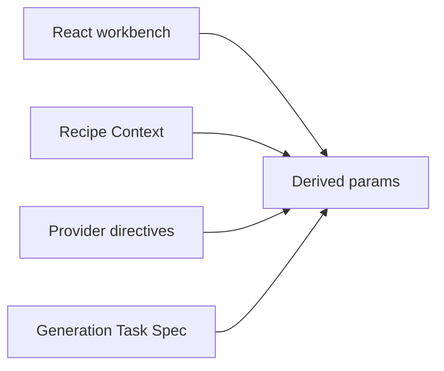
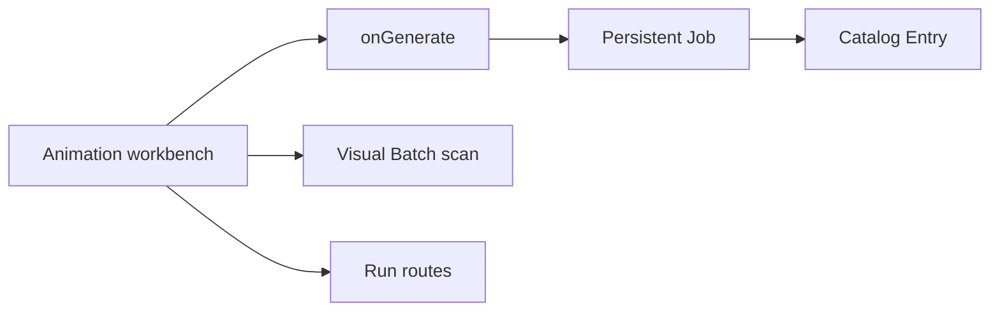

# Architecture review — Animation Sequence

Date: 2026-07-10

Acceptance status: Accepted on 2026-07-10 as part of the full architecture/debt objective

## Summary

- The backend route module is deep enough: `appFactory.ts` only supplies adapters and mounts it.
- The main friction is the frame-to-generation handoff. Selection, task choice, references, variants, and metadata are reconstructed across multiple modules.
- Durable run recovery is incomplete because React dispatches jobs and later scans the Visual Batch instead of reconciling Persistent Jobs and Catalog Entries.
- Backend persistence paths leak into the browser contract even though the UI does not use them.
- Recipe identity already has a strong catalog seam, but display and routing facts still require parallel registration.

## Recommendations

### 1. Deepen the Animation Frame Handoff module

**Recommendation strength**: Strong

**Files**

- `lib/recipeDerivedParams.ts`
- `lib/recipeContextBuilders/animationSequence.ts`
- `lib/recipeProviderDirectives.ts`
- `lib/recipeModules.ts`
- `components/recipes/AnimationSequenceRecipe.tsx`

**Problem**

The current frame handoff is shallow. `createAnimationSequenceRecipeParams` mostly copies fields, while frame selection, correction task choice, output count, references, and provider-independent metadata are reconstructed by separate callers. The UI fixes `batchCount` to one even though the contract carries `variantsPerFrame`; correction can build `image_edit` without an input asset; and reference frame ids do not become task assets at one authoritative seam. Recursive plans also name adjacent references that can have a later generation rank than their target, so the current reference contract is not executable as written.

**Solution**

Deepen the existing pure helper into one provider-independent Animation Frame Handoff projection. Recipe Context, Recipe Provider Directives, and the Generation Task Spec should adapt from that projection instead of rebuilding policy.

**Benefits**

- locality: frame selection and correction policy concentrate in one module
- leverage: one interface serves React dispatch, Recipe Context, directives, and task-spec construction
- interface becomes the test surface for task choice, correction input, variants, executable reference order, and metadata

**Before / After**

Today each caller knows part of the handoff policy. After deepening, callers know the handoff interface while the implementation absorbs selection and task policy.

**Dependencies / sequencing**

- First recommendation.
- Gives the durable coordinator one stable generation intent.
- Preserve provider-independent tasks and the existing Provider Boundary.

**Documentation follow-ups**

- Add **Animation Frame Handoff** to `CONTEXT.md` if accepted.
- Update the Animation Sequence section in `SKILLS.md` after the implementation lands.
- Track implementation and focused verification in `docs/architecture/WORKPLAN.md`.

### 2. Move durable run coordination outside React

**Recommendation strength**: Very strong

**Files**

- `components/recipes/AnimationSequenceRecipe.tsx`
- `hooks/useStudioGenerationActions.ts`
- `apps/local-server/src/animationSequenceService.ts`
- `packages/shared/src/animationSequenceContracts.ts`

**Problem**

The recipe module owns hydration, command errors, generation dispatch, Visual Batch matching, serial frame attachment, refresh, export, QA, and presentation. `onGenerate` returns no job linkage. The backend normally reaches `prompt_ready`, `generated`, or `blocked`, leaving declared `generating` and `correcting` states unreachable and `jobId` unset. Refresh recovery depends on scanning the current Visual Batch instead of durable Persistent Job and Catalog Entry truth.

**Solution**

Add a durable Animation Sequence Run coordinator outside the React surface. It should dispatch through Local Generation Run, record frame/job transitions, and reconcile completed Catalog Entries. React should consume a workbench view and commands while retaining only presentation state.

**Benefits**

- locality: enqueue, transition, recovery, and Catalog reconciliation bugs concentrate in one module
- leverage: one interface serves initial generation, correction, refresh recovery, and frame sync
- depth: the interface exposes workflow intent while the implementation absorbs job and Catalog choreography

**Before / After**

After deepening, the workbench calls one run coordinator; the coordinator owns Local Generation Run, Persistent Job transitions, Catalog reconciliation, and backend run updates.

**Dependencies / sequencing**

- Implement after Recommendation 1 so the coordinator receives one stable handoff intent.
- Preserve Catalog Entry as durable image truth and Visual Batch as compatibility only.
- Verify queued, completed, failed, correction, and refresh-recovery states.

**Documentation follow-ups**

- Add **Animation Sequence Run** and **Animation Sequence Run Coordinator** to `CONTEXT.md` if accepted.
- Amend `docs/adr/0002-animation-sequence-workflow.md` with durable job/Catalog reconciliation.
- Add state-transition and recovery tasks to `docs/architecture/WORKPLAN.md`.

### 3. Separate backend run records from client run projections

**Recommendation strength**: Medium

**Files**

- `packages/shared/src/animationSequenceContracts.ts`
- `apps/local-server/src/animationSequenceService.ts`
- `apps/local-server/src/animationSequenceRoutes.ts`
- `services/localStudioService.ts`

**Problem**

The browser-facing `AnimationSequenceRun` includes run, request, status, prompt, raw-frame, normalized-frame, export, and QA filesystem paths. The UI does not use those paths. GIF delivery also has two representations: `export.publicUrl` and a separately constructed files route.

**Solution**

Keep filesystem paths in a backend persistence record and project one client-facing run view with identifiers, statuses, diagnostics, and one canonical asset URL strategy.

**Benefits**

- locality: storage-layout knowledge remains in the backend module
- leverage: one projection serves list, get, create, attach, export, and QA responses
- interface shrinks; the implementation absorbs path persistence and public URL mapping

**Before / After**

Before, storage implementation is part of the browser interface. After, the client receives only workbench state and public asset references.

**Dependencies / sequencing**

- Follow Recommendation 2 so the public run view reflects settled transitions.
- Can be implemented independently from visual layout work.
- Include Studio Library relocation/recovery coverage before changing persisted path encoding.

**Documentation follow-ups**

- Amend `docs/adr/0002-animation-sequence-workflow.md` if persisted path encoding changes.
- Add contract migration and recovery tasks to `docs/architecture/WORKPLAN.md`.

### 4. Deepen Recipe Module Catalog registration

**Recommendation strength**: Strong, broader follow-up

**Files**

- `types.ts`
- `lib/recipeModules.ts`
- `lib/recipeCatalog.ts`
- `lib/activeRecipeIndicator.ts`
- `components/HeaderToolbar.tsx`
- `components/QueuePanel.tsx`
- `components/RecipesView.tsx`
- `components/RecipeRouter.tsx`

**Problem**

Adding Animation Sequence required parallel registration across recipe identity, ordering, active indicators, toolbar labels, queue normalization, icon maps, card metadata, preloaders, and render branching. The Recipe Module Catalog owns much of this identity, but callers still maintain parallel truths.

**Solution**

Deepen the existing Recipe Module Catalog and Recipe Discovery Projection so they own canonical recipe identity and shared display facts. Keep a small route adapter for lazy imports so demand mounting remains explicit.

**Benefits**

- locality: recipe identity and display drift concentrate in the existing catalog module
- leverage: one catalog entry serves navigation, cards, queue labels, indicators, and agent queries
- deletion test: removing the catalog would scatter the same facts back across many callers, so the existing seam has earned further depth

**Before / After**

Before, one recipe addition changes many maps. After, shared facts derive from the catalog and only executable lazy imports remain in the routing adapter.

**Dependencies / sequencing**

- Last recommendation or a separate follow-up.
- Do not widen the Animation Sequence runtime patch with a repo-wide registration migration.
- Preserve Route Preload Budget and demand-mounted recipe chunks.

**Documentation follow-ups**

- Sharpen **Recipe Module Catalog** and **Recipe Discovery Projection** relationships in `CONTEXT.md` if the ownership changes.
- Add incremental consumer-migration tasks to `docs/architecture/WORKPLAN.md`.

## Suggested execution order

1. Deepen the Animation Frame Handoff module — establishes one tested intent for every frame operation.
2. Move durable run coordination outside React — closes job, Catalog, status, and refresh-recovery gaps.
3. Separate backend run records from client run projections — shrinks the browser interface after transitions settle.
4. Deepen Recipe Module Catalog registration — broad follow-up that reduces future recipe fan-out.

## Preserved strengths

- `apps/local-server/src/appFactory.ts` is a correct composition root for this workflow.
- `createAnimationSequenceRoutes` owns route behavior and supports an injected module for tests.
- `animationSequenceService.ts` already hides substantial filesystem, Sharp, GIF, and QA implementation behind a compact workflow interface.
- The Generation Task / Generation Provider split remains intact.

## Documentation fan-out after acceptance

- `CONTEXT.md`: add or sharpen the accepted domain terms only.
- `docs/adr/0002-animation-sequence-workflow.md`: amend durable reconciliation and storage projection decisions.
- `docs/architecture/WORKPLAN.md`: create the shared execution tracker and link back to this review.
- `SKILLS.md`: update the workflow rules after the accepted seams exist in code.
