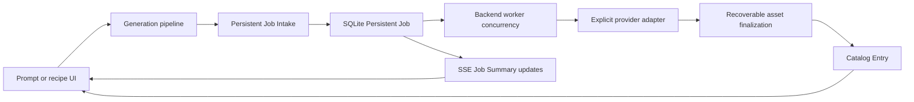

# Repo-wide simplification — 2026-07-18

Status: implemented; final closeout evidence is recorded below.

## Objective

Reduce concepts, state owners, files, branches, and maintenance obligations without weakening local-first safety, provider-secret handling, managed-path validation, durable persistence, accessibility, or supported HTTP behavior.

The audit traced the current UI generation path through Persistent Job Intake, worker execution, provider compilation, recoverable finalization, Catalog writes, SSE, and Catalog rendering. GitHub had no open issues or pull requests when this work started, so there was no issue state to reconcile.

## Ranked cuts

| Rank | Historical machinery                                                                                            | Evidence                                                                                                                                                                      | Direct replacement                                                                                                                       | Main risk and proof                                                                                                                                                                                                |
| ---: | --------------------------------------------------------------------------------------------------------------- | ----------------------------------------------------------------------------------------------------------------------------------------------------------------------------- | ---------------------------------------------------------------------------------------------------------------------------------------- | ------------------------------------------------------------------------------------------------------------------------------------------------------------------------------------------------------------------ |
|    1 | Browser `QueueJob`, state machine, backend-link reconciliation, cooldown, and Force mode                        | Every browser item dispatched immediately; backend worker concurrency already owned waiting. Force only changed local ordering/cooldown and never bypassed backend admission. | `handleGenerate` calls `executeGeneration`; Persistent Jobs, SSE, and Catalog Entries own progress, retry, cancel, refresh, and results. | A short click-to-intake transport interval is represented by pipeline progress before the durable row exists. Generation, Job Summary, placeholder, command-center, and browser checks cover the path.             |
|    2 | Second SQLite jobs/projects/assets implementation in `dbStore.ts`                                               | `createSqliteDbStore` was called only by its own test; production dynamically adapted `db.ts`.                                                                                | A small `StudioDbStore` composition contract backed only by `db.ts`.                                                                     | Production schema/migration behavior is unchanged; real SQLite migration and app-composition tests remain.                                                                                                         |
|    3 | Provider registry plus compiler/executor registries for five fixed providers                                    | No runtime registration API or third-party plugin lifecycle existed; every registry entry had compiler and executor flags set.                                                | Fixed non-secret capability definitions, external preflight definitions, and explicit compile/execute/worker dispatch.                   | A future provider requires one intentional built-in addition or a separately designed plugin contract. Provider capability, preflight, compiler, executor, worker, and source-audit gates cover current providers. |
|    4 | Unreachable browser Visual Batch import, recovery, cache-key store, aliases, and `GenerationBatch` intermediary | Import/recovery modules had no product caller; the Dashboard export was the only reachable compatibility behavior.                                                            | Catalog Entries render directly. The former workspace JSON shape is derived only on explicit export.                                     | Export JSON behavior remains tested; source audit forbids retired cache keys and batch types from returning.                                                                                                       |
|    5 | Opt-in `react-scan` runtime dependency and its dedicated architecture rule                                      | It loaded only under a development flag and contributed a transitive Babel advisory.                                                                                          | Existing React Doctor, source audits, browser verification, and bundle gates.                                                            | Optional profiling convenience is removed; no product path depended on it.                                                                                                                                         |
|    6 | Single-caller/pass-through modules                                                                              | Codex account renamer, Codex barrel, Studio page wrapper, generation dock mode helper, and deprecated export aliases added names without policy.                              | Direct imports, direct session adapter reuse, direct lazy grid surface, and inline one-branch presentation logic.                        | HTTP compatibility endpoint `/api/codex/account` and lazy route behavior remain covered.                                                                                                                           |

## Target shape

There are two durable product records in the hot generation path: Persistent Job for work and Catalog Entry for images. Browser state owns input and presentation only.

## Retained safety and behavior

- Persistent Job validation, immutable Library Context, backend worker concurrency, cancellation, retry, shutdown recovery, and finalization checkpoints remain.
- Provider Secrets remain backend-only and outside SQLite settings, jobs, compiled payload logs, transcripts, screenshots, and docs.
- Managed asset/path validation and External Output Source import boundaries remain unchanged.
- `/api/jobs`, `/api/codex/account`, provider endpoints, setup scripts, and the legacy workspace snapshot export remain supported.
- `/api/jobs` summary rows add `workspaceId`, `recipeId`, and `aspectRatio`; this is an additive response change used by refresh-safe UI projection.
- No Studio Library data, generated images, SQLite files, transcripts, secrets, or local output directories were changed.

## Deliberately not built

- No runtime provider plugin registry: the product has five fixed built-ins and no plugin installation/lifecycle contract.
- No browser queue recovery layer: Persistent Jobs already provide durable waiting and recovery.
- No import path for legacy workspace snapshot JSON: the product exposes export only.
- No general repository or service container: current direct composition seams are sufficient.
- No broad dependency rewrite: Electron remains on the supported release already in the repo. A scoped `undici@7.28.0` override updates the compatible transitive dependency required by `@electron/get` and clears the seven inherited advisories.

## Evidence

Baseline on clean `origin/main`:

- `bun install --frozen-lockfile`: passed.
- `bun run architecture:verify`: passed.
- `bun run check`: 2,612 formatted files and 820 lint/type files passed.
- `bun run test`: 216 files and 822 tests passed.
- `bun run build`: UI build, chunk budgets, and backend typecheck passed.
- `bun audit`: eight transitive advisories (three high, two moderate, three low), including one low path through `react-scan` and seven through Electron's `undici`.

Focused implementation checkpoint:

- 17 focused test files / 88 tests passed across real SQLite migration/summary projection, provider capability/preflight/compile/execute/worker behavior, direct generation projection, event projection, catalog export, and the persistent-jobs panel.
- `bun run check` passed after the structural cuts.

Final closeout:

- `bun install --frozen-lockfile`: passed with 175 installs across 317 packages and no changes.
- `bun run check`: 2,589 formatted files and 796 lint/type files passed.
- `bun run test`: 205 files and 791 tests passed.
- `bun run build`: UI build, chunk budgets, and backend typecheck passed; the main index remained within budget at 419.96 KB and 131.31 KB gzip.
- `bun run architecture:verify`: all style, recipe, provider, Catalog, Library layout, and demand-mounted UI source rules passed.
- `bun run providers:verify`: 23 provider audit rows passed and provider boundary violations remained zero.
- `bun audit`: no vulnerabilities after removing `react-scan` and pinning the compatible Electron download transport.
- Browser proof at 1,440 × 900 and 390 × 844: Persistent Jobs opened, closed, and reopened; the recent-result viewer navigated previous/next and closed with Escape; no Force or Browser Queue control remained; no horizontal overflow, console error, page error, or failed request was observed.
- React Doctor against `origin/main`: 74 changed React files scanned; no issues found.
- Net diff: 116 files, 701 lines added, 4,076 deleted, net reduction of 3,375 lines.

The change history is split into backend/domain simplification, live Studio-model simplification, and documentation/architecture closeout commits. The pull request is the final review and continuation surface.
